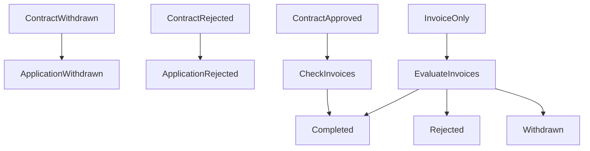

# Application Lifecycle — Simple Guide

This guide explains how applications work. Written in plain language.

---

## The Big Picture (Like a Story)

Imagine you want to borrow money.

1. You fill out a form. That's your **application**.
2. Sometimes you need a big agreement. That's a **contract**.
3. Sometimes you list things you want money for. Each thing is an **invoice**.

The system tracks: Did you get the money? Was it turned down? Did you cancel?

---

## What Is What?

### Application

- A request for money.
- Belongs to one company (the issuer).
- Can have a contract, invoices, or both.

### Contract

- A big agreement. Optional.
- Some applications have one. Some don't.
- Like signing a deal for a house.

### Invoice

- One item you want money for.
- You can have many invoices.
- Like a bill for one thing.

---

## The Golden Rule

**The contract is the boss.**

If the contract says "No" or "Cancelled", the whole application follows that. Invoices cannot change that.

---

## What Each Status Means (Plain Words)

### Application Status

| Status | In Plain Words |
| ------ | -------------- |
| **DRAFT** | You're still filling it out. Not sent yet. |
| **SUBMITTED** | You sent it. Waiting for someone to look at it. |
| **UNDER_REVIEW** | Someone is looking at it right now. |
| **AMENDMENT_REQUESTED** | They want you to fix something. You must update and send again. |
| **RESUBMITTED** | You fixed it and sent it again. |
| **APPROVED** | They said yes. |
| **COMPLETED** | All done. At least one thing was approved. |
| **WITHDRAWN** | You cancelled. Nothing will happen. |
| **REJECTED** | They said no. Nothing will happen. |
| **ARCHIVED** | Old. Put away. Not active anymore. |

### Contract Status

| Status | In Plain Words |
| ------ | -------------- |
| **APPROVED** | The deal is approved. You get the money. |
| **REJECTED** | The deal is turned down. No money. |
| **WITHDRAWN** | The deal was cancelled. |

### Invoice Status

| Status | In Plain Words |
| ------ | -------------- |
| **APPROVED** | This invoice got the green light. |
| **REJECTED** | This invoice was turned down. |
| **WITHDRAWN** | This invoice was cancelled. |

---

## How the System Decides (Step by Step)

The system asks questions in order. First answer wins.

### Step 1: Check the contract first

- Contract cancelled? → Application is **WITHDRAWN**. Done.
- Contract rejected? → Application is **REJECTED**. Done.

### Step 2: If contract is approved (or no contract)

- Contract approved and all invoices are done? → **COMPLETED**.
- No contract? Check the invoices.

### Step 3: If only invoices (no contract)

- All invoices rejected? → **REJECTED**.
- All invoices withdrawn? → **WITHDRAWN**.
- Mix (e.g. one approved, one rejected)? → **COMPLETED**.

### Step 4: Otherwise

- Keep the current status (e.g. SUBMITTED, UNDER_REVIEW).

---

## Simple Examples

| What Happened | Result |
| ------------- | ------ |
| No contract. Both invoices rejected. | REJECTED |
| No contract. Both invoices cancelled. | WITHDRAWN |
| No contract. One approved, one rejected. | COMPLETED |
| Contract rejected. (Invoices don't matter.) | REJECTED |
| Contract approved. All invoices done. | COMPLETED |

---

## What the User Sees (Status Alias)

The system uses codes like `OFFER_SENT` or `AMENDMENT_REQUESTED`. The screen shows friendly words instead.

| System Code | What User Sees |
| ----------- | -------------- |
| REJECTED | Rejected |
| COMPLETED | Completed |
| WITHDRAWN | Withdrawn |
| AMENDMENT_REQUESTED | Action Required |
| OFFER_SENT | Offer Received |
| UNDER_REVIEW | Under Review |
| SUBMITTED | Submitted |
| RESUBMITTED | Resubmitted |
| DRAFT | Draft |
| APPROVED | Approved |
| ARCHIVED | Archived |

### Why only one badge?

Each card shows one badge. But an application can have many statuses at once (app + contract + invoices). So we pick the most important one.

**How we pick:**

1. **Many invoices?** Pick the "loudest" one. Order: Rejected > Action Required > Offer Received > Submitted > Draft > Approved > Withdrawn.
2. **Then** combine app + contract + that invoice. Check in order: Rejected > Completed > Withdrawn > Action Required > Offer Received > Under Review > Submitted > Resubmitted > Draft > Approved > Archived.

Example: App says "Submitted", contract says "Offer Received". We show **Offer Received** because that's checked first.

---

## Withdraw Reasons

When something is cancelled, we can store why:

| Reason | Meaning |
| ------ | ------- |
| USER_CANCELLED | You clicked cancel. |
| OFFER_EXPIRED | The offer ran out of time. |

---

## Lifecycle Diagram

---

## For Developers: computeApplicationStatus

This function figures out the final status. It looks at the contract, invoices, and stored status. It returns the right answer using the rules above.

Contract is checked first. Invoices only matter when there is no contract (or when the contract is approved and we're checking if invoices are done).
