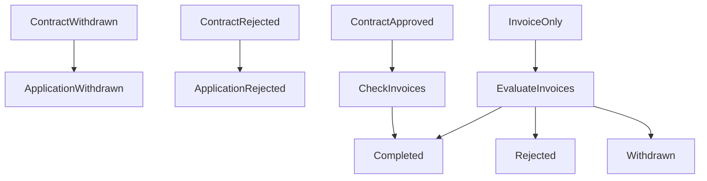

# Application Lifecycle

This document explains how applications, contracts, and invoices work together. It is written for developers new to the system.

---

## What an Application Is

An application is a request for financing. It belongs to one issuer organization.

An application can have:

- **One contract** (optional). Used when the financing structure is contract-based.
- **Many invoices**. Each invoice is a financing item.

The application status is computed from the contract and invoices. Contract status always overrides invoice status.

---

## Application Status Meaning

| Status | Meaning |
| ------ | ------- |
| DRAFT | The application is being set up. Not yet submitted. |
| SUBMITTED | The issuer sent the application to the admin for review. |
| UNDER_REVIEW | The admin is reviewing the application. |
| AMENDMENT_REQUESTED | The admin asked for changes. The issuer must update and resubmit. |
| RESUBMITTED | The issuer made changes and sent the application again. |
| APPROVED | The admin approved the application. (Used by admin workflow.) |
| COMPLETED | The financing workflow finished. At least one item was approved or has mixed outcomes. |
| WITHDRAWN | The issuer cancelled the request. All items were withdrawn. |
| REJECTED | The financing workflow finished. All items were rejected. |
| ARCHIVED | The application was archived. No longer active. |

---

## Contract Status Meaning

| Status | Meaning |
| ------ | ------- |
| APPROVED | The contract was approved. Financing can proceed. |
| REJECTED | The contract was rejected. No financing. |
| WITHDRAWN | The issuer or system withdrew the contract. No longer active. |

---

## Invoice Status Meaning

| Status | Meaning |
| ------ | ------- |
| APPROVED | The invoice was approved. Financing can proceed. |
| REJECTED | The invoice was rejected. No financing for this invoice. |
| WITHDRAWN | The invoice was withdrawn. No longer active. |

---

## Lifecycle Rules

### Contract Priority

Contract status always overrides invoice status. Invoices never override a contract result.

| Contract Status | Application Result |
| --------------- | ------------------ |
| REJECTED | REJECTED |
| WITHDRAWN | WITHDRAWN |

### Contract Approved Rule

If the contract is APPROVED, the application becomes COMPLETED once all invoices reach a final state (APPROVED, REJECTED, or WITHDRAWN).

### Contract-Only Applications

If there are no invoices, the contract determines the result:

| Contract | Application |
| -------- | ----------- |
| APPROVED | COMPLETED |
| REJECTED | REJECTED |
| WITHDRAWN | WITHDRAWN |

### Invoice-Only Applications

When there is no contract, invoices determine the result:

| Invoices | Application |
| -------- | ----------- |
| All REJECTED | REJECTED |
| All WITHDRAWN | WITHDRAWN |
| Mixed (e.g. REJECTED + APPROVED) | COMPLETED |

If all invoices have the same final result, the application follows that result. If invoices have mixed final results, the application is COMPLETED.

---

## Withdraw Reason

When an invoice or contract is withdrawn, a reason can be stored:

| Reason | Meaning |
| ------ | ------- |
| USER_CANCELLED | The issuer chose to withdraw. |
| OFFER_EXPIRED | The offer expired. The system withdrew it. |

---

## Lifecycle Decision Order

The system evaluates status in this order:

1. Contract WITHDRAWN → Application WITHDRAWN
2. Contract REJECTED → Application REJECTED
3. Contract APPROVED and invoices finished → COMPLETED (or no invoices → COMPLETED)
4. No contract and invoices finished → determine from invoice outcomes
5. Otherwise keep the stored application status

---

## Example Scenarios

| Contract | Invoices | Application |
| -------- | -------- | ----------- |
| none | REJECTED + REJECTED | REJECTED |
| none | WITHDRAWN + WITHDRAWN | WITHDRAWN |
| none | REJECTED + APPROVED | COMPLETED |
| none | REJECTED + WITHDRAWN | COMPLETED |
| none | APPROVED + WITHDRAWN | COMPLETED |
| APPROVED | APPROVED + REJECTED | COMPLETED |
| REJECTED | any | REJECTED |

---

## Lifecycle Diagram

---

## computeApplicationStatus

### What it does

`computeApplicationStatus` takes the contract, invoices, and stored application status. It returns the correct application status based on the lifecycle rules.

### Why it exists

The application status must reflect the state of its contract and invoices. This function centralizes that logic in one place.

### Why evaluation order matters

Contract status must be checked first. If the contract is REJECTED or WITHDRAWN, the application follows that outcome. Invoice rules only run when there is no contract.

### How contract priority works

Contract rules run first. Invoice rules run only when `!contract && invoices.length > 0`. Invoices never override REJECTED or WITHDRAWN contract outcomes.

### How invoice outcomes affect results

- All invoices same result → application follows that result
- Mixed invoice results → application is COMPLETED
- Empty invoice array is never treated as finished. Contract-only applications are handled separately.
