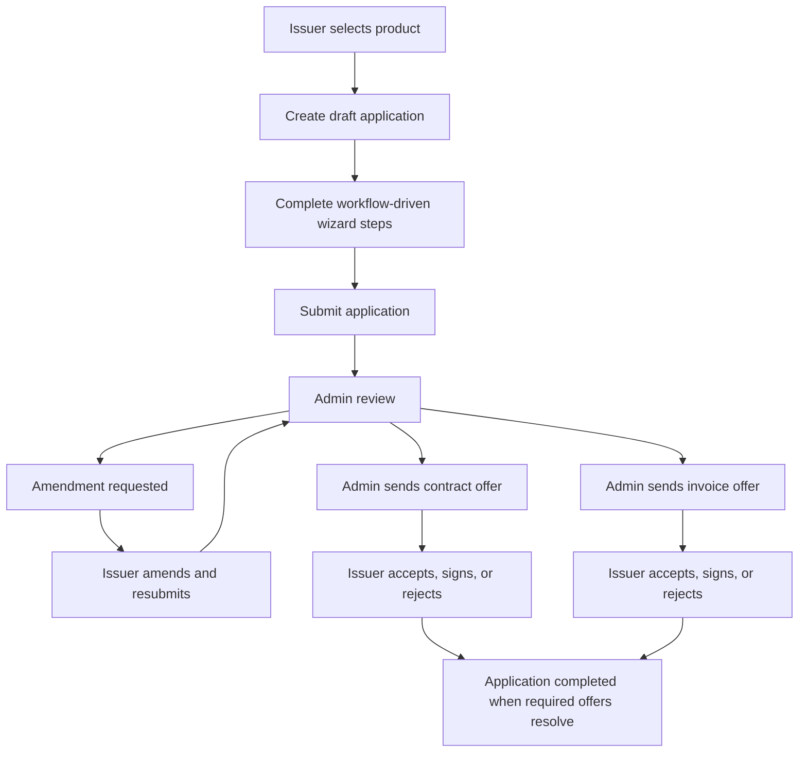

# Issuer Application Process Context

This document captures the current issuer application flow as implemented in the codebase. It is intended as future context for features that begin after an issuer application becomes an investable note.

## Scope

The issuer application process currently covers:

- Issuer onboarding and organization access.
- Product-driven application creation.
- Application wizard steps for financing type, financing structure, contract details, invoice details, company and business details, financial statements, supporting documents, and declarations.
- Admin review, amendment requests, resubmission, contract offers, invoice offers, offer expiry, and offer acceptance or rejection.
- SigningCloud-based offer signing when configured.

The application process hands off to the note lifecycle when the issuer-side application and its related contract or invoices reach a final accepted state. The post-application note lifecycle is now first class in the database and API, but origination remains the source of truth for issuer, contract, invoice, and paymaster context.

## Fee Flow Context

The product money-flow diagrams separate issuer-side fees from note servicing flows.

Issuer onboarding fee flow:

1. SME/issuer starts sign-in or onboarding.
2. Issuer pays the RM 150 onboarding fee before the onboarding flow starts.
3. CashSouk records the fee in the Operating Account.
4. The onboarding process runs eKYC/KYB.
5. The onboarding outcome is either successful or rejected.

Note issuance or financing request processing fee flow:

1. Onboarded SME/issuer creates a draft note or financing application.
2. Issuer submits the financing request.
3. Issuer pays the RM 50 application fee at submission.
4. CashSouk records the fee in the Operating Account.
5. Application is accepted for review and eventual listing if approved.

Implementation implication:

- These fees are separate from investor funding, paymaster repayment, service fee, ta'widh, and gharamah flows.
- Current codebase has onboarding and application workflows. The note lifecycle has a ledger for note funding, receipt, settlement, and bucket movements; issuer onboarding and application fee ledger posting remains a separate future integration.
- The RM 50 application fee is a future implementation item and should be enabled after the payment gateway is ready.
- Future implementation should avoid mixing issuer application fees with note repayment ledger entries.
- The application fee should be visible in admin finance/audit context as an issuer-paid Operating Account movement tied to the submitted application.

## Main Code Paths

Issuer app:

- `apps/issuer/src/app/(application-management)/applications/page.tsx` - issuer applications dashboard, offer return handling, offer finalization after SigningCloud redirect.
- `apps/issuer/src/app/(application-management)/applications/use-applications-data.ts` - application list hydration and dashboard data shaping.
- `apps/issuer/src/app/(application-management)/applications/status.ts` - issuer card status and badge mapping.
- `apps/issuer/src/app/(application-management)/applications/components/ReviewOfferModal.tsx` - primary offer review modal with SigningCloud start-signing flow.
- `apps/issuer/src/components/review-offer-modal.tsx` - dashboard offer modal used by the home financing section.
- `apps/issuer/src/app/(application-flow)/applications/new/page.tsx` - product selection and draft application creation.
- `apps/issuer/src/app/(application-flow)/applications/edit/[id]/page.tsx` - main application wizard, amendment handling, product version guard handling, step gating.
- `apps/issuer/src/app/(application-flow)/applications/steps/*.tsx` - step-specific forms.
- `apps/issuer/src/hooks/use-applications.ts` - application queries, step save, status updates, resubmit, offer actions.
- `apps/issuer/src/hooks/use-contracts.ts` - contract queries and mutations.
- `apps/issuer/src/hooks/use-invoices.ts` - invoice queries.
- `apps/issuer/src/hooks/use-products.ts` - product catalog loading.
- `apps/issuer/src/hooks/use-s3.ts` - S3 view URL helpers.

Backend:

- `apps/api/src/routes.ts` - registers `/v1/applications`, `/v1/contracts`, `/v1/invoices`, and admin routes.
- `apps/api/src/modules/applications/controller.ts` - issuer application routes and offer accept/reject/signing endpoints.
- `apps/api/src/modules/applications/service.ts` - application business logic and status updates.
- `apps/api/src/modules/applications/repository.ts` - application persistence.
- `apps/api/src/modules/applications/lifecycle.ts` - centralized application status rollup.
- `apps/api/src/modules/applications/amendments/service.ts` - amendment and resubmission flow.
- `apps/api/src/modules/contracts/controller.ts` and `apps/api/src/modules/contracts/service.ts` - issuer contract operations.
- `apps/api/src/modules/invoices/controller.ts` and `apps/api/src/modules/invoices/service.ts` - issuer invoice operations.
- `apps/api/src/modules/admin/controller.ts` and `apps/api/src/modules/admin/service.ts` - admin review, offer send, section/item review, CTOS, AML, and amendment orchestration.
- `apps/api/src/modules/signingcloud/*` - SigningCloud integration and webhook handling.

Shared packages:

- `packages/types/src/application-steps.ts` - canonical application step keys and workflow normalization helpers.
- `packages/types/src/index.ts` - shared DTOs and enums including `ApplicationStatus`, `ContractStatus`, `InvoiceStatus`, and `WithdrawReason`.
- `packages/config/src/api-client.ts` - typed frontend API client.
- `packages/config/src/status-badges.ts` - shared status badge labels and visual variants.
- `packages/config/src/review-refresh-policy.ts` - polling/refetch policy during review and offer states.
- `packages/types/src/resubmit-meaningful-field-path.ts` - fields that count as meaningful amendment changes.

## Current Data Model

The active issuer financing flow uses these Prisma models:

- `Application` stores the issuer submission and product-driven step payloads in JSON fields such as `financing_type`, `financing_structure`, `company_details`, `business_details`, `financial_statements`, `supporting_documents`, and `declarations`.
- `Contract` stores `contract_details`, `customer_details`, `offer_details`, `status`, and SigningCloud metadata. `customer_details` is the current source for the paymaster/obligor counterparty.
- `Invoice` stores `details`, `offer_details`, `status`, and SigningCloud metadata.
- `ApplicationReview`, `ApplicationReviewItem`, `ApplicationReviewRemark`, and `ApplicationReviewEvent` store admin review state and reviewer actions.
- `ApplicationRevision` stores submitted snapshots by review cycle.
- `ApplicationLog` stores issuer/admin activity timeline events.

Post-origination note schema:

- The note lifecycle now has first-class tables in `apps/api/prisma/schema.prisma`: `Note`, `NoteListing`, `NoteInvestment`, `NotePaymentSchedule`, `NotePayment`, `NoteSettlement`, `NoteLedgerAccount`, `NoteLedgerEntry`, `NoteEvent`, `NoteAdminAction`, `PlatformFinanceSetting`, and `WithdrawalInstruction`.
- Notes are created one per approved invoice. `Note.source_invoice_id` points to the invoice, while `Note.source_application_id` and `Note.source_contract_id` retain origination and paymaster context.
- `Note` snapshots the accepted context in `product_snapshot`, `issuer_snapshot`, `paymaster_snapshot`, `contract_snapshot`, and `invoice_snapshot` so servicing does not depend on mutable application JSON.
- The five platform buckets are represented by `NoteLedgerAccount.code`: `INVESTOR_POOL`, `REPAYMENT_POOL`, `OPERATING_ACCOUNT`, `TAWIDH_ACCOUNT`, and `GHARAMAH_ACCOUNT`.
- `NoteLedgerEntry` stores immutable postings with `account_id`, `direction`, `amount`, `idempotency_key`, `posted_at`, and links to note/payment/settlement/withdrawal records where applicable.
- Admin can view note bucket balances in `/finance/buckets`; balances are derived from ledger credits and debits.
- Admin notes registry consolidates approved invoices ready for note creation and existing notes into one table so an approved invoice with a created note is not shown twice.
- Posted settlement summaries are exposed on admin and issuer note pages. Once a note is settled, issuer settlement payment actions are disabled.
- `Loan` and `Investment` exist in `apps/api/prisma/schema.prisma`, but they are legacy/disconnected from the active issuer application routes and should not be treated as the current note lifecycle without deliberate migration work.

Paymaster clarification:

- The paymaster data already exists in the issuer origination flow, but it is usually stored and displayed as customer data rather than as a normalized paymaster entity.
- In this domain, the paymaster is the company/customer that gives the invoice or contract to the issuer and is expected to pay the obligation back directly.
- Current code stores this primarily in `Contract.customer_details`; invoice-only applications can still create/use a contract row to hold customer details even when there is no contract offer flow.
- Admin UI already displays this counterparty as Paymaster in application review contexts.
- Future note work should snapshot or normalize this existing customer/paymaster data. It should not require admins to re-enter paymaster information from scratch.

## Application Flow

## Product-Driven Steps

Applications are driven by the selected `Product.workflow` JSON.

Key behavior:

- New applications start with product selection in `new/page.tsx`.
- Creating an application calls `POST /v1/applications`, then redirects to the edit wizard.
- The edit wizard reads the product workflow and applies `enforceDeclarationsLastAndDropReview`.
- The legacy `review_and_submit` step is dropped from visible workflow handling.
- `declarations` is forced to the end.
- If the selected financing structure is `existing_contract`, `contract_details` is filtered out of the visible workflow.
- `last_completed_step` controls how far forward the issuer can navigate.
- `PATCH /v1/applications/:id/step` saves each step by `stepNumber`, `stepId`, and payload.

Typical step sequence:

- `financing_type` - selected product and product metadata.
- `financing_structure` - `new_contract`, `existing_contract`, or `invoice_only`.
- `contract_details` - contract and paymaster/customer data for new contract flows.
- `invoice_details` - invoice rows, invoice documents, requested financing amount/ratio, maturity data.
- `company_details` - issuer company profile data.
- `business_details` - operational, repayment, and business-risk data.
- `financial_statements` - financial statement upload and CTOS/financial validation context.
- `supporting_documents` - configured document uploads.
- `declarations` - final issuer declarations and submission.

## Financing Structures

The issuer can choose:

- `new_contract` - issuer enters a new contract, then invoices can be linked to the accepted contract facility.
- `existing_contract` - issuer selects a previously approved contract; contract step is skipped.
- `invoice_only` - invoices are financed without a real contract offer flow. A contract may still exist as a holder for customer/paymaster details, but invoice statuses control completion.

The `computeApplicationStatus` helper in `apps/api/src/modules/applications/lifecycle.ts` is important because contract-based and invoice-only lifecycles roll up differently.

## Contract and Facility Context

Contract offers currently follow this pattern:

- Issuer enters requested facility values in `contract_details`.
- Admin reviews and sends an offer through `POST /v1/admin/applications/:id/offers/contracts/send`.
- The backend validates that `offered_facility` is not greater than the requested facility.
- Offer metadata is stored in `contract.offer_details`.
- Issuer accepts/rejects or signs externally with SigningCloud.
- On acceptance, approved facility values are written into `contract_details`.

The facility source of truth is documented in `docs/guides/application-flow/contract-offer-facility-flow.md`.

Important helpers:

- `apps/api/src/lib/contract-facility.ts`
- `packages/config/offer-resolvers.ts`
- `apps/api/src/lib/invoice-offer.ts`

## Invoice Offer Context

Invoice offers currently follow this pattern:

- Issuer enters invoice details in the wizard.
- Admin reviews invoice items individually.
- Admin sends invoice offers through `POST /v1/admin/applications/:id/offers/invoices/:invoiceId/send`.
- The backend validates invoice value, requested financing ratio, requested amount, offered amount, offered ratio, profit rate, and Soukscore risk rating.
- Offer metadata is stored in `invoice.offer_details`.
- Issuer accepts/rejects or signs externally with SigningCloud.
- Approved invoices count toward utilized contract facility when attached to an approved contract.

Current money caveat:

- Contract and invoice monetary values are mostly stored inside JSON payloads and manipulated as JavaScript numbers.
- Future post-application note and servicing work should move monetary ledger values into typed numeric columns and use decimal-safe calculations.

## Admin Review and Amendment Context

Admin review uses section-level and item-level review records:

- Sections use `ApplicationReview`.
- Invoice and document items use `ApplicationReviewItem`.
- Reviewer remarks use `ApplicationReviewRemark`.
- Review events use `ApplicationReviewEvent`.
- Activity timeline entries use `ApplicationLog`.

Review section policy:

- `AdminService.getReviewSectionPolicy` builds the required and visible review sections from the selected product workflow.
- The financial section is always required.
- Workflow steps map to review sections for `company_details`, `business_details`, `supporting_documents`, `contract_details`, and `invoice_details`.
- Contract review is gated by financial, company, business, and documents approval.
- Invoice review is gated by financial, company, business, documents, and contract/customer approval.
- Existing-contract applications treat `contract_details` as approved in the admin UI because the contract facility was approved previously.
- Final admin approval calls `updateApplicationStatus(..., APPROVED)` and is blocked unless all required review sections are approved.

Review action behavior:

- First review action on `SUBMITTED` or `RESUBMITTED` calls `ensureUnderReview`, which moves the application into the current admin stage (`UNDER_REVIEW`, `CONTRACT_PENDING`, `INVOICE_PENDING`, `CONTRACT_SENT`, or `INVOICES_SENT`) based on contract/invoice state and tab unlocks.
- The Documents section is derived from per-document item rows; admins approve, reject, or amend each document item.
- Invoice approvals are finalized by issuer offer response, not by the generic item approval endpoint.
- Contract and invoice review actions are locked once the related offer is finalized by the issuer.
- Resetting contract or invoice review to pending can retract sent offers and reset contract or invoice statuses when the offer has not been finalized.

Amendment behavior:

- Admin adds section or item amendments as draft `REQUEST_AMENDMENT` remarks with `submitted_at = null`.
- The Request Amendment modal groups draft remarks by section; `submitPendingAmendments` sets `submitted_at`, creates an `AMENDMENTS_SUBMITTED` event, and moves the application to `AMENDMENT_REQUESTED`.
- Issuer sees the application as `AMENDMENT_REQUESTED`.
- The edit wizard unlocks only the affected areas.
- Item amendments unlock the parent section and the specific item scope key.
- `declarations` remains patchable during amendment mode so the issuer can resubmit final confirmations.
- Affected sections must be acknowledged before resubmission, except financial amendments.
- Issuer changes are compared against previous revisions.
- Resubmission uses `POST /v1/applications/:id/resubmit`.
- `review_cycle` increments across amendment rounds.
- Resubmission clears submitted amendment remarks and `AMENDMENT_REQUESTED` review rows, creates a new `ApplicationRevision` snapshot, resets `amendment_acknowledged_workflow_ids`, and sets status to `RESUBMITTED`.

CTOS, director, shareholder, and guarantor review:

- `AdminService.getApplicationDetail` enriches the issuer organization with latest CTOS company JSON, financial JSON, CTOS report metadata, party subject reports, and `ctos_party_supplements`.
- `ApplicationFinancialReviewContent` displays CTOS financial rows beside issuer-provided unaudited financials and exposes organization and subject CTOS report actions.
- Director/shareholder rows are built by `getDirectorShareholderDisplayRows` from CTOS company JSON, legacy corporate entities, KYC status, AML status, and CTOS party supplements.
- Party matching is based on normalized IC or SSM numbers. Directors are always included; individual shareholders are included at 5% or above; corporate shareholders are included as corporate parties.
- Financial approval is blocked by `assertLatestCtosPartyKycApproved` when required latest CTOS/RegTank individual KYC is not approved.
- Issuer-side profile flow can save a party email and send or restart a RegTank onboarding link after organization onboarding is completed. Approved party onboarding is locked.
- Admin can start Acuris screening for application guarantors through `startApplicationGuarantorAcurisScreening`; individual guarantors require name, IC, email, and nationality, while company guarantors require business name, SSM, and email.
- When directors or shareholders change, the current source of truth is the latest CTOS/company extraction plus party supplements; admins should pull fresh CTOS data and ensure the row's role, ID, and onboarding state are current before financial approval.

Existing docs:

- `docs/guides/application-flow/amendment-flow.md`
- `docs/guides/application-management/issuer-applications-dashboard.md`
- `docs/guides/application/status-reference.md`
- `docs/guides/application/lifecycle-possibilities.md`
- `docs/guides/application/admin-stage-simple.md`
- `docs/guides/admin/activity-timeline.md`

## SigningCloud Context

SigningCloud is used for offer acceptance when configured.

Flow:

- Issuer opens the offer review modal from the applications list.
- The modal calls the relevant `start-signing` API.
- API returns a `signingUrl`.
- Browser redirects to SigningCloud.
- Issuer returns to the applications dashboard with signing query parameters.
- The dashboard calls the corresponding `finalize-signing` API.
- Contract/invoice `offer_signing` JSON is updated.
- Signed letter blobs can be fetched from signed-letter endpoints.

Important implementation detail:

- The applications list offer modal supports SigningCloud.
- The home dashboard offer modal calls accept APIs directly and can fail when signing is required. Future work should consolidate these modals before extending the offer/note boundary.

## Status Model

Application statuses include:

- `DRAFT`
- `SUBMITTED`
- `UNDER_REVIEW`
- `CONTRACT_PENDING`
- `CONTRACT_SENT`
- `CONTRACT_ACCEPTED`
- `INVOICE_PENDING`
- `INVOICES_SENT`
- `AMENDMENT_REQUESTED`
- `RESUBMITTED`
- `APPROVED`
- `COMPLETED`
- `WITHDRAWN`
- `REJECTED`
- `ARCHIVED`

Contract and invoice statuses include:

- `DRAFT`
- `SUBMITTED`
- `OFFER_SENT`
- `APPROVED`
- `REJECTED`
- `AMENDMENT_REQUESTED`
- `WITHDRAWN`

Issuer dashboard status display is derived from a combination of:

- Application status.
- Contract status.
- Invoice statuses.
- Withdraw reason.
- Offer states.
- Amendment state.

## Current Gaps and Risks

- There is no first-class note creation step after application completion.
- There is no investor marketplace implementation in `apps/investor`; `/investments` is linked but not implemented.
- There is no admin `/notes` route even though the sidebar includes it.
- There is no repayment, paymaster payment, settlement, refund, late-fee, or accounting ledger model.
- Existing `Loan` and `Investment` models are not wired into active routes.
- Monetary values in active application, contract, and invoice flows are often JSON/number based rather than decimal-ledger based.
- Paymaster is currently stored as customer detail context, not a normalized backend entity.
- Signing flow is split across two issuer offer modal implementations.
- Some existing docs have minor drift from the current file structure; use the code paths in this document as the current anchors.

## Boundary for Note Creation

The clean boundary for future note work should be:

- Application has completed review.
- Required contract/invoice offers have been accepted or signed.
- The final accepted commercial terms are frozen into an immutable snapshot.
- A post-application process creates one note record per approved invoice. The related application and contract remain source context for issuer, product, paymaster/customer, and offer snapshots.

The note feature should not mutate the historical application snapshot. It should reference the application, contract, invoice, issuer organization, product version, accepted offer details, and paymaster/customer details.

## Recommended Build Boundary

When building the note feature, treat issuer applications as the origination workflow and notes as the financing instrument workflow.

The first note creation service should:

- Read from approved `Invoice` records and their parent `Application`/`Contract` context.
- Validate that the invoice is eligible for note creation and has not already produced a note.
- Copy accepted invoice terms into immutable note term fields.
- Preserve references back to the source application, contract, invoice, issuer organization, and product.
- Avoid using mutable application JSON as the long-term accounting source of truth.
