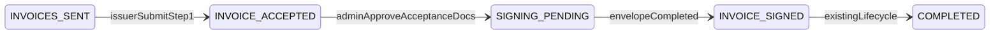
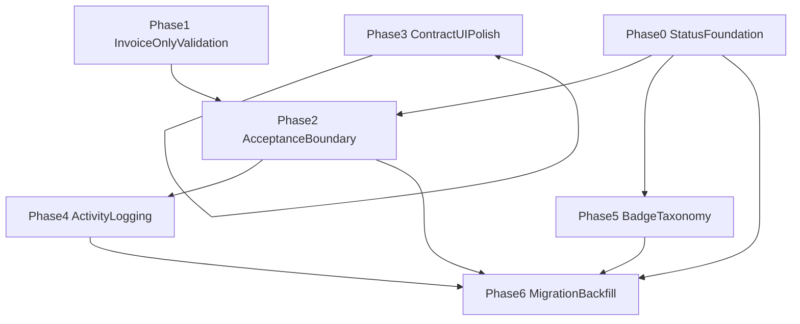

# Offer Flow Polish Roadmap

Implementation roadmap for offer-acceptance UX fixes, admin UI polish, application-status clarity, activity logging, and badge taxonomy. Derived from product feedback and codebase investigation (Jul 2026).

**Related docs:** [offer-acceptance-and-signing-phases.md](./offer-acceptance-and-signing-phases.md), [issuer-offer-flow.md](../../integrations/issuer-offer-flow.md), [status-badges.md](../status-badges.md), [activity-timeline.md](../admin/activity-timeline.md)

---

## 1. Scope and confirmed decisions

### In scope

| # | Issue | Decision |
|---|-------|----------|
| 1 | ~~Continue should save LO + Guarantee Acknowledgement~~ | **Removed:** upload-only Step 1; no checkbox acknowledgements |
| 2 | Acceptance documents should not save unless Submit | Defer DB + S3 persistence to Submit only |
| 3 | Multiple invoices → switch to Invoice-only fails silently | Frontend guard + structured error before API |
| 4 | Customer Consent in Contract / amendment UI | **Product override:** removed from admin Evidence UI (API/storage intact). Download parity not shipped. |
| 5 | Send Contract Offer dialog — long acceptance deadline copy | Shorter, stacked layout; shared between contract + invoice confirm dialogs |
| 6 | Logging for Acceptance and Signing Package | New `ApplicationLogEventType` values at key milestones |
| 7 | Application statuses for acceptance / signing milestones | Persist on **application** row (not contract/invoice entity enums) |
| 8 | Status badge colour taxonomy | Four semantic groups: issuer action, admin action, completed, expired/closed |

### Application status model (confirmed)

One primary offer per application; structure determines which *Accepted* / *Signed* label applies.

| Status | When set | Financing structure |
|--------|----------|---------------------|
| `CONTRACT_ACCEPTED` | Issuer submits Step 1 (acceptance docs) | Contract / new contract |
| `INVOICE_ACCEPTED` | Issuer submits Step 1 (acceptance docs) | Invoice-only |
| `SIGNING_PENDING` | Admin approves acceptance docs → `APPROVED_FOR_SIGNING` | Both (single shared status) |
| `CONTRACT_SIGNED` | All signers complete envelope | Contract / new contract |
| `INVOICE_SIGNED` | All signers complete envelope | Invoice-only |

**Semantic shift:** Today `CONTRACT_ACCEPTED` is written when the **contract envelope completes** (`respondToContractOffer` accept). After this work it means **acceptance submitted**, not signing complete. Post-signing becomes `CONTRACT_SIGNED` / `INVOICE_SIGNED`.

**Out of scope for invoice acceptance statuses:** Contract-linked invoices keep direct Accept/Decline after contract signing. Their application lifecycle stays `INVOICE_PENDING` → `INVOICES_SENT` → `COMPLETED` when contract is `APPROVED` and all invoices are terminal (`computeApplicationStatus` in `apps/api/src/modules/applications/lifecycle.ts`).

### Invariants (must hold after implementation)

- Navigating away from Upload in Review Offer modal does **not** write `Application.acceptance_documents`.
- Submit is the only action that moves application → `CONTRACT_ACCEPTED` / `INVOICE_ACCEPTED` and `offer_acceptance` → `PENDING_ADMIN_REVIEW` (or `APPROVED_FOR_SIGNING` when no acceptance docs).
- Signing webhook / envelope completion is idempotent (`ALREADY_RESPONDED` / `INVALID_STATE` already handled in `finalizeOfferAfterEnvelopeCompletion`).
- `submitted_at` blocks admin commercial re-send (`isOfferAcceptanceResendBlocked` in `packages/types/src/offer-acceptance.ts`).

---

## 2. Current state and root causes

### 2.1 ~~Continue does not persist acknowledgements~~ (removed)

**Historical:** Checkbox acknowledgement steps existed before upload-only acceptance. The Letter of Offer / Guarantee acknowledgement flow and partial-save PATCH routes were removed. Step 1 is upload-only; only **Submit** persists acceptance.

**Key files today:**

- `apps/issuer/src/app/(application-management)/applications/components/ReviewOfferModal.tsx`
- `apps/issuer/src/lib/signing-offer-steps.ts`
- `apps/api/src/modules/applications/service.ts` — `submitContractOfferAcceptance`, `submitInvoiceOfferAcceptance`
- `packages/types/src/offer-acceptance.ts`

### 2.2 Acceptance documents persist before Submit

**Symptom:** Uploading Board Resolution then navigating away (or closing modal) writes to `Application.acceptance_documents` and S3. Admin Acceptance tab can show uploads while issuer is still `PENDING_ISSUER`.

**Root cause:** `ensurePostApplicationDocumentsSaved()` in `ReviewOfferModal.tsx` calls `PATCH /v1/applications/:id/step` with `stepId: "acceptance_documents"`. It is invoked from:

- `submitOfferAcceptance` (intended)
- `navigateFromUploadDocuments` (sidebar / Continue — **unintended**)
- `prepareAccept` before signing (legacy path)

**Admin visibility:** `isAcceptanceDocumentsSectionActive()` in `apps/admin/src/components/application-review/sections/acceptance-section.tsx` treats any upload as active, even pre-submit.

**Gap vs supporting docs:** `supporting_documents` has orphan S3 cleanup on failed DB write; acceptance path does not.

### 2.3 Invoice-only switch with multiple invoices

**Symptom:** User adds 2+ invoices under `new_contract`, returns to Financing Structure, selects Invoice-only, Save fails with generic error; UI can show invoice-only via `sessionStorage` while DB still has `new_contract`.

**Root cause:**

- Backend guard exists: `ApplicationService.updateStep` throws `400 MAX_INVOICES_REACHED` when `structure_type === "invoice_only"` and `invoices.length > 1` (`apps/api/src/modules/applications/service.ts` ~950).
- `FinancingStructureStep` has no proactive validation.
- `InvoiceDetailsStep` reads DB structure, not session override — user can keep adding invoices until save fails.
- Failed save leaves `cashsouk:financing_structure_override` in sessionStorage.

**Docs:** [invoice-details-validation.md](./invoice-details-validation.md), [issuer-dashboard-application-contract-invoice-flow.md](../../issuer-dashboard-application-contract-invoice-flow.md).

### 2.4 Customer Consent — hard-coded label, dynamic data, no Download on live rows

**Verdict:** Label **"Customer Consent"** is hard-coded JSX in four admin surfaces. Document metadata is **dynamic** from `customer_details.document` JSON (`{ s3_key, file_name, file_size?, uploaded_at? }`).

| Surface | File | Download today |
|---------|------|----------------|
| Contract review (live) | `apps/admin/src/components/application-review/sections/contract-section.tsx` | View only |
| Contract review (amendment compare) | same | View + Download (via `ComparisonFileChipList`) |
| Customer tab (invoice-only) | `apps/admin/src/components/application-review/sections/customer-section.tsx` | View only |
| Contract detail modal | `apps/admin/src/contracts/components/contract-detail-modal.tsx` | View only (inline S3 helper) |

**Note:** Issuer `contract-details-step.tsx` does not upload `customer_details.document`. API supports `type: "consent"` on contract upload URL (`apps/api/src/modules/contracts/schemas.ts`) but UI is unused — out of scope for this slice.

### 2.5 Send Contract Offer — acceptance deadline copy

**Symptom:** Confirm dialog shows one long right-aligned string from `previewAcceptanceDeadlineFromWorkflow().summary`, e.g. `Issuer has 7 days · Accept by 29 Jul 2026, 2:36 PM`. Wraps poorly at `sm:max-w-md`.

**Duplication:** Same pattern in `contract-section.tsx` and `invoice-review-list.tsx`. Helper lives in `packages/types/src/offer-phase-deadline-display.ts`.

### 2.6 Sparse logging and status ambiguity

**Activity logs today:** Offer send/accept/reject/expired exist (`ApplicationLogEventType` in `apps/api/src/modules/applications/logs/types.ts`). Missing:

- Step 1 acceptance submit
- Admin approval → signing unlocked
- Signing package created / sent / completed / voided

**Status ambiguity:** Phase lives in `offer_details.offer_acceptance` JSON while application status stays coarse (`CONTRACT_SENT`, `CONTRACT_ACCEPTED`, etc.). Admin list filters cannot distinguish "acceptance under review" vs "waiting for signatures" without opening the application.

**Badge fragmentation:** Central config in `packages/config/src/status-badges.ts` (7 variants). Local overrides in `acceptance-section.tsx` (`OFFER_ACCEPTANCE_STATUS_STYLES`) and `signing-envelope-panel.tsx` (`STATUS_STYLES`).

---

## 3. Target lifecycle

### 3.1 Contract financing

```mermaid
stateDiagram-v2
  direction LR
  CONTRACT_SENT --> CONTRACT_ACCEPTED: issuerSubmitStep1
  CONTRACT_ACCEPTED --> SIGNING_PENDING: adminApproveAcceptanceDocs
  SIGNING_PENDING --> CONTRACT_SIGNED: envelopeCompleted
  CONTRACT_SIGNED --> INVOICE_PENDING: invoiceTabUnlocked
  INVOICE_PENDING --> INVOICES_SENT: allInvoicesOfferedOrResolved
  INVOICES_SENT --> COMPLETED: allInvoicesTerminal
```

When contract has no invoices: `CONTRACT_SIGNED` → `COMPLETED` directly.

### 3.2 Invoice-only financing

### 3.3 Mapping from `offer_acceptance.status`

| `offer_acceptance.status` | Application status (contract) | Application status (invoice-only) |
|---------------------------|--------------------------------|-----------------------------------|
| `PENDING_ISSUER` | `CONTRACT_SENT` | `INVOICES_SENT` |
| `PENDING_ADMIN_REVIEW` / `CHANGES_REQUESTED` | `CONTRACT_ACCEPTED` | `INVOICE_ACCEPTED` |
| `APPROVED_FOR_SIGNING` / `SIGNING_IN_PROGRESS` | `SIGNING_PENDING` | `SIGNING_PENDING` |
| `COMPLETED` (+ entity `APPROVED`) | `CONTRACT_SIGNED` → invoice stages | `INVOICE_SIGNED` → `COMPLETED` |

Entity contract/invoice status remains **Option A** (`OFFER_SENT` until envelope → `APPROVED`). Application status is the admin-filterable overlay.

### 3.4 Activity log events (proposed)

Add to `ApplicationLogEventType` (names illustrative — align naming in implementation):

| Event | Hook |
|-------|------|
| `CONTRACT_OFFER_ACCEPTANCE_SUBMITTED` / `INVOICE_OFFER_ACCEPTANCE_SUBMITTED` | `submit*OfferAcceptance` |
| `CONTRACT_ACCEPTANCE_APPROVED_FOR_SIGNING` / `INVOICE_ACCEPTANCE_APPROVED_FOR_SIGNING` | `syncOfferAcceptancePhaseFromAcceptanceDocs` → `APPROVED_FOR_SIGNING` |
| `SIGNING_PACKAGE_CREATED` | `SigningService.createEnvelope` |
| `SIGNING_PACKAGE_SENT` | `SigningService.sendEnvelope` |
| `SIGNING_PACKAGE_COMPLETED` | envelope rollup → `COMPLETED` |
| `SIGNING_PACKAGE_VOIDED` | `voidEnvelope` / decline rollup |

**Keep** existing `CONTRACT_OFFER_ACCEPTED` / `INVOICE_OFFER_ACCEPTED` at final commercial accept (`respondTo*Offer`) OR rename display labels to "Offer signed" in timeline only — do not reuse for Step 1 submit (audit confusion).

Update: `docs/guides/admin/activity-timeline.md`, `docs/guides/application/logging-scenarios.md`, `apps/admin/src/components/admin-activity-timeline.tsx`, `apps/api/src/modules/activity/adapters/application-log.ts`.

---

## 4. Phased implementation

Recommended order minimises breakage: quick UX wins first, then transaction boundaries, then status migration last.

### Phase 0 — Foundation (blocking for Phases 4–5)

**Goal:** Shared types, Prisma enum, transition matrix, lifecycle hooks.

| Task | Details | Depends on |
|------|---------|------------|
| Add `ApplicationStatus` values | `INVOICE_ACCEPTED`, `SIGNING_PENDING`, `CONTRACT_SIGNED`, `INVOICE_SIGNED` in `packages/types`, Prisma, `@cashsouk/config` | — |
| Redefine `CONTRACT_ACCEPTED` semantics | Document + code: acceptance submitted, not signing complete | Enum addition |
| Central transition helper | Single function: given `financing_structure`, `offer_acceptance.status`, contract/invoice entity status, invoice counts → application status | Enum addition |
| Update `resolveAdminStageStatus` | `apps/api/src/modules/admin/service.ts` — replace current `CONTRACT_ACCEPTED` usage when contract `APPROVED` + invoice tab locked | Transition helper |
| Update `computeApplicationStatus` | Preserve contract-linked invoice → `COMPLETED` path; integrate new statuses for phased offers | Transition helper |
| Admin filters + badges config | `applications-table-toolbar.tsx`, `status-badges.ts`, `action-required-statuses.ts` | Enum addition |
| Issuer card mapping | `apps/issuer/.../status.ts`, `offer-utils.ts` | Badge config |

**Files (primary):**

- `packages/types/src/index.ts`
- `apps/api/prisma/schema.prisma` + migration
- `apps/api/src/modules/applications/lifecycle.ts`
- `apps/api/src/modules/admin/service.ts`
- `apps/api/src/modules/applications/service.ts`
- `packages/config/src/status-badges.ts`
- `docs/guides/application/status-reference.md`

### Phase 1 — Invoice-only validation (quick win)

**Goal:** Block invalid structure switch before API; fix session desync.

| Task | Details |
|------|---------|
| Proactive guard | In `financing-structure-step.tsx`: if selecting `invoice_only` and `invoices.length > 1`, disable Save and show actionable inline error |
| Error mapping | In edit page `handleSaveAndContinue`: map `MAX_INVOICES_REACHED` to specific copy (not generic toast) |
| Session hygiene | Clear or revert `sessionStorage` override on failed financing_structure save |
| Optional | Pass `effectiveStructureType` into `InvoiceDetailsStep` so UI limits rows when override is invoice-only |

**Acceptance:** User with 2+ invoices cannot proceed to invoice-only without removing extras; no UI/DB mismatch after failed save.

**Tests to add:** API unit test for `updateStep` + `MAX_INVOICES_REACHED`; issuer component test for guard; Playwright: multi-invoice → back → invoice-only → error.

**Files:**

- `apps/issuer/src/app/(application-flow)/applications/steps/financing-structure-step.tsx`
- `apps/issuer/src/app/(application-flow)/applications/edit/[id]/page.tsx`
- `apps/issuer/src/app/(application-flow)/applications/steps/invoice-details-step.tsx`
- `apps/api/src/modules/applications/service.ts` (structured error payload — optional)

### Phase 2 — Acceptance transaction boundary

**Goal:** Correct persistence timing for acceptance docs; wire application status on Submit.

| Task | Details | Status |
|------|---------|--------|
| Defer acceptance docs | Remove `updateApplicationStep` from leave-Upload when Step 1 editable; keep local draft until Submit | Done |
| Submit-only upload | On Submit: S3 upload + write `acceptance_documents` + `submitOfferAcceptance` (still two calls; atomic body deferred) | Done |
| Application status on Submit | Set `CONTRACT_ACCEPTED` / `INVOICE_ACCEPTED` in submit handlers (Phase 0 helper) | **Deferred — needs Phase 0** |
| Admin visibility gate | `isOfferAcceptanceDocumentsVisibleToAdmin`: require `submitted_at` or status ≥ `PENDING_ADMIN_REVIEW` | Done |
| S3 orphans | PUT may still happen on file select before Submit; DB write deferred. Full orphan cleanup deferred | Partial |

**Connected updates:**

- `packages/config/src/api-client.ts`
- `apps/admin/src/components/application-review/sections/acceptance-section.tsx`
- `apps/api/src/modules/applications/supporting-docs-workflow.ts` — submit gate unchanged

**Acceptance:** Docs uploaded + navigate away → DB unchanged; Submit → docs visible to admin (+ application status when Phase 0 lands).

**Tests:** Unit coverage for visibility helper + resend-block on `submitted_at` (`offer-acceptance-flow.test.ts`).

### Phase 3 — Contract UI polish

**Goal:** Download parity and readable confirm dialog. Independent of Phase 0–2 but shares S3 hook.

| Task | Details |
|------|---------|
| Evidence row Download | Add Download next to View on live Contract Document + Customer Consent rows |
| Contract detail modal | Refactor to `useAdminS3DocumentViewDownload`; add Download |
| Optional DRY extract | `ReviewEvidenceDocumentRow` shared component |
| Deadline layout | Split `AcceptanceDeadlinePreview` into stacked rows (`days`, `acceptBy`) or add `confirmDialogLines` in `offer-phase-deadline-display.ts` |
| Shared confirm summary | Extract component used by `contract-section.tsx` and `invoice-review-list.tsx` |

**Files:**

- `apps/admin/src/components/application-review/sections/contract-section.tsx`
- `apps/admin/src/components/application-review/sections/customer-section.tsx`
- `apps/admin/src/contracts/components/contract-detail-modal.tsx`
- `apps/admin/src/hooks/use-admin-s3-document-view-download.ts`
- `packages/types/src/offer-phase-deadline-display.ts`

**Acceptance:** Download works when `s3_key` present; deadline readable at dialog width; contract + invoice dialogs match.

**Tests:** Unit test for deadline formatting; component test for Download button; manual UAT on amendment compare (unchanged).

### Phase 4 — Activity logging

**Goal:** Timeline coverage for acceptance and signing package milestones.

| Task | Details |
|------|---------|
| Add enum values | `apps/api/src/modules/applications/logs/types.ts` |
| Emit at hooks | See §3.4 table |
| Timeline labels | `admin-activity-timeline.tsx` + activity adapter |
| Issuer feed policy | Update `docs/guides/activity-log-inventory.md` — which events appear in curated issuer `/activity` |

**Depends on:** Phase 2 (acceptance submit hook), existing signing service.

**Acceptance:** Each milestone creates one timeline row with `contract_id` / `invoice_id` / `envelope_id` metadata; no PII in metadata.

**Tests:** Mock `logApplicationActivity` in service tests; extend `application-log.test.ts`.

### Phase 5 — Badge taxonomy

**Goal:** Four semantic colour groups applied consistently.

| Group | Meaning | Example statuses |
|-------|---------|------------------|
| **issuer_action** | Issuer must act | `DRAFT`, `AMENDMENT_REQUESTED`, `CONTRACT_SENT`, `INVOICES_SENT`, `CHANGES_REQUESTED` (via offer phase) |
| **admin_action** | Waiting on CashSouk | `SUBMITTED`, `UNDER_REVIEW`, `CONTRACT_ACCEPTED`, `INVOICE_ACCEPTED`, `SIGNING_PENDING`, `PENDING_ADMIN_REVIEW` (phase badge) |
| **completed** | Success terminal / signed | `CONTRACT_SIGNED`, `INVOICE_SIGNED`, `COMPLETED`, `APPROVED` |
| **expired_closed** | Negative / closed | `OFFER_EXPIRED`, `REJECTED`, `WITHDRAWN`, `DECLINED` |

**Implementation:**

- Extend `StatusVariant` or map existing variants → four groups in `status-badges.ts`
- Add Tailwind tokens in `packages/styles` if new group tokens needed (follow brand rule — no hardcoded hex in apps)
- Replace local `OFFER_ACCEPTANCE_STATUS_STYLES` / envelope `STATUS_STYLES` with shared lookup keyed by phase or envelope status
- Issuer card: map `SIGNING_PENDING` → admin-action colour; `CONTRACT_ACCEPTED` / `INVOICE_ACCEPTED` → admin-action (issuer sees "Under Review" where appropriate)

**Depends on:** Phase 0 enum + presentation labels.

**Docs:** Update `docs/guides/status-badges.md`.

### Phase 6 — Migration and backfill

**Goal:** Safe rollout for in-flight offers.

| Scenario | Backfill rule |
|----------|---------------|
| `offer_acceptance` = `PENDING_ADMIN_REVIEW` / `CHANGES_REQUESTED` | → `CONTRACT_ACCEPTED` or `INVOICE_ACCEPTED` |
| `offer_acceptance` = `APPROVED_FOR_SIGNING` / `SIGNING_IN_PROGRESS` | → `SIGNING_PENDING` |
| Envelope `COMPLETED`, entity `APPROVED` | → `CONTRACT_SIGNED` / `INVOICE_SIGNED`; then re-run invoice lifecycle if contract-linked |
| Legacy `CONTRACT_ACCEPTED` (old semantics = post-signing) | Recompute: if envelope complete → `CONTRACT_SIGNED`; if contract `APPROVED` + invoices pending → `INVOICE_PENDING` / `INVOICES_SENT` per `resolveAdminStageStatus` |
| No `offer_acceptance` (legacy direct signing) | Leave existing lifecycle unchanged |
| Pre-submit draft `acceptance_documents` in DB | Ops decision: optional cleanup where `submitted_at` is null |

**Rollout order:**

1. Deploy logging (Phase 4) — forward-only, low risk — **done**
2. Deploy UI polish (Phase 1, 3) — no schema change — **done** (structure branch reset supersedes keep-one guard)
3. Deploy acceptance boundary (Phase 2) — behaviour change; communicate to ops — **in progress / this rollout** (status-on-submit deferred to Phase 0)
4. Deploy enum + migration + backfill (Phase 0 + 6) — coordinate admin filter updates
5. Deploy badge taxonomy (Phase 5)

**Edge cases to verify:**

- Offer expiry job (`apps/api/src/lib/jobs/acceptance-signing-expiry.ts`)
- Admin retract / re-send offer
- `CHANGES_REQUESTED` restamp acceptance clock
- Envelope void → rollback to `APPROVED_FOR_SIGNING` → application back to `SIGNING_PENDING` or accepted?
- Signing deadline extension
- Contract-linked invoice accept before contract envelope complete (`CONTRACT_SIGNING_INCOMPLETE`)

---

## 5. Dependency graph

Phases 1 and 3 can ship early in parallel. Phase 0 blocks status-on-submit (Phase 2) and badges (Phase 5). Migration (Phase 6) is last.

---

## 6. Acceptance criteria by issue

| # | Criteria |
|---|----------|
| 1 | ~~Checkbox ack partial save~~ — removed; Step 1 is upload-only |
| 2 | Upload doc → navigate away → `Application.acceptance_documents` unchanged; admin tab hidden; Submit → docs + status visible |
| 3 | 2+ invoices + invoice-only → blocked with clear message before API; session override cleared on failure |
| 4 | Live Evidence rows + contract detail modal: View + Download when `s3_key` set; amendment compare unchanged |
| 5 | Confirm dialog shows stacked duration + accept-by; contract and invoice dialogs match |
| 6 | Timeline shows submit, approve-for-signing, package create/send/complete/void events with correct metadata |
| 7 | Admin list filter finds `SIGNING_PENDING`; contract path: accepted → pending → signed; invoice-only: accepted → pending → signed → completed |
| 8 | All new statuses map to exactly one of four badge groups; no ad-hoc colours in acceptance/envelope panels |

---

## 7. Test matrix

| Layer | Coverage |
|-------|----------|
| **Unit** | `offer-phase-deadline-display` confirm layout; transition helper; upload-only acceptance flow; `MAX_INVOICES_REACHED` |
| **API integration** | Submit sets application status; no acceptance_documents before submit; signing hooks emit logs |
| **Frontend unit** | `ReviewOfferModal` defer docs until Submit; financing structure guard; evidence Download renders |
| **Regression** | `offer-acceptance-flow.test.ts`, `acceptance-signing-expiry.test.ts`, `card-status-and-refresh.test.ts`, `offer-utils.test.ts` |
| **E2E Playwright** | Multi-invoice invoice-only error; submit-only docs; admin filter by `SIGNING_PENDING`; Send Offer confirm layout; Evidence download |
| **Migration** | Script test on staging snapshot: backfill counts match manual audit sample |

Manual UAT: extend `docs/manual-test-plans/after-offer-to-note-money-flow-frontend-uat.txt`.

---

## 8. Files likely affected (implementation reference)

### Shared

- `packages/types/src/index.ts`
- `packages/types/src/offer-acceptance.ts`
- `packages/types/src/offer-phase-deadline-display.ts`
- `packages/config/src/status-badges.ts`
- `packages/config/src/api-client.ts`

### API

- `apps/api/prisma/schema.prisma`
- `apps/api/src/modules/applications/service.ts`
- `apps/api/src/modules/applications/offer-acceptance.ts`
- `apps/api/src/modules/applications/lifecycle.ts`
- `apps/api/src/modules/applications/controller.ts`
- `apps/api/src/modules/applications/logs/types.ts`
- `apps/api/src/modules/applications/supporting-docs-workflow.ts`
- `apps/api/src/modules/admin/service.ts`
- `apps/api/src/modules/signing/service.ts`
- `apps/api/src/modules/activity/adapters/application-log.ts`

### Issuer

- `apps/issuer/src/app/(application-management)/applications/components/ReviewOfferModal.tsx`
- `apps/issuer/src/app/(application-flow)/applications/steps/financing-structure-step.tsx`
- `apps/issuer/src/app/(application-flow)/applications/edit/[id]/page.tsx`
- `apps/issuer/src/app/(application-management)/applications/status.ts`
- `apps/issuer/src/lib/offer-utils.ts`

### Admin

- `apps/admin/src/components/application-review/sections/contract-section.tsx`
- `apps/admin/src/components/application-review/sections/customer-section.tsx`
- `apps/admin/src/components/application-review/sections/acceptance-section.tsx`
- `apps/admin/src/components/application-review/signing/signing-envelope-panel.tsx`
- `apps/admin/src/components/invoice-review-list.tsx`
- `apps/admin/src/components/admin-activity-timeline.tsx`
- `apps/admin/src/components/applications-table-toolbar.tsx`
- `apps/admin/src/contracts/components/contract-detail-modal.tsx`

### Docs to update (during implementation)

- `docs/guides/application-flow/offer-acceptance-and-signing-phases.md`
- `docs/guides/application/status-reference.md`
- `docs/guides/status-badges.md`
- `docs/guides/admin/activity-timeline.md`
- `docs/guides/application/logging-scenarios.md`
- `docs/integrations/issuer-offer-flow.md`

---

## 9. Definition of done (roadmap → shipped)

- [ ] All eight issues meet §6 acceptance criteria
- [ ] Prisma migration applied; backfill script run on staging with sign-off
- [ ] No regressions in CI: lint, typecheck, unit, integration, Playwright
- [ ] Docs in §8 updated; dev showcase `/dev/status-examples` shows new badge groups
- [ ] Ops notified of acceptance-doc persistence change and optional draft cleanup
- [ ] Admin filters include new statuses; default views reviewed (`applications/[productKey]/page.tsx`)

---

## 10. Open questions (resolved)

| Question | Resolution |
|----------|------------|
| Persist statuses on entity or application? | **Application** row only; entity stays Option A |
| Customer Consent scope? | Admin Download only |
| Invoice Accepted for contract-linked invoices? | **No** — keep existing invoice lifecycle |
| Single or split Signing Pending? | **Single** `SIGNING_PENDING` |
| `CONTRACT_ACCEPTED` meaning? | **Repurposed** to acceptance submitted; signing complete → `CONTRACT_SIGNED` |

No remaining product blockers for implementation.
