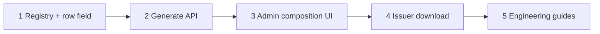

# Generated document system — implementation slices

Playbook for building the generated document system (ARF-i contract facility LO first). Source plan: `generated_document_system_c018657d` in Cursor plans.

**Yes — build in vertical slices.** Each slice should be mergeable on its own, manually verifiable, and committed before the next starts. Do not batch the whole plan into one PR unless you already finished every slice gate below.

## Rules

1. Finish one slice completely (code + automated checks + manual checks) before starting the next.
2. One commit per slice (or one commit + follow-up fix commits if a gate fails). Do not start slice N+1 on uncommitted slice N work.
3. If a manual check fails, fix it in the same slice — do not paper over it in a later slice.
4. Keep out of scope: trustee/prospectus generators, invoice LO (invoice e-sign uses Facility Agreement), Send Offer auto-generate, CMS upload of Word templates. PDFKit `GENERATED_OFFER_LETTER` remains only for in-flight envelopes.

## Slice map

| Slice | Operator-visible outcome | Main deliverables |
|-------|--------------------------|-------------------|
| **1** | Catalog exists; product JSON can store a generated type | Registry + row field parse/serialize |
| **2** | Admin/issuer can call generate and get a filled LO PDF | Generate facade + API + gates |
| **3** | Admin can pick Generated in product builder | Workflow document row editor UI |
| **4** | Issuer Download template produces the filled PDF | Issuer download wiring |
| **5** | Engineers know how to extend the system | Guides + settings-products note |



---

## Slice 1 — Registry and product row field

**Goal:** Define the catalog contract and let product document rows persist `generated_document_type` (even before UI exists).

### Build

- [ ] `packages/types/src/generated-documents.ts` — registry with `key`, `version`, `label`, `description`, `allowedContexts`, `requires`
- [ ] First entry: `arf_contract_facility_lo`, `version: 1`, `allowedContexts: ["acceptance_documents"]`
- [ ] Export from `packages/types`
- [ ] Extend acceptance (and supporting/guarantor serializers) so `generated_document_type` round-trips
- [ ] Mutual exclusion with upload template: if generated type is set, do not also require/persist a conflicting `template.s3_key` in serialize rules (follow plan)

### Automated checks

- [ ] Types package builds / monorepo typecheck for touched packages
- [ ] Unit tests for parse/serialize: row with `generated_document_type` survives round-trip; unknown keys rejected or stripped per existing patterns

### Manual verification

1. In a unit test or small script, build an acceptance document row with `generated_document_type: "arf_contract_facility_lo"` and assert serialize → parse returns the same key.
2. Confirm the catalog list helpers return exactly one type for `acceptance_documents` and none for contexts that should be empty.

### Suggested commit

```text
Add generated-document catalog and product row field

Introduce the typed registry (ARF LO v1) and round-trip
generated_document_type on document rows so later slices can
compose and generate against a stable contract.
```

### Stop gate

Do not start Slice 2 until the registry key is stable and row JSON round-trips in tests.

---

## Slice 2 — Generate API (LO)

**Goal:** An authenticated generate endpoint fills the LO via existing merge/render/Gotenberg helpers and returns PDF (docx optional).

### Prerequisites

- [ ] Slice 1 merged/committed
- [ ] Gotenberg running locally (`docker-compose.gotenberg.yml` or project equivalent)
- [ ] A contract application with offer sent (`offer_details` present) for manual testing
- [ ] Frozen `product_version` whose acceptance row includes `generated_document_type: "arf_contract_facility_lo"`  
  *(Until Slice 3 UI exists: set this via product workflow JSON / existing admin save path / DB edit of draft product then republish as you normally version products.)*

### Build

- [ ] `apps/api/src/modules/generated-documents/` facade: list/get type, `generateDocument({ type, applicationId, format })`
- [ ] Switch on catalog key; LO calls `letter-of-offer/` helpers
- [ ] Application-scoped route (issuer + admin, ownership/RBAC)
- [ ] Gates: product slot must declare the type; `requires` must be met (LO → contract offer sent). Else 400
- [ ] Log SHA-256 of template bytes (response header optional). Do not persist instances
- [ ] Keep demo routes; optionally share the same helpers

### Automated checks

- [ ] Service/unit tests: missing product slot → 400; missing offer_details → 400; happy path mocks render/convert if full Gotenberg is too heavy for CI
- [ ] Auth/RBAC smoke if the module has a pattern for it

### Manual verification

1. Start API + Gotenberg.
2. Ensure test application’s frozen product has the generated type on an acceptance row (hand-set if needed).
3. As **admin** (or issuer owner), call generate for that application + `arf_contract_facility_lo`.
4. Open the PDF: issuer identity / facility amount / guarantors (where data exists) look filled; signature lines blank; known-empty commercial fields blank.
5. Negative checks:
   - Application without offer sent → 400
   - Product row without generated type → 400
   - Wrong user / no access → 401/403 per existing API norms
6. Optional: `format=docx` returns a Word file that opens.

### Suggested commit

```text
Add generated-document API for ARF contract LO

Wrap existing LO merge/render/Gotenberg behind a catalog-gated
generate endpoint so filled PDFs can be produced on demand.
```

### Stop gate

Do not start Slice 3 until a real PDF downloads successfully and both negative gates above fail closed.

---

## Slice 3 — Admin composition UI

**Goal:** Product builders can choose Template source **None | Upload | Generated** and pick a catalog type for acceptance rows.

### Prerequisites

- [ ] Slice 2 committed (UI can be built against Slice 1 alone, but verifying end-to-end config → generate needs Slice 2)

### Build

- [ ] `workflow-document-row-editor.tsx`: Template source None | Upload | Generated
- [ ] Generated: dropdown filtered by `allowedContexts`; hide Generated when catalog empty for that context
- [ ] Mutually exclusive with `template.s3_key`
- [ ] When Generated: lock PDF + single file; default name from catalog label (editable)
- [ ] Persist via existing product save path using Slice 1 field

### Automated checks

- [ ] Admin typecheck / lint for touched files
- [ ] Any existing product-form tests updated if they assert template shape

### Manual verification

1. Admin → Settings → Products → open a contract product workflow → Acceptance document row.
2. Set Template source → **Generated** → choose ARF contract facility LO → save / publish product version as usual.
3. Re-open the product: selection still shows Generated + LO (not Upload, no stale S3 template).
4. Switch back to Upload, attach a file, save, re-open: Upload path still works; generated type cleared.
5. Switch to None: no template, no generated type.
6. Create or use an application on that product version; call generate (Slice 2) — should succeed now **without** hand-editing JSON.

### Suggested commit

```text
Add Generated template source in product document rows

Let admins compose catalog document types onto workflow rows
so LO generation can be configured without editing JSON by hand.
```

### Stop gate

Do not start Slice 4 until an admin can configure Generated in the UI and Slice 2 generate succeeds against that product version.

---

## Slice 4 — Issuer download wiring

**Goal:** Issuer **Download template** on acceptance uses generate when the row has `generated_document_type`.

### Prerequisites

- [ ] Slice 3 committed
- [ ] Test issuer account owning an application past Send Offer, on a product with Generated LO configured

### Build

- [ ] In issuer supporting-documents / acceptance reuse path (`supporting-documents-step.tsx` or shared helper): if `generated_document_type` is set, call generate endpoint instead of S3 template download
- [ ] Preserve Upload behaviour when only `template.s3_key` is set
- [ ] Sensible filename and error toasts on 400 (offer not ready / not configured)

### Automated checks

- [ ] Issuer typecheck / lint for touched files
- [ ] Optional component test if the download branch is easy to unit test; otherwise manual is enough for this slice

### Manual verification

1. As issuer, open the application → acceptance / upload step that shows the LO row.
2. Click **Download template** → browser receives a filled PDF (not an empty uploaded blank).
3. Spot-check a few filled fields against the application.
4. Upload a completed copy as usual; submit acceptance still works.
5. Regression: a different acceptance row that still uses **Upload** template downloads from S3 as before.
6. As admin, confirm generate/download still allowed where RBAC already permits (if admin UI has a parallel control; otherwise API check from Slice 2 is enough).

### Suggested commit

```text
Wire issuer template download to generated documents

When a product row uses a catalog type, Download template calls
generate so issuers receive a filled LO PDF for that application.
```

### Stop gate

Do not start Slice 5 until the full operator path works: Admin configures → Issuer downloads filled PDF → Issuer uploads completed file.

---

## Slice 5 — Engineering guides

**Goal:** Document how the system works and how to extend it, without changing runtime behaviour.

### Prerequisites

- [ ] Slices 1–4 committed (docs should describe what actually shipped)

### Build

- [ ] `docs/guides/generated-documents/README.md` — system overview (git source of truth; product_version vs template version; do not overwrite issued uploads)
- [ ] `add-a-document-type.md` — checklist from the plan
- [ ] `add-a-placeholder.md` — EXISTS / DERIVE / LEGAL_DEFAULT / EMPTY / SIGNEE
- [ ] `lo-data-sources.md` — what the builder does today + pending legal fields (link detailed placeholder map)
- [ ] Short section in `docs/settings-products.md` for Generated template source
- [ ] Link this playbook from the README as historical/build context (optional)

### Automated checks

- [ ] Links resolve; no need for code tests

### Manual verification

1. Skim README as an operator: three layers make sense.
2. Walk `add-a-document-type.md` against what was actually implemented — steps match file paths.
3. Confirm `lo-data-sources.md` matches current empty vs filled behaviour from Slice 2/4 PDFs.
4. Confirm `settings-products.md` mentions Generated and points at the guides.

### Suggested commit

```text
Document generated-document catalog and extension guides

Capture how operators compose types and how engineers add
document types, placeholders, and LO data sources.
```

### Stop gate

Plan complete when guides match the shipped behaviour. New document types start from `add-a-document-type.md`, not by copying this playbook.

**Status:** Slices 1–5 shipped. Guides live under `docs/guides/generated-documents/`.

---

## Quick reference — full operator path (after Slice 4)

1. **Admin** sets Acceptance row → Template **Generated** → ARF contract facility LO → save product version.
2. **Ops/Admin** sends contract offer on an application using that product version.
3. **Issuer** opens acceptance step → **Download template** → filled PDF.
4. **Issuer** signs/completes offline → **uploads** completed file → submits as today.

## If you get stuck between slices

| Symptom | Likely slice to revisit |
|---------|-------------------------|
| Dropdown empty / type missing | 1 (registry) or 3 (context filter) |
| 400 “not on product” | 3 config not on frozen version, or app not on that version |
| 400 offer/requires | 2 gate; offer not sent |
| Blank/wrong PDF fields | Existing LO builder — not a composition bug; track via placeholder map |
| Download still hits S3 | 4 branch not detecting `generated_document_type` |
| Gotenberg / conversion errors | Local Gotenberg; Slice 2 infra — not UI |

## Related

- Cursor plan id: `generated_document_system_c018657d`
- Placeholder detail: [arf-letter-of-offer-placeholder-map.md](../application-flow/arf-letter-of-offer-placeholder-map.md)
- Offer acceptance phases: [offer-acceptance-and-signing-phases.md](../application-flow/offer-acceptance-and-signing-phases.md)
