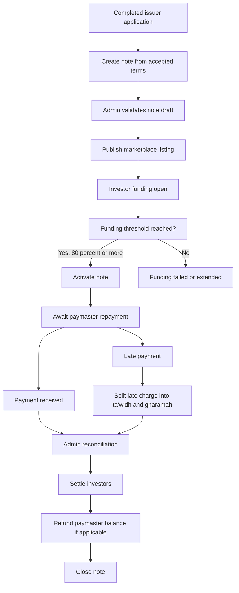

# Note Lifecycle Management Plan

This document proposes the future note lifecycle from the point where a completed issuer application becomes an investable note. It covers marketplace listing, investor funding, admin controls, repayments, late payments, partial and advance payments, paymaster refunds, ledger requirements, and implementation phases.

## Scope

The note lifecycle starts after issuer application completion.

In scope:

- Creating notes from accepted application/contract/invoice offers.
- Admin note review, publication, marketplace controls, funding controls, servicing controls, and exception handling.
- Investor marketplace listing and investment commitments.
- Successful funding threshold at 80% or more of target funding.
- Paymaster repayment handling for invoice/contract financing, using the existing customer/paymaster data captured during issuer origination.
- Investor settlement.
- Platform fee handling.
- Refund to paymaster when funding percentage is below 100%.
- Late payment calculations borne by the issuer.
- Late payment split into ta'widh and gharamah accounts for Syariah compliance.
- Ledger, audit, reconciliation, and reporting foundations.

Out of scope for the first implementation pass unless explicitly added:

- Secondary market trading.
- Automated bank rails.
- Tax reporting.
- Full accounting system integration.
- Regulatory reporting exports beyond internal admin reports.

## Current Codebase Findings

Current state:

- Admin sidebar already includes `Notes` at `/notes` in `apps/admin/src/components/app-sidebar.tsx`.
- There is no `apps/admin/src/app/notes/page.tsx`.
- Admin sidebar also includes `Investments` at `/investments`, but that page is also missing.
- Investor dashboard links to `/investments`, but `apps/investor/src/app` has no investments or marketplace route.
- Notification `NEW_PRODUCT_ALERT` links to `/investments/:productId`, but that route does not exist.
- Active origination data lives in `Application`, `Contract`, and `Invoice`.
- `Loan` and `Investment` models exist in Prisma but are not wired into active `/v1` routes.
- Paymaster/obligor data is already captured in the origination flow, primarily as `Contract.customer_details`; admin UI also labels this counterparty as Paymaster.
- There is no `Note`, `NoteInvestment`, `Repayment`, `Payment`, `Settlement`, ledger table, or normalized `Paymaster` table.

Key files:

- `apps/admin/src/components/app-sidebar.tsx`
- `apps/admin/src/app/contracts/page.tsx`
- `apps/admin/src/contracts/hooks/use-contracts.ts`
- `apps/api/prisma/schema.prisma`
- `apps/api/src/routes.ts`
- `apps/api/src/modules/admin/controller.ts`
- `apps/api/src/modules/admin/service.ts`
- `apps/api/src/modules/applications/lifecycle.ts`
- `apps/api/src/lib/contract-facility.ts`
- `apps/api/src/lib/invoice-offer.ts`
- `packages/config/src/api-client.ts`
- `packages/types/src/index.ts`
- `apps/investor/src/app/page.tsx`
- `apps/investor/src/components/account-overview-card.tsx`
- `apps/api/src/modules/notification/registry.ts`

## Recommended Domain Boundary

Do not treat a note as an application status. A note should be its own domain object.

Applications are origination records:

- Product selection.
- Issuer submission.
- Admin review.
- Contract/invoice offer.
- Issuer acceptance/signing.

Notes are financing instruments:

- Marketplace listing.
- Investor commitments.
- Funding close.
- Servicing.
- Repayment.
- Settlement.
- Refunds.
- Late/default handling.
- Ledger and reporting.

The note creation process should copy accepted commercial terms from application/contract/invoice records into immutable note fields. The note may reference source rows, but its financial ledger should not depend on mutable JSON payloads from the application flow.

## Paymaster Source Data

The paymaster is not a new party that admins should need to enter from scratch.

In this platform, the paymaster is the company/customer that gives the invoice or contract to the issuer. The issuer uses that receivable to raise financing, and the paymaster is expected to pay the obligation back directly.

Current implementation notes:

- The issuer flow generally calls this party `customer`.
- The backend stores the data primarily in `Contract.customer_details`.
- Invoice-only applications can still use a contract row to hold customer details, even when there is no contract offer flow.
- Admin application review already derives and displays this party as Paymaster from `customer_details` and related application/company data.

Future note implementation should therefore:

- Read paymaster data from the completed source application, contract, and invoice context.
- Snapshot the paymaster fields onto the note at creation time for auditability.
- Optionally normalize the paymaster into a dedicated counterparty table for concentration limits, reporting, and future reuse.
- Avoid making paymaster creation a separate manual admin step unless the source data is incomplete.

## Money Flow Context

The product money-flow diagrams add an important operating model: note funding and repayment should be modeled through platform pools/accounts, not just as direct status changes on a note.

High-level pools and accounts:

- `Investor Pool` receives investor deposits and holds investor balances used to fund notes.
- `Repayment Pool` receives financing repayment from the buyer/paymaster.
- `Operating Account` receives CashSouk platform and service fees.
- `Ta'widh Account` receives the late payment fee component, if applicable.
- `Gharamah Account` receives the penalty charge component, if applicable.

Proposed money movement:

1. Investor deposits enter the Investor Pool.
2. Platform fee can move from the Investor Pool or funding workflow into the Operating Account, depending on final fee policy.
3. Successful note disbursement moves funded capital from the Investor Pool to the SME/issuer.
4. The buyer/paymaster pays financing repayment into the Repayment Pool.
5. The Repayment Pool distributes investor principal plus profit/return back into the Investor Pool.
6. Service fee moves from the Repayment Pool to the Operating Account.
7. Late payment fee, if any, moves from the Repayment Pool or issuer receivable workflow into the Ta'widh Account.
8. Penalty charge, if any, moves into the Gharamah Account.
9. Investor withdrawals move available investor balance out of the Investor Pool.

Implementation implication:

- These pools/accounts should map to ledger accounts in `NoteAccount` and immutable postings in `NoteLedgerEntry`.
- The UI can show note status, but finance operations should be driven by balanced ledger movements between pools/accounts.
- Late payment servicing must keep ta'widh and gharamah separate from platform operating income.
- If the paymaster repayment exceeds what is needed for investor principal, investor return, fees, and late charges, the remaining balance is payable/refundable according to the note terms and final product policy.

## Perspective Overview

### Investor

The investor deposits funds into the Investor Pool, browses marketplace notes, commits an investment amount, and waits for the note to reach the successful funding threshold. After the note is activated and later repaid by the paymaster, the investor receives principal plus agreed profit/return back into the Investor Pool. The investor can then withdraw available balance.

Investor-facing controls should show:

- available balance,
- open marketplace notes,
- funding progress,
- committed amount,
- active investments,
- expected maturity and return,
- repayment status,
- available withdrawal balance.

### Issuer

The issuer is the SME that owns the invoice/contract receivable and raises financing against it. After onboarding, the issuer creates a financing application, pays any required financing processing fee, submits the application, responds to admin amendments, and accepts/signs the offer. Once the note is successfully funded, funds are disbursed to the issuer. If payment is late, late payment charges are borne by the issuer.

Issuer-facing controls should show:

- application and amendment status,
- offer status,
- note listing/funding status after acceptance,
- disbursement status,
- late payment obligations where applicable.

### Paymaster

The paymaster is the buyer/customer/obligor from the source invoice or contract. This data already exists in origination as customer/paymaster details. The paymaster does not fund the note; the paymaster repays the financing obligation into the Repayment Pool when the invoice/contract is due.

Paymaster-related admin data should show:

- source customer/paymaster details,
- invoice or contract obligation,
- due date,
- repayment receipt status,
- partial or full payment history,
- refund/payable balance if applicable.

### Admin

Admin owns the operational lifecycle across origination, listing, funding close, servicing, reconciliation, and exceptions. Admin creates or validates the note from accepted issuer terms, publishes it to the marketplace, monitors funding, closes funding at or above 80%, activates the note, records paymaster repayments, calculates fees and late charges, approves reconciliation, posts ledger entries, settles investors, and handles refunds/withdrawals/exceptions.

Admin controls should cover:

- note creation from completed applications,
- source data validation and snapshot,
- marketplace publishing,
- funding close/fail/extension,
- disbursement confirmation,
- repayment receipt recording,
- partial, advance, and late payment handling,
- ta'widh and gharamah split approval,
- service fee and platform fee posting,
- investor settlement,
- paymaster refund/payable workflow,
- audit trail and ledger export.

## Proposed End-to-End Flow

## Proposed Note State Model

Use separate status dimensions instead of one large state enum.

`note.status`:

- `DRAFT`
- `READY_FOR_REVIEW`
- `LISTED`
- `FUNDING_OPEN`
- `FUNDING_SUCCESSFUL`
- `FUNDING_FAILED`
- `ACTIVE`
- `REPAID`
- `SETTLED`
- `DEFAULTED`
- `CANCELLED`

`note.servicing_status`:

- `NOT_STARTED`
- `AWAITING_PAYMASTER_PAYMENT`
- `PARTIALLY_PAID`
- `PAID_EARLY`
- `PAID_ON_TIME`
- `LATE`
- `RECONCILING`
- `DISPUTED`
- `CLOSED`

`note.funding_status`:

- `NOT_LISTED`
- `OPEN`
- `SOFT_FILLED`
- `FULLY_FILLED`
- `CLOSED_SUCCESSFUL`
- `CLOSED_UNSUCCESSFUL`
- `REFUNDED`

`note.reconciliation_status`:

- `NOT_REQUIRED`
- `PENDING`
- `BALANCED`
- `OUT_OF_BALANCE`
- `APPROVED`
- `POSTED`

This keeps marketplace, servicing, and accounting workflows independent.

## Proposed Data Model

Use new note tables rather than reviving the disconnected legacy `Loan` and `Investment` tables without migration design.

Core origination linkage:

- `Note`
  - `id`
  - `note_number`
  - `source_application_id`
  - `source_contract_id`
  - `source_invoice_id`
  - `issuer_organization_id`
  - `product_id`
  - `product_version`
  - `paymaster_id` or `paymaster_snapshot`
  - `status`
  - `funding_status`
  - `servicing_status`
  - `reconciliation_status`
  - `currency`
  - `invoice_face_value`
  - `funding_target_amount`
  - `min_successful_funding_percent`
  - `max_funding_percent`
  - `funded_amount`
  - `funded_percent`
  - `expected_profit_rate_percent`
  - `platform_fee_amount`
  - `platform_fee_rate_percent`
  - `issue_date`
  - `maturity_date`
  - `payment_due_date`
  - `terms_snapshot`
  - `created_by_admin_user_id`
  - `published_by_admin_user_id`
  - timestamps

- `Paymaster` or `PaymasterCounterparty`
  - Optional normalized record derived from existing source customer/paymaster data.
  - Should link back to contract/invoice `customer_details` when created.
  - If normalization is deferred, `Note.paymaster_snapshot` should hold the frozen customer/paymaster fields needed for servicing, investor disclosure, and audit.

Marketplace and funding:

- `NoteListing`
  - `note_id`
  - listing title/summary/risk rating/disclosure snapshot
  - `published_at`
  - `opens_at`
  - `closes_at`
  - `visibility`
  - `is_featured`
  - `min_investment_amount`
  - `max_investment_amount`

- `NoteInvestment`
  - `note_id`
  - `investor_organization_id`
  - `investor_user_id`
  - `amount`
  - `status`
  - `committed_at`
  - `confirmed_at`
  - `cancelled_at`
  - `refunded_at`

Servicing and repayment:

- `NotePaymentSchedule`
  - due dates and expected receivable amounts.

- `NotePayment`
  - payment receipts from paymaster.
  - supports full, partial, and advance payments.
  - stores bank reference, received date, value date, amount, method, and reconciliation state.

- `NoteSettlement`
  - settlement batch for investor principal/profit, platform fee, paymaster refund, ta'widh, and gharamah.

Ledger:

- `NoteLedgerEntry`
  - immutable accounting entries for all note movements.
  - store amount as `numeric(18,6)`.
  - include debit/credit account, counterparty, source event, and idempotency key.

- `NoteAccount`
  - logical accounts such as investor payable, platform fee income, paymaster refund payable, ta'widh compensation, and gharamah charity.

Audit:

- `NoteEvent`
  - timeline events for note creation, listing, funding, payment, reconciliation, settlement, late charge assessment, and admin overrides.

- `NoteAdminAction`
  - admin action log with actor, reason, before/after values, correlation ID, and approval state.

## Monetary Rules

All note, investment, repayment, settlement, and ledger values should use database `numeric(18,6)` and decimal-safe application logic. Do not use floating-point math for note servicing.

Recommended amount fields:

- Store money in the database as `numeric(18,6)`.
- Send money through API DTOs as strings or decimal-safe serialized values.
- Format money only at the UI boundary.
- Store percentages as decimal columns with enough precision, for example `numeric(9,6)`.
- Round only at posting boundaries, not during intermediate calculations.

## Funding Rules

Definitions:

- `invoice_face_value` - paymaster obligation amount for the invoice or accepted receivable.
- `funding_target_amount` - amount opened to investors.
- `funded_amount` - confirmed investor capital.
- `funded_percent = funded_amount / funding_target_amount * 100`.
- `min_successful_funding_percent = 80`.

Rules:

- Admin can publish a note only after accepted source terms are frozen.
- Marketplace funding opens with a target and a close date.
- Funding is successful when confirmed investments reach at least 80% of the target.
- Funding may continue until 100% if still within the listing window and admin policy allows.
- Admin can close funding when it is at least 80%.
- Funding below 80% at close should either fail, extend, or require explicit admin override depending on product rules.
- Investor allocations must be locked before note activation.
- If funding fails, confirmed investor funds must be refunded or released according to the payment rail model.

## Paymaster Repayment and Refund Logic

Paymaster repayment assumption:

- Paymaster means the existing customer/obligor from the source contract or invoice, not a newly-entered party.
- Paymaster repays the invoice/contract financing obligation in full.
- If investor funding is below 100%, the unfunded balance exists as surplus after investor and platform obligations are satisfied.
- The balance, less applicable platform fee, is refunded to the paymaster.

Proposed settlement waterfall:

1. Record paymaster receipt.
2. Match receipt to note and payment schedule.
3. Allocate investor principal repayment based on confirmed investment allocations.
4. Allocate investor profit according to accepted note terms.
5. Allocate platform fee.
6. Allocate late charges if applicable.
7. Allocate paymaster refund for surplus caused by funding below 100%.
8. Post ledger entries.
9. Mark settlement as approved and posted.

Formula baseline:

- `funding_gap_amount = funding_target_amount - funded_amount`
- `paymaster_receipt_amount = amount received from paymaster`
- `investor_principal_due = funded_amount`
- `investor_profit_due = calculated from note terms`
- `platform_fee_due = configured fee amount or rate-based calculation`
- `late_charge_due = ta'widh_amount + gharamah_amount`
- `paymaster_refund_due = paymaster_receipt_amount - investor_principal_due - investor_profit_due - platform_fee_due - late_charge_due`

The refund should never be posted from a negative value. If the formula is negative, the note is underpaid and should remain in partial or exception state.

Open accounting decision:

- Confirm whether platform fee is deducted from the total paymaster receipt, the unfunded balance, issuer proceeds, investor return, or another contractual base. The implementation should make this configurable per product/note until the policy is finalized.

## Payment Scenarios

### Full On-Time Payment

Admin controls:

- Record payment receipt.
- Match payment to note.
- Preview settlement waterfall.
- Approve reconciliation.
- Post ledger.
- Mark investors settled.
- Process paymaster refund if any.
- Close note.

### Partial Payment

Admin controls:

- Record partial receipt.
- Choose allocation method:
  - pro rata to investors,
  - fees first,
  - principal first,
  - manual allocation with approval.
- Keep remaining receivable open.
- Update note to `PARTIALLY_PAID`.
- Show outstanding principal, profit, fee, refund, and late charge projections.
- Support later top-up payments.

Recommended default:

- Use pro rata investor allocation unless a product-level waterfall says otherwise.
- Require finance approval before posting manual overrides.

### Advance Payment

Admin controls:

- Record early receipt.
- Calculate settlement as of value date.
- Recompute profit if early payment affects profit under the note terms.
- Preview early-payment adjustment.
- Approve and post settlement.

Open policy decision:

- Confirm whether advance payment reduces expected profit, preserves original profit, or applies a product-specific rebate.

### Late Payment

Late payments are borne by the issuer.

Admin controls:

- Detect late payment from due date and grace period.
- Calculate days late.
- Calculate late charge.
- Split late charge into:
  - ta'widh compensation account,
  - gharamah charity account.
- Show calculation basis and approval history.
- Allow approved adjustment or waiver.
- Post late charge ledger entries.
- Track issuer receivable separately from paymaster receipt if the paymaster pays the principal obligation but issuer owes late charges.

Recommended baseline fields:

- `due_date`
- `grace_period_days`
- `late_start_date`
- `days_late`
- `late_charge_base_amount`
- `tawidh_rate`
- `gharamah_rate`
- `tawidh_amount`
- `gharamah_amount`
- `late_charge_status`
- `waived_amount`
- `waiver_reason`
- `approved_by_admin_user_id`

Open policy decision:

- Confirm the exact ta'widh and gharamah rates, caps, rounding, grace period, and whether the split applies daily, monthly, or at final settlement.

## Admin Notes Page

Route:

- `apps/admin/src/app/notes/page.tsx`
- Optional detail route: `apps/admin/src/app/notes/[id]/page.tsx`

Recommended page structure:

- Summary cards:
  - draft notes,
  - listed notes,
  - funding open,
  - funding successful,
  - active servicing,
  - overdue,
  - pending reconciliation,
  - settled.
- Filters:
  - status,
  - funding status,
  - servicing status,
  - product,
  - issuer,
  - paymaster,
  - maturity range,
  - due date range,
  - risk rating,
  - funding percent.
- Main table:
  - note number,
  - issuer,
  - paymaster,
  - source invoice/contract,
  - target amount,
  - funded amount/percent,
  - due date,
  - status,
  - servicing state,
  - next required action.

Recommended detail page sections:

- Source application snapshot.
- Note terms.
- Marketplace listing controls.
- Funding allocations.
- Investor allocation table.
- Payment schedule.
- Payment receipts.
- Settlement waterfall preview.
- Late payment calculator.
- Paymaster refund calculator.
- Ledger entries.
- Documents and signed offer letters.
- Timeline and audit log.

Admin actions:

- Create note from completed application.
- Edit draft note terms before publishing.
- Validate source data and freeze source snapshot.
- Publish listing.
- Unpublish listing before investor commitments.
- Pause/resume funding.
- Extend listing close date.
- Close funding at 80% or more.
- Mark funding failed and trigger refunds/releases.
- Activate note.
- Record paymaster payment.
- Record partial payment.
- Record advance payment.
- Calculate late charges.
- Approve or waive late charge.
- Split late charge into ta'widh and gharamah.
- Preview settlement waterfall.
- Approve reconciliation.
- Post ledger entries.
- Trigger investor settlement.
- Trigger paymaster refund.
- Mark settled.
- Open dispute/exception.
- Attach supporting documents.
- Export ledger and settlement reports.

## Investor Marketplace

Investor routes to add:

- `apps/investor/src/app/investments/page.tsx`
- `apps/investor/src/app/investments/[id]/page.tsx`
- Optional portfolio route if not folded into dashboard.

Marketplace capabilities:

- List open notes.
- View note details and risk disclosures.
- Show issuer/paymaster summary with PII masking.
- Show target amount, funded percent, remaining amount, maturity, expected return, and risk rating.
- Enforce investor onboarding, AML, and suitability checks.
- Enforce sophisticated investor rules and RM 50,000 cap for non-sophisticated investors where applicable.
- Create investment commitment.
- Show investment status and allocation.
- Show repayment and settlement history after activation.

Existing investor gaps:

- Dashboard financial widgets are placeholders.
- `/investments` and `/transactions` routes are missing.
- Deposit/payment rail is marked coming soon.
- Notification link semantics currently use `productId`; future marketplace links should use `noteId`.

## Backend API Proposal

Admin APIs:

- `GET /v1/admin/notes`
- `GET /v1/admin/notes/:id`
- `POST /v1/admin/notes/from-application/:applicationId`
- `PATCH /v1/admin/notes/:id/draft`
- `POST /v1/admin/notes/:id/publish`
- `POST /v1/admin/notes/:id/unpublish`
- `POST /v1/admin/notes/:id/funding/close`
- `POST /v1/admin/notes/:id/funding/fail`
- `POST /v1/admin/notes/:id/activate`
- `POST /v1/admin/notes/:id/payments`
- `POST /v1/admin/notes/:id/late-charge/calculate`
- `POST /v1/admin/notes/:id/late-charge/approve`
- `POST /v1/admin/notes/:id/settlements/preview`
- `POST /v1/admin/notes/:id/settlements/approve`
- `POST /v1/admin/notes/:id/settlements/post`
- `GET /v1/admin/notes/:id/ledger`
- `GET /v1/admin/notes/:id/events`

Investor APIs:

- `GET /v1/marketplace/notes`
- `GET /v1/marketplace/notes/:id`
- `POST /v1/marketplace/notes/:id/investments`
- `GET /v1/investor/investments`
- `GET /v1/investor/investments/:id`
- `GET /v1/investor/portfolio`

All routes should use zod validation, response envelopes, correlation IDs, structured logs, and role/ownership checks consistent with existing backend rules.

## Services and Modules

Recommended backend modules:

- `apps/api/src/modules/notes`
  - note controller, service, repository, schemas.
- `apps/api/src/modules/marketplace`
  - investor-facing listing and commitment APIs.
- `apps/api/src/modules/note-ledger`
  - immutable ledger posting and balance checks.
- `apps/api/src/modules/note-servicing`
  - repayments, late charges, settlements, refunds.

Recommended frontend modules:

- `apps/admin/src/notes`
  - hooks, query keys, table, toolbar, detail sections, calculators.
- `apps/investor/src/investments`
  - marketplace hooks, cards, detail page, invest flow, portfolio widgets.
- `packages/types`
  - note DTOs, statuses, request/response types.
- `packages/config`
  - typed API client methods and note formatting helpers.

## Ledger and Audit Requirements

Ledger rules:

- Every posted financial movement must have immutable ledger entries.
- Every ledger entry must have an idempotency key.
- Every settlement batch must balance before posting.
- Admin previews should not create posted ledger entries.
- Adjustments and waivers should post reversing or adjustment entries rather than editing posted entries.
- Manual overrides require reason and approver.

Audit rules:

- Store before/after values for sensitive note actions.
- Record actor, role, IP, user agent, correlation ID, and timestamp.
- Do not log PII or bank account details in plain text.
- Surface note timeline in admin detail view.

## Syariah Late Payment Handling

Assumption selected for planning:

- Late payment is split into ta'widh and gharamah.

Recommended model:

- Ta'widh is compensation/recovery and can be tracked separately from platform fee income.
- Gharamah is a charity-bound amount and must be tracked in a separate account.
- Admin should see the split before approval.
- Settlement should prevent posting if the late charge split is missing, unapproved, or out of balance.
- Reports should separately export ta'widh and gharamah amounts.

Implementation should keep rates, caps, rounding, and grace period configurable by note/product because final policy may depend on Shariah board approval.

## Implementation Phases

### Phase 1: Foundation

- Add note domain types and Prisma models.
- Add migrations with numeric money columns.
- Add backend note module with admin list/detail/read APIs.
- Add note creation from completed application.
- Add immutable source snapshot fields.
- Add basic note event log.
- Add `packages/types` and `packages/config` client methods.

### Phase 2: Admin Notes Page

- Create `/notes` admin page.
- Add list filters, summary cards, and note table.
- Add note detail page or modal.
- Add draft validation, publish controls, and source application context.
- Reuse admin list patterns from contracts and users pages.

### Phase 3: Marketplace and Funding

- Add investor marketplace routes.
- Add investor note detail page.
- Add investment commitment API.
- Enforce investor eligibility and caps.
- Track funding percent and successful funding threshold.
- Fix notification route semantics from product ID to note ID.
- Add admin controls for close/extend/fail funding.

### Phase 4: Servicing and Payments

- Add payment schedule and payment receipt models.
- Add admin payment recording.
- Add settlement waterfall preview.
- Add partial and advance payment handling.
- Add investor portfolio/repayment display.

### Phase 5: Late Payment and Refunds

- Add late payment calculator.
- Add ta'widh/gharamah split.
- Add fee/refund calculator.
- Add paymaster refund workflow.
- Add reconciliation approval and ledger posting.
- Add exports for finance and compliance.

### Phase 6: Hardening

- Add unit tests for calculators.
- Add service tests for state transitions.
- Add integration tests for note creation, funding close, payment posting, and settlement.
- Add Playwright smoke tests for admin notes and investor marketplace.
- Add seed scenarios for completed application to note, 80% funded note, 100% funded note, partial payment, advance payment, late payment, and refund.

## Testing Strategy

Backend unit tests:

- Funding threshold calculation.
- Investor allocation calculation.
- Settlement waterfall.
- Paymaster refund formula.
- Partial payment allocation.
- Advance payment adjustment.
- Late payment day count.
- Ta'widh/gharamah split.
- Ledger balance validation.

Backend integration tests:

- Create note from completed application.
- Reject note creation from ineligible application.
- Publish listing.
- Invest in note.
- Close funding at 80%.
- Fail funding below 80%.
- Record paymaster full payment.
- Record partial payment.
- Record late payment and split charges.
- Post settlement and prevent duplicate posting.

Frontend tests:

- Admin can navigate to `/notes`.
- Admin can filter notes.
- Admin can open note detail.
- Admin can preview settlement.
- Investor can open `/investments`.
- Investor can view a note detail.
- Investor cannot invest when not eligible.

## Key Open Decisions

These should be resolved before implementation begins:

- Exact platform fee basis and timing.
- Exact investor profit calculation for early, on-time, partial, and late payment.
- Exact ta'widh and gharamah rates, caps, rounding, and grace period.
- Whether investor funds are actually held before 80% close or only committed/reserved.
- Whether funding can close automatically at 100% or requires admin approval.
- Whether paymaster should be normalized immediately as a standalone counterparty/entity or initially stored as a note-level snapshot derived from source `customer_details`.
- Whether existing `Loan` and `Investment` tables should be archived, renamed, migrated, or ignored in favor of new note tables.
- Whether manual admin overrides need maker-checker approval for finance actions.

## Recommended First Build Slice

The safest first slice is admin-visible note creation and review without investor money movement:

1. Create normalized note tables and source snapshots.
2. Create notes from completed applications.
3. Build admin `/notes` list and detail.
4. Validate immutable terms and publish readiness.
5. Add read-only marketplace listing API from published notes.

After that, add investment commitments, funding close, servicing, payment receipt, settlement, late payment, and refund workflows in separate slices.

