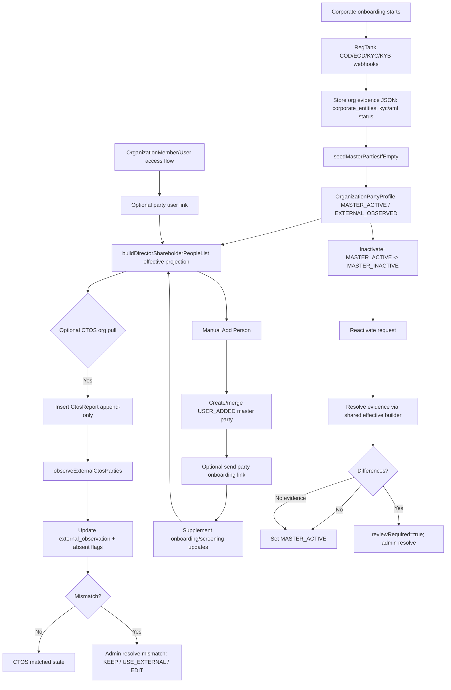
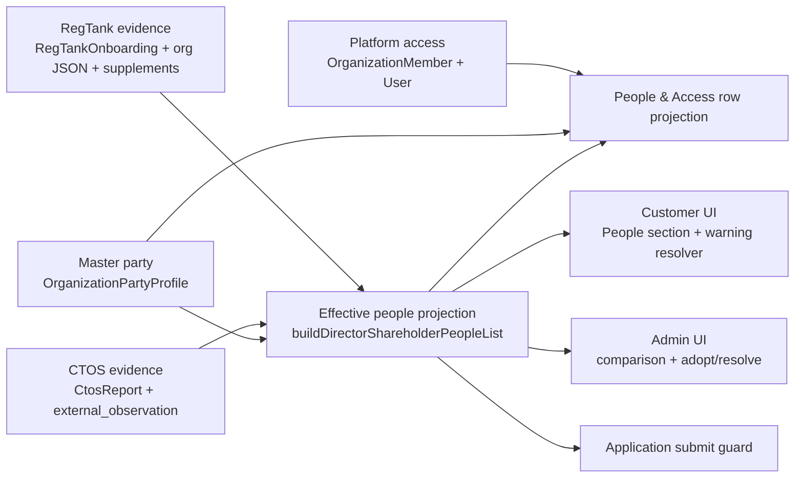

# Company People Lifecycle (Issuer + Investor)

Last audited: 2026-09-14  
Scope: company accounts only (`issuer` and `investor`), excluding personal issuer.

## 1) Concepts and Source-of-Truth

- **MASTER (authoritative company person record):** `OrganizationPartyProfile` rows in `MASTER_ACTIVE`/`MASTER_INACTIVE`.
- **REGTANK evidence:** webhook/response data stored on `RegTankOnboarding.webhook_payloads`, org JSON fields (`corporate_entities`, `director_kyc_status`, `director_aml_status`, `business_aml_status`), and party supplement onboarding/screening snapshots.
- **CTOS evidence:** append-only `CtosReport` snapshots; per-party comparison snapshot in `OrganizationPartyProfile.external_observation`.
- **PLATFORM ACCESS:** `OrganizationMember` + `User`; optional `OrganizationPartyProfile.user_id` link.
- **PEOPLE LIST (`people[]`):** runtime projection from multiple sources; not a persisted table.
- **APPLICATION:** submit guard consumes current effective people projection at submit/resubmit time (not frozen per row in a dedicated party table).

## 2) Data Models (Master vs Evidence)

## Core Org + Person

- **`IssuerOrganization` / `InvestorOrganization`**
  - Represents organization account and org-level onboarding state.
  - Holds evidence JSON: `corporate_entities`, `director_kyc_status`, `director_aml_status`, `business_aml_status`, `corporate_onboarding_data`.
  - Editable via onboarding/profile flows; survives source changes unless explicitly overwritten by webhook updates.
  - Key: `id`.

- **`OrganizationPartyProfile`**
  - Master company person/entity row (`origin`, roles, shareholding, identity, `membership_status`).
  - `external_observation` stores latest comparable CTOS/effective evidence snapshot used for mismatch review.
  - `mismatches` are computed DTO-time from master vs `external_observation`.
  - Editable (user/admin with field locking rules).
  - Matching key: `party_key` + identity normalization (`findExistingPartyForIdentityKey`).
  - `user_id` is optional durable person-to-user link (not access grant).

- **`OrganizationMember`**
  - Access grant for portal user role (`ORGANIZATION_ADMIN` / `ORGANIZATION_MEMBER`).
  - Not a company-role record.
  - Key: composite unique `(user_id, org_id)` per portal.

- **`User`**
  - Platform identity/login account.
  - May exist without any company person row.
  - Key: `user_id`.

## Onboarding + CTOS evidence

- **`RegTankOnboarding`**
  - Tracks onboarding sessions (`request_id`, `reference_id`, status, payload history).
  - Evidence table; not master company-person table.
  - Key: `request_id` / `reference_id`.

- **`CtosReport`**
  - Append-only CTOS snapshots (`subject_ref=null` for org snapshot; non-null for subject reports).
  - Does not overwrite master directly.
  - Key: row `id`; latest selected by `fetched_at desc`.

- **`CtosPartySupplement`**
  - Per-party auxiliary onboarding/screening state keyed by `party_key` and org.
  - Stores onboarding request id/email/verify-link + screening snapshot in `onboarding_json`.
  - Evidence/supporting state; not the master role/identity record.

## Invitations and application relations

- **`IssuerOrganizationInvitation` / `InvestorOrganizationInvitation`**
  - Access invitation records.
  - Optional `organization_party_profile_id` makes them person-scoped.
  - Email is delivery/acceptance routing, not person identity key.

- **`Application` / `ApplicationRevision`**
  - No dedicated persisted `application_people` relation.
  - `ApplicationRevision.snapshot` includes company section snapshots + org snapshot, but submit guards read live org party projection at submit/resubmit.

## 3) Person Concept Boundaries (Verified)

- **Master Person:** `OrganizationPartyProfile` (`MASTER_ACTIVE` / `MASTER_INACTIVE`) = current company person record.
- **RegTank Evidence:** onboarding + KYC/KYB/AML evidence from webhook payloads and org/supplement JSON.
- **CTOS Evidence:** `CtosReport` and party `external_observation` comparison snapshot.
- **Platform Access:** `OrganizationMember` and `User` rows; independent from company roles.

Confirmed separation in code:
- Company person can exist without platform access (`platformAccess = No access`).
- Platform member can exist without company role (`platform_only` row).
- No merge by email for person identity linkage.

## 4) Initial Corporate Onboarding Flow (RegTank -> Master)

1. COD webhook (`WAIT_FOR_APPROVAL`) parses and stores:
   - `corporate_entities` (directors/shareholders/corporateShareholders),
   - `director_kyc_status`,
   - onboarding/supporting JSON (`corporate_onboarding_data`, docs, declarations).
2. `seedMasterPartiesIfEmpty()` resolves regulatory candidates from CTOS and RegTank evidence.
3. If regulatory structure not yet established:
   - use CTOS candidates when CTOS has usable related parties, else RegTank candidates;
   - create/fill `OrganizationPartyProfile` rows (`MASTER_ACTIVE` or `EXTERNAL_OBSERVED` for gated cases like under-threshold shareholder-only).
4. Identity key matching uses normalized identity/business numbers (`normalizeDirectorShareholderIdKey`, `findExistingPartyForIdentityKey`).
5. Director + shareholder are merged by key in candidate merge and people projection.
6. EOD/KYC/KYB statuses remain in evidence JSON/supplements; master is not replaced wholesale by evidence payloads.
7. Corporate shareholders are represented as `entityType=CORPORATE`, `is_shareholder=true`, identity prefix `ROC`, keyed by business registration number.

## 5) Effective People List (`buildDirectorShareholderPeopleList`)

`people[]` is a **merged effective projection with source precedence and fallback**, not master-only.

Algorithm:

1. Normalize CTOS company JSON.
2. If CTOS missing:
   - build from user-declared evidence (`corporate_entities` + kyc/aml JSON + supplements),
   - `listSource = ONBOARDING`.
3. If CTOS present:
   - build CTOS-derived people.
   - if no visible usable rows -> fallback to user-declared build, `listSource = CTOS_EMPTY`, set CTOS-empty warning.
   - else `listSource = CTOS`.
4. If no master parties loaded: return above result.
5. If master parties loaded:
   - During initial onboarding and `listSource=CTOS`, CTOS is structural baseline (`ctosAuthoritative=true`), then inject later-added master parties.
   - Otherwise retain only active master-operational keys and merge master parties back in (`preferMasterValues` when not initial onboarding).
6. Stamp parent corporate request id and apply master email override by key.

Result: `people[]` = effective, filtered, role-gated operational projection.

## 6) Source Precedence / Fallback Matrix (Resolution Rules)

- **CTOS usable + initial onboarding:** CTOS structure wins for baseline row set, then later user-added master rows may be injected.
- **CTOS empty/unusable:** fallback to RegTank/onboarding evidence build (`CTOS_EMPTY` marker), then master merge rules still apply.
- **Post-initial lifecycle (onboarding completed/rejected):** stored `MASTER_ACTIVE` parties become authoritative for shared fields when merged (`preferMasterValues`).
- **User-added master parties:** always represented via master merge if active and operational.
- **Inactive master parties:** excluded from active operational people projection.
- **Observed-only parties (`EXTERNAL_OBSERVED`):** visible in admin party view as observed candidates; not active master until adopted.

## 7) Does CTOS Become Truth Automatically?

No automatic overwrite of master.

When CTOS org report is pulled:
- new `CtosReport` row is inserted (append-only),
- `observeExternalCtosParties()` updates/creates comparison snapshots and observed rows,
- master row values are not auto-overwritten with CTOS values.

Master changes from CTOS require explicit actions:
- **Adopt new observed party** (`adoptObservedParty`) -> `EXTERNAL_OBSERVED` to `MASTER_ACTIVE`.
- **Resolve mismatch** (`resolvePartyMismatch`) with `KEEP`, `USE_EXTERNAL`, or `EDIT` (allowed mapped fields only).

## 8) Old RegTank Data After CTOS

- RegTank evidence remains stored in org JSON + onboarding payload history + supplements.
- CTOS fetch does not delete RegTank evidence.
- People projection may prefer CTOS or master for display depending lifecycle phase, so RegTank evidence can be less visible but still present.
- Admin still has access to evidence-backed statuses/links through merged projection and supplement fields.

## 9) CTOS_EMPTY Behavior (Current)

If RegTank/master has usable people and CTOS has none:
- `listSource = CTOS_EMPTY`,
- people list still contains fallback usable people,
- customer missing-people warning is now suppressed because warning resolver checks final usable `people[]`,
- admin CTOS copy can still indicate CTOS-empty condition independently.

Master and evidence behavior:
- master remains unchanged unless explicit adopt/resolve/edit actions.
- external observation updates only when CTOS comparison snapshots are processed.
- application submit gate uses effective `people[]`, so fallback people count for readiness checks.

## 10) Warning Semantics (Current vs Intended)

Current implementation has two distinct semantics:

- **Admin CTOS empty warning (`resolveDirectorShareholderCtosEmptyWarning`)**:
  - Means CTOS source returned no usable people (source-state warning).
- **Customer warning (`resolveCustomerDirectorShareholderEmptyWarning`)**:
  - Shown only when empty-condition exists *and* final usable `people[]` is empty (action-required warning).

This now avoids false “please add people” when fallback/master already has usable rows.

## 11) Manual Add Person Fields (Issuer/Investor Company UI)

`AddPersonForm` supports two paths:

- **Minimal onboarding add** (individual director/shareholder without identity number):
  - required: `name`, `email`; and `shareholdingPercentage` if shareholder.
- **Full manual form**:
  - `entityType`, roles, name,
  - identity prefix + identity number (corporate forces `ROC`),
  - email (individual),
  - DOB/incorporation date, gender/nationality/country incorporation,
  - address fields,
  - share type/units/amount/percentage,
  - designation/appointment/resignation.

Corporate shareholder can be manually added as company (`entityType=CORPORATE`) with ROC identity.

## 12) Manual Deduplication / Matching

Dedup for create is identity-key based:
- `identityKey = canonicalPartyIdentityKey(identityNumber)`.
- If identity key exists, system looks for existing party via `findExistingPartyForIdentityKey` (party key + identity number normalization + entity type).
- If no identity key (minimal add), a generated key `user:{uuid}` is created.

Important:
- No email-based person identity dedup for party creation.
- Minimal add without identity can create distinct person rows even if same human exists in external evidence.

## 13) User Adds Person Already Known from RegTank

- If add includes matching identity key:
  - existing master row is updated fill-empty style and roles may be merged.
- If matching row is `EXTERNAL_OBSERVED`:
  - blocked with “Add this CTOS person to current profile before editing.”
- If matching row is `MASTER_INACTIVE`:
  - blocked (must reactivate path).
- If add is minimal without identity:
  - cannot identity-match existing RegTank row; new generated-key person may be created.

## 14) User Adds Person Before CTOS

- New row is created as `MASTER_ACTIVE` (`origin=USER_ADDED`).
- Person appears in effective people projection (subject to role/share filters).
- Customer missing-people warning disappears if this yields usable director/shareholder coverage.
- Person is not externally verified by CTOS by default.
- KYC/AML is not auto-started just by create; onboarding send flow must be triggered for actionable individuals.

## 15) User-Added Person Then CTOS Differs

- If CTOS can match by identity key, differences are represented via `external_observation`/`mismatches` and admin resolution flow.
- Master does not auto-overwrite.
- If user-added person has generated key and no matchable identity, CTOS cannot reliably auto-match; observed row can appear separately.

## 16) Person Missing from CTOS

- A blank / unusable CTOS company extract (no matchable directors or shareholders, often a wrong or missing SSM) warns and keeps current profile people. It does not mark everyone `absent_from_latest_external` and does not block Financial approve.
- When latest CTOS is usable, comparable active master parties missing from that extract are marked `absent_from_latest_external=true`.
- Person remains master unless explicitly inactivated.
- Admin can **Leave as current profile**, which stores the current extract fingerprint on `external_observation`. The request must send the fingerprint the admin reviewed; a mismatch with the latest extract is `409 CTOS_EXTRACT_CHANGED`. Absence review also compares the person's identity to the latest extract, so a stale `absent_from_latest_external` flag cannot acknowledge someone who has reappeared before observation finishes. CTOS review clears until the extract fingerprint changes.
- Admin CTOS column shows “Not found” only while absence still needs review.
- Finance `people[]` keeps master AML for operational master people even when CTOS keys miss or mismatch. KYC Approved is not treated as AML Approved.
- Application submit / Financial approve is based on onboarding + AML of visible people, not CTOS presence.

## 17) Platform Access vs Company Person (Duplicate-looking Rows)

Expected behavior:
- `people-access` projection can produce:
  - `company_person` row (master party),
  - separate `platform_only` row (owner/member without linked party).

This is intentional when no explicit `party.user_id` link exists.

Rules:
- No email merge for person/user identity linkage.
- Linking is explicit via person-scoped invitation acceptance (`claimPartyProfileUserLink`).
- Duplicate-looking names/emails do not auto-collapse rows.

## 18) Inactivate Flow

State transition: `MASTER_ACTIVE -> MASTER_INACTIVE` via `inactivateMasterParty`.

Effects:
- Row is retained (no delete), including roles/history/evidence/user link.
- `user_id` and platform membership are not removed automatically.
- Inactive rows move to inactive section in People & Access.
- Inactive parties are excluded from active effective operational people projection.

## 19) Who Can Inactivate / Reactivate

Customer routes:
- Requires org owner or org admin (`assertOrgOwnerOrAdmin`).
- Issuer company: owner/admin can inactivate and reactivate.
- Investor company: owner/admin can inactivate and reactivate.
- Regular member/user: cannot inactivate or reactivate.

Admin routes:
- Require `organizations.manage`.
- Can inactivate/reactivate for both portals.

## 20) Reactivate Flow (Current)

`reactivateMasterParty` now:

1. Requires row exists and is `MASTER_INACTIVE`.
2. Resolves latest effective evidence using shared people builder pipeline (`buildDirectorShareholderPeopleList`) plus CTOS/RegTank candidate extraction.
3. Writes merged `external_observation` evidence snapshot (or clears when none).
4. Computes mismatches from master vs observation.
5. If mismatches exist -> `reviewRequired=true`, row stays inactive.
6. If no mismatches -> row set to `MASTER_ACTIVE`.

No CTOS-only source selection remains in reactivate.

## 21) Reactivate Restrictions (Can Any Inactive Party Be Reactivated Anytime?)

Enforced restrictions:
- party must exist,
- party must currently be `MASTER_INACTIVE`,
- caller must be authorized (owner/org-admin for customer route; admin manage for admin route).

Not currently enforced in reactivate:
- no direct block by KYC/AML status,
- no application-state-based block,
- no explicit external-absence block.

## 22) KYC / AML Interaction

- Manual add does not auto-launch onboarding.
- Individual onboarding/KYC send is via party onboarding send flow; requires actionable person + email + eligibility.
- AML/KYB screening snapshots are stored in supplement `onboarding_json.screening` and/or org evidence JSON.
- Inactivate/reactivate does not reset historical evidence automatically.
- Reactivate does not restart onboarding; it reuses effective evidence comparison.

Corporate shareholder specifics:
- treated as `entityType=CORPORATE`,
- no individual platform invite path,
- no individual KYC flow; KYB/AML evidence applies.

## 23) Application Gating (Issuer)

Submit/resubmit guard:
- `assertIssuerOrgDirectorShareholderOnboardingReady` builds effective people with master merge.
- Uses `isReadyForSubmit(people)`:
  - checks visible **individual** rows only,
  - each must be onboarding `WAIT_FOR_APPROVAL` or `APPROVED`,
  - AML status is not part of this submit gate.

Not currently required by this guard:
- explicit “must have at least one director/shareholder” check (if zero visible individuals, returns ready).

## 24) Scenario Matrix

| # | Scenario | Master | RegTank | CTOS | Effective people list | Warning | Admin review | KYC/KYB | AML | Application usable | Expected action |
|---|---|---|---|---|---|---|---|---|---|---|---|
| 1 | RegTank person only | Seeded/filled master | Yes | None | From onboarding + master merge | No if usable person exists | No (unless mismatch later) | Needed for individuals | Pending until screened | Usually blocked until onboarding ready | Send onboarding / complete KYC |
| 2 | RegTank + matching CTOS | Active master | Yes | Yes match | CTOS or merged projection | No | No | Existing status reused | Existing status reused | Depends on onboarding ready | Continue |
| 3 | RegTank + differing CTOS | Active master | Yes | Yes diff | Master/effective list with diff state | Usually no customer missing warning | Yes (`mismatches`) | Existing | Existing | Can be blocked by onboarding status | Admin keep/use/edit |
| 4 | RegTank + CTOS empty | Active master/fallback | Yes | Empty | Fallback projection (`CTOS_EMPTY`) | Customer warning only if final usable empty | Possible absence flags | Existing | Existing | Depends on readiness | Continue if usable; otherwise add people |
| 5 | No RegTank + CTOS person | Master may seed from CTOS | No | Yes | CTOS-derived + master seed | No | Maybe if later mismatch | Needs onboarding for individuals | Pending | Depends | Invite/send onboarding |
| 6 | No RegTank + no CTOS | None | No | No | Empty | Yes | No | None | None | Technically ready by submit guard if no individuals; product risk | Add required people |
| 7 | User-added person only | `USER_ADDED` active | Optional | No | Master-merged row | No if usable | No | Not auto-started | Not auto-started | Blocked until onboarding ready for individuals | Send onboarding |
| 8 | User-added + CTOS match | Active | Optional | Match | Unified by identity key | No | No | Reused/progressed | Reused/progressed | Depends on readiness | Continue |
| 9 | User-added + CTOS differs | Active | Optional | Diff | Row + mismatch | No missing warning if usable | Yes | Existing | Existing | Depends | Admin resolve mismatch |
| 10 | User-added + CTOS missing person | Active | Optional | Person absent | Person stays active; absent flag true | Usually no missing warning if usable | Admin sees "Not found" | Existing | Existing | Depends | Decide keep/inactivate |
| 11 | Inactive person | `MASTER_INACTIVE` | Any | Any | Inactive section; not active operational | May trigger warning if no other usable active people | No automatic review | Historical retained | Historical retained | Not counted as active operational | Reactivate or add replacement |
| 12 | Inactive + matching evidence reactivate | Inactive -> active | Any | Any | Reactivated same row | N/A | No | Reused | Reused | Depends on readiness | Reactivate direct |
| 13 | Inactive + differing evidence reactivate | Inactive | Any | Any diff | Stays inactive pending review | N/A | Yes (`reviewRequired=true`) | Reused | Reused | No until resolved | Admin resolve then activate |
| 14 | Inactive + no evidence reactivate | Inactive -> active | None usable | None usable | Direct reactivate (no fake mismatch) | N/A | No | Reused | Reused | Depends | Reactivate |
| 15 | Platform-only user | No party | N/A | N/A | `platform_only` row | No | No | N/A | N/A | Not a company person | Link to party if intended |
| 16 | Same human: party + platform access | Party linked to user | Any | Any | Single company row if linked; otherwise split rows | No | No | Party status | Party status | Depends on party readiness | Use person-scoped invitation/link |
| 17 | Corporate shareholder active | Master corporate row | Maybe | Maybe | Corporate shareholder row | No if usable shareholder threshold met | CTOS diff review possible | KYB-oriented | Corporate AML | Not part of individual submit check | Maintain KYB/AML evidence |
| 18 | Corporate shareholder inactive | Inactive corporate row | Maybe | Maybe | Inactive list; excluded from active operational | Could contribute to empty active set | Reactivate review may apply | Historical retained | Historical retained | Not active operational | Reactivate or replace |

## 25) Mermaid Flow Diagram

## 26) Mermaid Source Diagram

## 27) Confirmed Bugs Fixed in This Audit Stream

- **CONFIRMED BUG (fixed):** customer missing-people warning was keyed only on `CTOS_EMPTY` and ignored final fallback/master people.
  - Fixed by resolving warning against final usable `people[]`.
- **CONFIRMED BUG (fixed):** reactivate path previously used CTOS-specific source path and could raise false mismatch/absence in CTOS-empty + fallback scenarios.
  - Fixed by reusing shared effective people source resolver in reactivate evidence resolution.

## 28) Product Decisions Needed (Open)

- **PRODUCT DECISION NEEDED:** Should customer see a non-blocking “external source empty, fallback shown” informational state distinct from “no usable people”?
- **PRODUCT DECISION NEEDED:** Should issuer submit guard fail when there are zero visible individual people (currently treated as ready)?
- **PRODUCT DECISION NEEDED:** For minimal manual adds without identity, should there be a guided reconciliation UX to reduce duplicate-human rows before CTOS matching?

## 29) Primary Code References

- People source builder: `apps/api/src/modules/admin/build-people-list.ts`
- Master seed + CTOS observe + inactivate/reactivate: `apps/api/src/modules/organization-profile/service.ts`
- Master-party load wrapper: `apps/api/src/modules/organization-profile/load-master-parties-for-people.ts`
- Candidate extraction/merge: `apps/api/src/modules/organization-profile/extract-regulatory-parties.ts`
- Mismatch serialization/computation: `apps/api/src/modules/organization-profile/serialize.ts`
- CTOS report ingestion: `apps/api/src/modules/ctos/ctos-report-service.ts`
- RegTank COD/KYC/KYB/EOD handlers: `apps/api/src/modules/regtank/webhooks/*.ts`
- Customer/Admin people row projection: `packages/types/src/people-access-rows.ts`, `packages/types/src/admin-people-access-rows.ts`
- Warning resolver + readiness gates: `packages/types/src/application-people-display.ts`
- User add-person form: `packages/ui/src/portal-person-forms.tsx`
- Party routes/permissions: `apps/api/src/modules/organization-profile/controller.ts`
- Platform-person linking/invitations: `apps/api/src/modules/organization/party-platform-link.ts`
