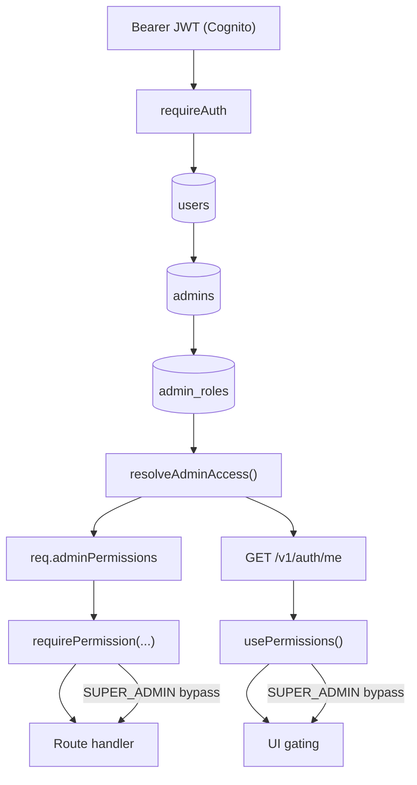

# Admin RBAC AI Context

## 1. Purpose

This document describes the admin portal RBAC implementation. It is the primary reference for AI agents and developers working on admin access control.

Permission keys are dotted strings defined in `packages/types/src/rbac.ts`. The core rules:

- `.view` controls page access, sidebar visibility, direct URL blocking, and data fetch enablement
- `.manage` or an action-specific permission controls mutation actions
- Frontend disables mutation buttons (with tooltip) when permission is missing
- Backend enforces every permission with `requirePermission(...)` and returns 403 on failure
- Super Admin (`SUPER_ADMIN` role key) has full access and bypasses all permission checks

The API is the real security boundary. Frontend gating is for navigation and UX affordances only.

---

## 2. Permission source of truth

**File:** `packages/types/src/rbac.ts`

| Export | Purpose |
|---|---|
| `ADMIN_PERMISSIONS` | Readonly tuple of all 47 valid permission strings. Derive `AdminPermission` from this. |
| `AdminPermission` | TypeScript union type of all permission strings. Used as the type for all permission arguments. |
| `ADMIN_PERMISSION_GROUPS` | Groups permissions by module for the Permission Configuration UI. Every permission must appear in a group. |
| `FULL_ACCESS_ADMIN_ROLE_KEYS` | Currently `[AdminRole.SUPER_ADMIN]`. Roles in this list bypass `requirePermission` checks entirely. |
| `SUPER_ADMIN_ROLE_TEMPLATE` | The system template for the Super Admin role — not editable, gets all permissions. |

### Naming conventions

- Use dotted keys: `module.action` or `module.domain.action`
- Use `service_fee` (singular), not `service_fees`
- Use `platform_settings` for admin platform finance settings, not `platform_settings.finance`
- Use `document_management` for the standalone Document Management page
- Use `disbursements` for issuer payouts / issuer money out
- Use `withdrawals` only if a standalone investor withdrawal admin page exists
- Use `settlements` only if a standalone settlement page exists

---

## 3. Frontend RBAC framework

### Sidebar and route gating

- Sidebar menu items are hidden if the user lacks the required `.view` permission
- Direct URL access is blocked by wrapping the page body with `<RequirePermission permission="..." />`
- While permissions load, `RequirePermission` shows skeleton placeholders
- When access is denied, it renders `AccessDeniedCard` (existing component)

### Data fetch gating

React Query hooks accept an `enabled` flag. Pass `canViewX` to prevent fetching when the user lacks `.view`:

```tsx
const { data } = useNotes({ enabled: canViewNotes });
```

### Read-only vs manage

If the user has `.view` but not `.manage`, the page loads and shows data normally. Only mutation buttons are disabled.

### Disabled button pattern

Keep action buttons visible but disabled with a tooltip:

```tsx
<Button
  disabled={!canManage}
  title={!canManage ? "You do not have permission to perform this action." : undefined}
  onClick={handleAction}
>
  Approve
</Button>
```

For Switch components, wrap in a tooltip since `title` on Switch is not reliable:

```tsx
<TooltipProvider>
  <Tooltip>
    <TooltipTrigger asChild>
      <div className={!canManage ? "cursor-not-allowed opacity-60" : ""}>
        <Switch disabled={isPending || !canManage} ... />
      </div>
    </TooltipTrigger>
    {!canManage && <TooltipContent>You do not have permission to perform this action.</TooltipContent>}
  </Tooltip>
</TooltipProvider>
```

### Key frontend files

| File | Role |
|---|---|
| `apps/admin/src/hooks/use-permissions.ts` | `usePermissions()` hook — exposes `can()`, `canAny()`, `isLoading` |
| `apps/admin/src/components/require-permission.tsx` | `<RequirePermission permission="...">` — page-level route guard |
| `apps/admin/src/components/app-sidebar.tsx` | Sidebar — gates all menu items and data fetches by `.view` permissions |

### Hook usage

```tsx
const { can, canAny, isLoading } = usePermissions();

const canViewNotes = can("notes.view");
const canManageNotes = can("notes.manage");
const canCreate = can("notes.create");
```

`SUPER_ADMIN` bypasses `can()` and `canAny()` — always returns true.

### Block a whole page

```tsx
<RequirePermission permission="notes.view">
  <NotesPageContent />
</RequirePermission>
```

### Hide a sidebar item

```tsx
{canViewNotes && <SidebarMenuItem href="/notes">Notes</SidebarMenuItem>}
```

---

## 4. Backend RBAC framework

### Auth flow

1. `requireAuth` verifies the Cognito access token and loads `User` → `Admin` → `AdminRoleConfig`
2. `resolveAdminAccess()` returns the effective `roleKey`, `roleName`, and `permissions`
3. The request receives `req.admin`, `req.adminPermissions`, `req.adminRoleKey`, `req.adminRoleName`
4. `requirePermission(...)` checks `req.adminPermissions` — or bypasses for `FULL_ACCESS_ADMIN_ROLE_KEYS`
5. Returns 403 `FORBIDDEN` if permission is not present

### Middleware

```ts
// Single required permission
requirePermission("notes.manage")

// Any one of several permissions
requireAnyPermission("applications.view", "applications.manage")
```

### Base router gates

It is acceptable for a sub-router to use `.use(requireRole(UserRole.ADMIN))` as a first-layer guard, **only if every individual child route also has its own `requirePermission(...)` guard**. Do not rely on the base gate alone.

Example:

```ts
adminNotesRouter.use(requireRole(UserRole.ADMIN)); // first-layer gate
adminNotesRouter.get("/", requirePermission("notes.view"), handler);
adminNotesRouter.post("/", requirePermission("notes.create"), handler);
```

### Backend controller files

| File | Covers |
|---|---|
| `apps/api/src/lib/auth/middleware.ts` | `requireAuth`, `requireRole`, `requirePermission`, `requireAnyPermission`, `hasPermission` |
| `apps/api/src/lib/auth/rbac.ts` | `resolveAdminAccess()` — loads permissions from DB |
| `apps/api/src/modules/admin/controller.ts` | Dashboard, Users, Organizations, Roles, Audit, Onboarding, Applications, Contracts |
| `apps/api/src/modules/notes/controller.ts` | Notes, Bucket Balances, Repayments, Platform Finance Settings, Investments, Disbursements |
| `apps/api/src/modules/notification/controller.ts` | Notifications |
| `apps/api/src/modules/site-documents/admin-controller.ts` | Document Management |
| `apps/api/src/modules/site-documents/log-controller.ts` | Document audit logs |
| `apps/api/src/modules/products/controller.ts` | Product Settings |
| `apps/api/src/modules/products/log/controller.ts` | Product audit logs |
| `apps/api/src/modules/products/upload/controller.ts` | Product uploads |
| `apps/api/src/modules/auth/controller.ts` | `POST /auth/admin/create-user` → `roles.manage` |

---

## 5. Permission mapping table

### Dashboard

| | |
|---|---|
| View permission | `dashboard.view` |
| Widget-level | `dashboard.finance.view`, `dashboard.operations.view`, `dashboard.platform.view` |
| Backend | `GET /v1/admin/dashboard/stats` → `dashboard.view` |
| Frontend page | `apps/admin/src/app/page.tsx` (root `page.tsx`, not `app/dashboard/`) |
| Notes | Widget visibility gated by widget-specific permissions on frontend only; single stats endpoint uses `dashboard.view` |

### Notes

| | |
|---|---|
| View | `notes.view` |
| Create note | `notes.create` |
| Manage (featured toggle, lifecycle actions) | `notes.manage` |
| Repayment actions | `notes.repayment.manage` |
| Settlement actions | `notes.settlement.manage` |
| Disbursement / issuer payout actions | `notes.disbursement.manage` |
| Default actions | `notes.default.manage` |
| Backend | `apps/api/src/modules/notes/controller.ts` |
| Frontend pages | `apps/admin/src/app/notes/page.tsx`, `apps/admin/src/app/notes/[id]/page.tsx` |

### Applications

| | |
|---|---|
| View + comments | `applications.view` |
| Status change | `applications.manage` |
| Financial section | `applications.financial.manage` |
| Company section | `applications.company.manage` |
| Business & Guarantor section | `applications.business_guarantor.manage` |
| Supporting Documents section | `applications.documents.manage` |
| Contract section | `applications.contract.manage` |
| Invoice section | `applications.invoice.manage` |
| Backend | `apps/api/src/modules/admin/controller.ts` |
| Frontend pages | `apps/admin/src/app/applications/`, `apps/admin/src/app/applications/[productKey]/[id]/page.tsx` |

Section mapping (`SECTION_PERMISSION_MAP` in the detail page):

```
financial             → applications.financial.manage
company_details       → applications.company.manage
business_details      → applications.business_guarantor.manage
supporting_documents  → applications.documents.manage
contract_details      → applications.contract.manage
invoice_details       → applications.invoice.manage
```

Application comments (both view and add) use `applications.view` only. Do not gate comments behind section manage permissions.

### Onboarding

| | |
|---|---|
| View | `onboarding.view` |
| Mutations | `onboarding.manage` |
| Backend | `apps/api/src/modules/admin/controller.ts` |
| Frontend page | `apps/admin/src/app/onboarding-approval/page.tsx` |

### Users

| | |
|---|---|
| View | `users.view` |
| Mutations | `users.manage` |
| Backend | `apps/api/src/modules/admin/controller.ts` |
| Frontend pages | `apps/admin/src/app/users/page.tsx`, `apps/admin/src/app/users/[id]/page.tsx` |

### Organizations

| | |
|---|---|
| View | `organizations.view` |
| Mutations (sophisticated toggle, CTOS generation) | `organizations.manage` |
| Backend | `apps/api/src/modules/admin/controller.ts` |
| Frontend pages | `apps/admin/src/app/organizations/page.tsx`, `apps/admin/src/app/organizations/[portal]/[id]/page.tsx` |

### Roles

| | |
|---|---|
| View Roles & Users page | `roles.view` |
| View Permission Configuration page | `roles.view` |
| Mutations (create/edit/delete role, save permissions, invite/deactivate/reactivate users) | `roles.manage` |
| Backend | `apps/api/src/modules/admin/controller.ts`, `apps/api/src/modules/auth/controller.ts` |
| Frontend page | `apps/admin/src/app/settings/roles/page.tsx` |

Do not require `roles.manage` to navigate to or view the Permission Configuration page.

### Notifications

| | |
|---|---|
| View (all tabs including Configuration, Custom & Groups, Logs) | `notifications.view` |
| Mutations (Add Missing Types, toggles, Send Notification, Create/Manage Groups) | `notifications.manage` |
| Backend | `apps/api/src/modules/notification/controller.ts` |
| Frontend page | `apps/admin/src/app/settings/notifications/page.tsx` |

Do not block any notification tab behind `notifications.manage`.

### Audit Logs

| | |
|---|---|
| Access Logs | `audit.access.view` |
| Security Logs | `audit.security.view` |
| Document Logs | `audit.document.view` |
| Product Logs | `audit.product.view` |
| Backend | `apps/api/src/modules/admin/controller.ts` |
| Frontend pages | `apps/admin/src/app/audit/*/page.tsx` |
| Notes | All audit pages are read-only. Search/filter/export use same view permission. |

### Document Management

| | |
|---|---|
| View | `document_management.view` |
| Mutations (Upload, Edit, Replace, Archive, Restore) | `document_management.manage` |
| Backend | `apps/api/src/modules/site-documents/admin-controller.ts` |
| Frontend page | `apps/admin/src/app/documents/page.tsx` |
| Notes | Documents inside Notes or Applications use the parent module's permission, not `document_management.*` |

### Investments

| | |
|---|---|
| View | `investments.view` |
| Backend | `apps/api/src/modules/notes/controller.ts` (`adminInvestmentsRouter`) |
| Frontend page | `apps/admin/src/app/investments/page.tsx` |

### Contracts

| | |
|---|---|
| View | `contracts.view` |
| Mutations (resign offer) | `contracts.manage` |
| Backend | `apps/api/src/modules/admin/controller.ts` |
| Frontend pages | `apps/admin/src/app/contracts/page.tsx`, `apps/admin/src/app/contracts/[id]/page.tsx` |
| Notes | Contract tab inside Application Review uses `applications.contract.manage`, not `contracts.manage` |

### Bucket Balances

| | |
|---|---|
| View | `bucket_balances.view` |
| Backend | `apps/api/src/modules/notes/controller.ts` |
| Frontend page | `apps/admin/src/app/finance/buckets/page.tsx` |

### Repayments

| | |
|---|---|
| View | `repayments.view` |
| Backend | `apps/api/src/modules/notes/controller.ts` |
| Frontend page | `apps/admin/src/app/finance/repayments/page.tsx` |
| Notes | Repayment actions inside Note Detail use `notes.repayment.manage` |

### Disbursements / Issuer Payouts

| | |
|---|---|
| View | `disbursements.view` |
| Mutations (generate letter, mark submitted, mark completed, initiate payout) | `disbursements.manage` |
| Backend | `apps/api/src/modules/notes/controller.ts` (`withdrawalsRouter`) |
| Frontend page | `apps/admin/src/app/finance/issuer-payouts/page.tsx` |
| Notes | Issuer disbursement actions inside Note Detail use `notes.disbursement.manage`, not `disbursements.manage` |

### Service Fee

| | |
|---|---|
| View | `service_fee.view` |
| Backend | `apps/api/src/modules/notes/controller.ts` |
| Frontend page | `apps/admin/src/app/finance/service-fee-trustee-letters/page.tsx` |
| Notes | Service fee workflow actions inside Note Detail use `notes.settlement.manage` |

### Product Settings

| | |
|---|---|
| View | `products.view` |
| Mutations | `products.manage` |
| Backend | `apps/api/src/modules/products/controller.ts` |
| Frontend page | `apps/admin/src/app/settings/products/page.tsx` |

### Platform Finance Settings

| | |
|---|---|
| View | `platform_settings.view` |
| Mutations | `platform_settings.manage` |
| Backend | `apps/api/src/modules/notes/controller.ts` (`platformFinanceSettingsRouter`) |
| Frontend page | `apps/admin/src/app/settings/platform-finance/page.tsx` |

---

## 6. Important special cases

### Dashboard

- Dashboard route is `apps/admin/src/app/page.tsx` — the root `page.tsx`, not `app/dashboard/page.tsx`
- `GET /v1/admin/dashboard/stats` → guarded by `dashboard.view`
- The stats endpoint is not split by widget. Frontend hides widgets using `dashboard.finance.view`, `dashboard.operations.view`, `dashboard.platform.view`
- Dashboard quick action cards follow their target module's `.view` permission

### Applications — comments

```
View section comments  → applications.view
Add section comment    → applications.view
Approve section        → applications.<section>.manage
Reject section         → applications.<section>.manage
Request amendment      → applications.<section>.manage
Reset to pending       → applications.<section>.manage
```

Do not require any section manage permission for comments.

### Roles page

- `/settings/roles` (Roles & Users list): visible and readable with `roles.view`
- `/settings/roles/configuration` (Permission Configuration): visible and readable with `roles.view`
- All mutations (create role, save permissions, invite user, deactivate/reactivate user): require `roles.manage`
- Never gate navigation to the Permission Configuration page behind `roles.manage`

### Notifications page

- The whole Notification Management page, including all tabs (Configuration, Custom & Groups, Logs), is visible with `notifications.view`
- Only mutation controls require `notifications.manage`
- Never block entire tabs behind `notifications.manage`

### Documents inside Notes or Applications

Documents inside a Note Detail page follow `notes.view` for read-only viewing, or the relevant `notes.<domain>.manage` if the document action is part of a note workflow.

Documents inside an Application Review section follow `applications.view` for read-only viewing, or `applications.<section>.manage` if the document action is a section workflow step.

The `document_management.*` permissions apply only to the standalone Document Management page at `/documents`.

### Settings > General and Settings > Security

`/settings/general` and `/settings/security` are sidebar links that do not yet have backing `page.tsx` files. They are gated behind `platform_settings.view` in the sidebar. When these pages are implemented, use `platform_settings.view` / `platform_settings.manage` unless the feature scope requires a separate permission key.

### RegTank onboarding-settings route

`GET /v1/regtank/admin/onboarding-settings/:formId` uses `requireRole("ADMIN")` only. This route is an internal ops/debug endpoint not used by any admin frontend page. It is outside the RBAC rollout scope.

---

## 7. Future-only permissions

The following permissions exist in `ADMIN_PERMISSIONS` and `ADMIN_PERMISSION_GROUPS` but do not currently have active admin pages or full workflows. Do not create new routes or pages for these without product confirmation.

These permissions have been removed from the catalog because they have no active code usage. Add them back when the corresponding page or action is implemented.

| Permission | Reason removed |
|---|---|
| `reports.view`, `reports.export` | No reports page exists |
| `investments.manage` | Investment listing is read-only; no admin mutation routes |
| `bucket_balances.manage` | View-only page; no correction/adjustment routes |
| `repayments.manage` | Repayment actions inside Note Detail use `notes.repayment.manage` |
| `service_fee.manage` | Service fee workflow actions inside Note Detail use `notes.settlement.manage` |

The following permissions are **not** in this list because they have active backend routes:

| Permission | Active usage |
|---|---|
| `disbursements.manage` | 4 routes in `withdrawalsRouter` (generate letter, mark submitted, mark completed, initiate payout) |
| `contracts.manage` | `POST /contracts/:id/offers/resign` in `admin/controller.ts` |

---

## 8. Manual QA checklist

### Super Admin

- [ ] All sidebar items visible
- [ ] All pages accessible
- [ ] All action buttons enabled (lifecycle, Turn Into Note, section actions, Save Settings, Upload, etc.)
- [ ] Can create/edit roles and invite/deactivate admin users
- [ ] Can save permission changes in Permission Configuration

### View-only role (all `.view`, no `.manage`)

- [ ] All sidebar items visible; all pages load with data
- [ ] All mutation buttons disabled with tooltip "You do not have permission to perform this action."
- [ ] Application section Approve/Reject/Request Amendment disabled
- [ ] Note lifecycle action buttons and Featured toggle disabled
- [ ] "Turn Into Note" button disabled
- [ ] Documents Upload/Edit/Replace/Archive/Restore disabled
- [ ] Roles page and Permission Configuration visible and read-only
- [ ] Notifications page visible; Add Missing Types / toggles / Send disabled

### Role with `applications.view` only

- [ ] Only Applications sidebar item visible
- [ ] Applications list and detail accessible
- [ ] Section workflow buttons disabled
- [ ] Comment box works — adding a comment succeeds
- [ ] Direct URL to `/notes`, `/users`, etc. shows Access Denied

### Role with `roles.view` only

- [ ] Roles & Users page accessible with admin user list
- [ ] Permission Configuration page accessible and read-only
- [ ] Create Role, Save Changes, Invite User buttons disabled
- [ ] Activate/Deactivate/Resend/Revoke buttons disabled

### Role with `notifications.view` only

- [ ] Notifications page accessible
- [ ] All tabs (Configuration, Custom & Groups, Logs) visible
- [ ] Add Missing Types, toggles, Send Notification, Create Group disabled

### Role with `audit.access.view` only

- [ ] Only Access Logs sidebar item visible under Audit section
- [ ] Access Logs page loads correctly
- [ ] Security Logs, Document Logs, Product Logs sidebar items hidden
- [ ] Direct URL to hidden audit pages shows Access Denied

---

## 9. Developer warning notes

- **Do not add admin routes or pages for future-only permissions** without product confirmation
- **Do not make frontend-only RBAC changes** without adding the matching backend `requirePermission` guard
- **Do not require `.manage` to view a page** — `.view` controls page/sidebar/data access; `.manage` controls mutations only
- **Do not require section manage permission for application comments** — comments use `applications.view`
- **Do not block the Roles Permission Configuration page behind `roles.manage`** — it must be viewable with `roles.view`
- **Do not block Notification Management tabs behind `notifications.manage`** — all tabs are viewable with `notifications.view`
- **Do not rename `service_fee` to `service_fees`** — the catalog uses singular
- **Do not rename `platform_settings`** to `platform_settings.finance` or any variant
- **Do not use `document_management.*`** for documents inside Notes or Application Review — use the parent module's permission
- **Do not remove the `requireRole(UserRole.ADMIN)` base gate** from sub-routers without ensuring all child routes have their own `requirePermission` guard

---

## 10. Adding a new permission

1. Add the string to `ADMIN_PERMISSIONS` in `packages/types/src/rbac.ts`
2. Add it to the correct group in `ADMIN_PERMISSION_GROUPS` (or create a new group)
3. Enforce it on the API route with `requirePermission("new.permission")`
4. Gate the related UI with `usePermissions().can("new.permission")` or `<RequirePermission permission="new.permission">`
5. If it is a `.view` permission, add it to the sidebar gating in `app-sidebar.tsx`
6. If it is future-only, add it to section 7 above with a reason

---

## 11. Runtime flow diagram


