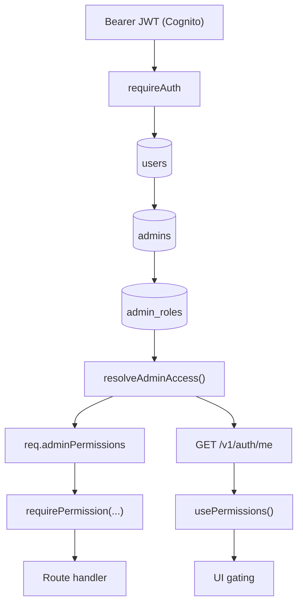

# Admin RBAC Guide

## Overview

The system has four parts:

1. A shared permission vocabulary in `packages/types/src/rbac.ts`
2. A database role catalog in `apps/api/prisma/schema.prisma` (`admin_roles`)
3. Runtime resolution in `apps/api/src/lib/auth/rbac.ts`
4. API and UI enforcement through `requirePermission(...)` and `usePermissions()`



## Permission catalog

Permissions are defined as dotted `resource.action` strings in `packages/types/src/rbac.ts`.

Current live permissions:

- `roles.manage`

The backend and frontend both import from the same source so route guards and UI guards stay aligned.

## Default roles

The default system roles are also defined in `packages/types/src/rbac.ts`:

- `SUPER_ADMIN`
- `COMPLIANCE_OFFICER`
- `OPERATIONS_OFFICER`
- `FINANCE_OFFICER`

These are synced into the `admin_roles` table by `ensureAdminRoleCatalog()`.

`SUPER_ADMIN` is the only full-access bypass role. All other roles rely on their explicit permission list.

## Runtime flow

1. `requireAuth` verifies the Cognito access token.
2. The API loads the `User` record, then the related `Admin` row and `AdminRoleConfig`.
3. `resolveAdminAccess()` returns the effective `roleKey`, `roleName`, and `permissions`.
4. The request gets `req.admin`, `req.adminPermissions`, `req.adminRoleKey`, and `req.adminRoleName`.
5. Route middleware such as `requirePermission("roles.manage")` enforces access.
6. `GET /v1/auth/me` returns the same resolved permission set for the frontend.

## Current enforcement

The live permission catalog is intentionally small until more routes are migrated.

- `GET /v1/admin/roles` requires `roles.manage`
- `PATCH /v1/admin/roles/:key/permissions` requires `roles.manage`
- `PUT /v1/admin/admin-users/:id/role` requires `roles.manage`

`/settings/roles` and `/settings/roles/configuration` are also gated in the admin UI on `roles.manage`.

`SUPER_ADMIN` is the only seeded role with `roles.manage`. Other seeded roles start with no live permissions until you assign them in the catalog.

## Add a new permission

1. Add the permission string to `ADMIN_PERMISSIONS` in `packages/types/src/rbac.ts`.
2. Add it to `ADMIN_PERMISSION_GROUPS` so the configuration UI can render it.
3. Assign it to the appropriate role templates in `DEFAULT_ADMIN_ROLE_TEMPLATES`.
4. If the default catalog changed, bump `ADMIN_ROLE_CATALOG_REVISION`.
5. Enforce it on the API route with `requirePermission(...)`.
6. Gate the related UI using `usePermissions().can(...)` or `usePermissions().canAny(...)`.

## Add a new default role

1. Add the new enum value to `AdminRole` in:
   - `packages/types/src/admin.ts`
   - `apps/api/prisma/schema.prisma`
2. Add the role key to `DEFAULT_ADMIN_ROLE_KEYS`.
3. Add a new entry to `DEFAULT_ADMIN_ROLE_TEMPLATES`.
4. Update any UI label maps that display admin roles.
5. Run a Prisma migration for the enum change.

## Add a custom role

The database layer now supports custom role rows in `admin_roles`, but there is not yet a runtime role-management endpoint or admin UI for creating custom roles.

For now, custom roles can be inserted operationally if needed, as long as:

- `admins.role_id` references the custom row
- `admins.role_description` remains a sensible fallback key

## Enforce on a route

Use the middleware in `apps/api/src/lib/auth/middleware.ts`:

```ts
router.put(
  "/admin-users/:id/role",
  requirePermission("roles.manage"),
  handler
);
```

Use `requireAnyPermission(...)` when one of several permissions should unlock a route.

## Gate the UI

The API is the real security boundary. UI gating is for navigation, layout, and affordances only.

### Hook

Use `apps/admin/src/hooks/use-permissions.ts`:

```tsx
const { can, canAny, isLoading } = usePermissions();

if (isLoading) {
  return <Skeleton className="h-10 w-40" />;
}

const canManageRoles = can("roles.manage");
const canReviewOrManage = canAny("applications.review", "applications.manage");
```

`SUPER_ADMIN` bypasses permission checks in `can()` and `canAny()`. Everyone else is checked against the permission list from `GET /v1/auth/me`.

### Block a whole page

Wrap the page body in `RequirePermission` from `apps/admin/src/components/require-permission.tsx`:

```tsx
<RequirePermission permission="roles.manage">
  <RolesPageContent />
</RequirePermission>
```

While permissions are loading, the component shows skeleton placeholders. When access is denied, it renders `AccessDeniedCard` instead of the page content.

### Hide navigation or sections

Conditionally render links, buttons, or menu items:

```tsx
const { can } = usePermissions();
const canManageRoles = can("roles.manage");

{canManageRoles ? (
  <Link href="/settings/roles">Roles & Users</Link>
) : null}
```

For grouped nav, filter children before mapping. See `apps/admin/src/components/app-sidebar.tsx`, which hides `/settings/roles` unless `can("roles.manage")` is true.

### Disable an action with feedback

Keep the control visible but block the mutation when access is missing:

```tsx
<Button
  disabled={!canManageRoles}
  onClick={handleStartEditRole}
>
  Edit role
</Button>
```

Pair disabled controls with a guard in the handler so keyboard or programmatic triggers still fail safely:

```tsx
const handleStartEditRole = () => {
  if (!canManageRoles) {
    toast.error("Cannot edit role", {
      description: "Your role does not have permission to manage admin roles.",
    });
    return;
  }

  setIsEditingRole(true);
};
```

See `apps/admin/src/components/admin-user-table-row.tsx` for this pattern.

### Inline feature gates

For smaller UI fragments, prefer a direct `can()` check over `RequirePermission`:

```tsx
{can("roles.manage") ? <InviteAdminDialog /> : null}
```

Use `RequirePermission` when the entire route segment should be inaccessible, and `can()` when only part of a page should change.
