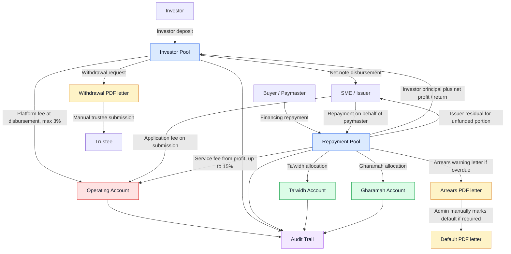
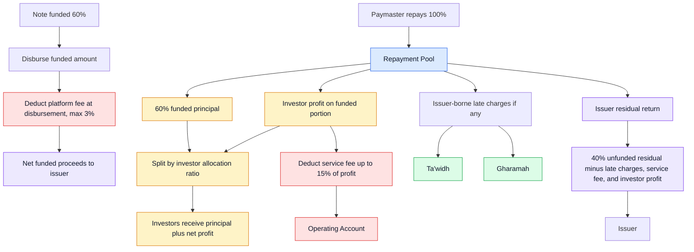

## Overview

Use this guide when you need to understand where note money is, what action to take next, or how a repayment should be allocated. It is written for admin portal users and focuses on day-to-day operations.

A note is created from one approved invoice. If a contract has multiple approved invoices, each invoice can become its own note. The admin portal keeps the note linked to its issuer, paymaster, source application, source contract, and source invoice so you can review the full context when needed.

## Where To Work

- Use **Notes** to create notes from approved invoices, publish notes, close funding, activate servicing, record repayments, settle notes, generate letters, and review the note timeline.
- Use **Bucket Balances** to view the five platform money buckets and inspect activity logs for each bucket.
- Use **Platform Finance Settings** to manage the default grace period, arrears threshold, Ta'widh cap, Gharamah cap, and letter templates.

## The Five Buckets

CashSouk tracks note money through five operational buckets:

- **Investor Pool** holds investor money, investment commitments, repayment returns, and investor withdrawals.
- **Repayment Pool** receives repayment money from the paymaster or from an issuer paying on behalf of the paymaster.
- **Operating Account** receives application fees, platform fees, and service fees.
- **Ta'widh Account** receives the compensation portion of approved late-payment charges.
- **Gharamah Account** receives the charity or penalty portion of approved late-payment charges.

The bucket balances page is based on posted ledger activity. Credits increase a bucket, debits reduce a bucket, and the activity log shows the transactions behind each balance.

## Note Money Flow

## From Invoice To Funding

Create notes only from approved invoices. Review the invoice, issuer, paymaster, risk rating, amount, profit rate, platform fee, service fee, maturity date, and listing summary before publishing.

When a note is published, it becomes available in the investor marketplace. Investors can commit funds until funding is closed or failed.

- **Publish** makes a reviewed note available to investors.
- **Unpublish** removes a note from the marketplace before investor commitments exist.
- **Close Funding** locks a successfully funded note once it meets the required funding threshold.
- **Fail Funding** closes an open note that did not meet the required funding threshold.
- **Activate** starts servicing after funding has been closed successfully.

## Disbursement

The platform fee is deducted at disbursement. It is set per note and capped at 3%.

After funding is closed and the note is activated, the funded amount is applied as follows:

- the platform fee goes to the Operating Account,
- the net funded proceeds are disbursed to the issuer,
- the note moves into servicing so repayment can be tracked.

## Repayment And Settlement

The repayment amount is based on the invoice face value. It is not the same as the funded amount or the disbursed amount.

Repayment is usually paid by the paymaster into the Repayment Pool. The issuer may also pay the settlement amount on behalf of the paymaster through the issuer portal. When that happens, the admin should review the submitted payment, approve or reject it, and preserve the payment source in the audit trail.

When settlement is posted, the Repayment Pool is allocated across the relevant buckets:

- investors receive principal and net profit according to their allocation,
- the Operating Account receives the service fee,
- Ta'widh and Gharamah amounts are posted if approved late charges apply,
- any issuer residual is returned to the issuer.

After settlement is posted, the note is treated as settled and further payment actions should be disabled.

## Settlement Example

Example: if a note is 60% funded and the paymaster repays 100% of the invoice, investors receive the funded 60% principal plus net profit pro rata. The issuer receives the remaining residual after investor allocation, service fee, approved late charges, and investor profit are applied. The platform fee was already deducted during disbursement.

## Late Payments

Late charges are handled manually when repayment funds are received. They are not posted automatically by a daily system job.

Before applying late charges, run the overdue check on the note. This helps confirm the overdue days and prevents duplicate late-charge allocation by taking previous late charges into account.

Late charges are borne by the issuer, but they are deducted from repayment proceeds before any issuer residual is returned.

- **Grace period** is configurable. The standard default is 7 days.
- **Ta'widh** is set at receipt time and capped at 1% per annum.
- **Gharamah** is set at receipt time and capped at 9% per annum.
- **Arrears** starts after the grace period plus the arrears threshold. With a 7-day grace period and 14-day arrears threshold, arrears starts 21 days after the missed payment date.
- **Default** is never automatic. Admin can mark a note as default only after it is already in arrears.

## Arrears And Default Letters

Use generated PDF letters to support arrears and default handling.

- Generate an arrears or warning letter once the note enters arrears.
- Review the letter before external communication.
- If the note must be marked as default, use the manual default action and generate the default letter.
- Keep the generated letters attached to the note timeline.

## Withdrawals

Investor withdrawals and other trustee-submitted withdrawals must have a generated PDF instruction letter before they are marked as submitted.

The withdrawal letter should include:

- withdrawal reference,
- source bucket,
- beneficiary details or masked bank reference,
- amount and currency,
- reason,
- requester and reviewer,
- related note or investor reference, where applicable,
- trustee submission status.

Mark a withdrawal as submitted only after the letter has been generated and the trustee submission has actually been completed.

## Audit Trail

Every important money-flow action should be visible in the note timeline or bucket activity log. This includes:

- note creation from approved invoice,
- publish, unpublish, close funding, fail funding, and activate actions,
- disbursement,
- paymaster repayment receipts,
- issuer payments made on behalf of paymaster,
- settlement preview and approval,
- settlement posting,
- issuer residual return,
- late-fee calculation and allocation,
- withdrawal letter generation,
- trustee submission marking,
- arrears/default letter generation,
- manual overrides and waivers.

When reviewing a note, use the activity timeline together with the ledger and bucket activity logs. The timeline explains who did what. The ledger and bucket logs explain how money moved.
