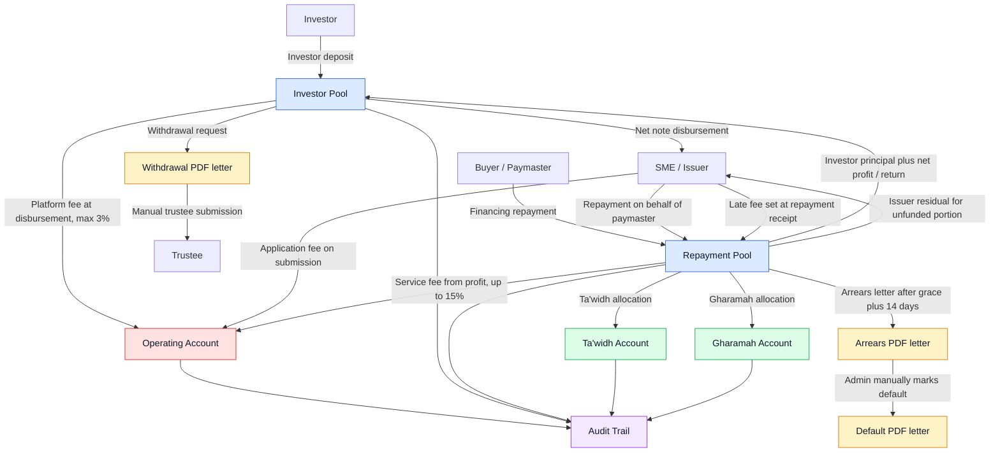
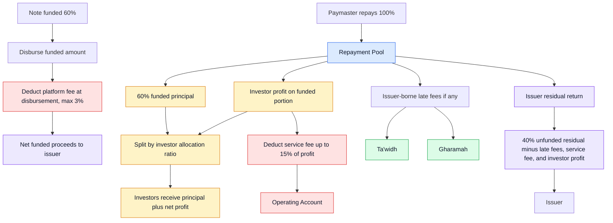

## Purpose

Use this guide when reviewing or operating note money flows in the admin portal. It explains the five platform buckets, how investor funding and paymaster repayment move through the platform, how issuer application fees are handled, and which PDF letters and audit records must be generated.

## Five Platform Buckets

The note operating model uses five core buckets:

- `Investor Pool` - investor deposits, investment commitments, investor repayments, and investor withdrawals.
- `Repayment Pool` - paymaster financing repayments before settlement allocation.
- `Operating Account` - CashSouk application fees, platform fees, and service fees.
- `Ta'widh Account` - Syariah compensation component of late payment charges.
- `Gharamah Account` - Syariah penalty/charity component of late payment charges.

Issuer application fees are not shown in the original money-flow diagram, but they should be included. When the issuer submits a financing application, the application or financing processing fee is paid into the Operating Account.

## Flowchart for Review

## Admin Operating Rules

- Platform fee is not a global setting. It is set per note at the point of disbursement and capped at 3%.
- Service fee is not a global setting. It is determined per customer/note, deducted from investor profit when paymaster repayment is received, and standard capped up to 15% of profit.
- Grace period should be configurable as a global admin setting, with a standard default of 7 days.
- Ta'widh defaults should be configurable, manually set at receipt time, and capped at 1% per annum.
- Gharamah defaults should be configurable, manually set at receipt time, and capped at 9% per annum.
- Late fees should be calculated and posted only when repayment funds are received. They should not be accrued or posted by a daily cron job.
- Arrears threshold should be configurable, with a standard default of 14 days after the grace period. With the 7-day grace period, arrears starts 21 days after the missed payment date.
- Default is not automatic. Admin can manually mark the note as default any time after the note is already in arrears.
- Financing repayment is paid by the buyer/paymaster into the Repayment Pool.
- Issuer can also pay into the Repayment Pool on behalf of the paymaster, likely from the issuer portal. Admin should reconcile it as a valid repayment while preserving the payment source.
- Late fees are borne by the issuer, but deducted from repayment proceeds before returning any issuer residual.
- If a note is funded below 100%, the paymaster still repays the source invoice/contract obligation. After investor settlement, service fee, and approved late charges, the unfunded residual balance is returned to the issuer. Platform fee has already been deducted at disbursement.
- Example: if the note is 60% funded and the paymaster repays 100%, investors receive the funded 60% principal plus net profit pro rata, and the issuer receives the remaining 40% less approved late fees, service fee, and investor profit.

## Settlement Waterfall Example

## Withdrawal Letters

Investor withdrawal and other pool withdrawal flows should generate a PDF template letter before funds are manually submitted to the trustee.

The letter should include:

- withdrawal reference,
- source bucket,
- beneficiary name,
- beneficiary bank details or masked reference,
- amount and currency,
- reason,
- requested by,
- reviewed by,
- approval timestamps,
- trustee submission status,
- related note or investor reference where applicable.

The admin portal should keep the generated PDF, submission status, and activity timeline entry. Completion should only be marked after manual trustee submission is confirmed.

## Arrears and Default Letters

Arrears and default should be generated from templates and attached to the note timeline.

- The 7-day grace period controls whether late fees are applied when repayment funds are received.
- Arrears begins after the grace period plus the configured arrears threshold. Standard timing is 7 days of grace plus 14 arrears-threshold days.
- At arrears, generate an arrears/default warning letter PDF.
- Default is a manual admin action available once the note is in arrears.
- When admin marks default, generate a default letter PDF.
- Admin should review generated letters before any external submission or communication.

## Audit Trail

Every money-flow action should be auditable:

- setting changes,
- application fee receipt,
- note funding close,
- disbursement,
- paymaster repayment receipt,
- issuer-on-behalf-of-paymaster repayment receipt,
- settlement preview and approval,
- ledger posting,
- issuer residual return,
- late-fee calculation and allocation,
- withdrawal letter generation,
- trustee submission marking,
- arrears/default letter generation,
- manual overrides and waivers.

Audit entries should include actor, role, timestamp, before/after values where relevant, IP address, user agent, correlation ID, related note/application IDs, and generated document references.

