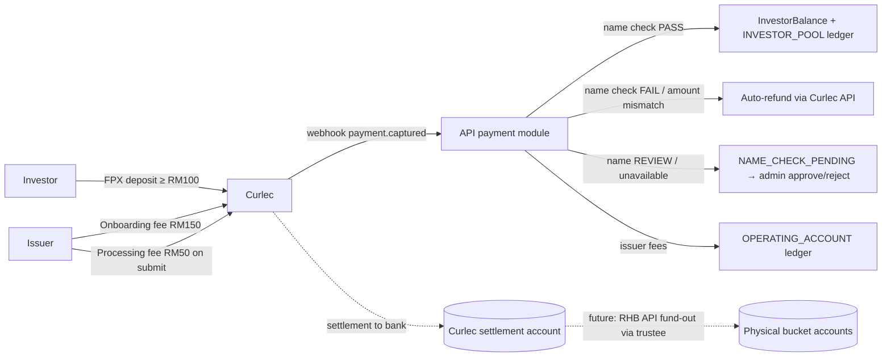

# Payment Gateway Integration — Razorpay Curlec (As Built)

Implementation snapshot (Jul 2026). Compare against the initial plan in `payment-gateway-curlec-plan.md`.

Technical reference for the shipped Curlec money-in integration: investor deposits, issuer onboarding fee, application processing fee, AML name checks, auto-refunds, ledger posting, and settlement reconciliation.

- **Initial plan:** `payment-gateway-curlec-plan.md`
- **Business as-built:** `payment-gateway-curlec-plan-business-as-built.md`
- **Ops runbook:** `payment-gateway-curlec-ops-runbook.md`
- **Recon dev testing:** `payment-gateway-curlec-recon-testing.md`

## Implementation status (Jul 2026)

Phases 1–5 are **shipped**. Phase 6 (live smoke, prod env wiring, dev-tool removal) is **in progress**.

| Component | Location | Status |
|---|---|---|
| Payment module | `apps/api/src/modules/payment/` | Done |
| Prisma models | `GatewayPayment`, `GatewayWebhookEvent`, `GatewayReconRun`, `GatewayReconException` | Done |
| Investor deposit API + UI | `deposit-*`, `apps/investor/` Curlec checkout | Done |
| Issuer onboarding fee | `onboarding-fee-*`, `apps/issuer/src/app/onboarding/fee/` | Done |
| Application processing fee | `processing-fee-*`, application submit step | Done |
| Webhooks | `POST /v1/webhooks/curlec` (raw body + HMAC) | Done |
| Auto-refund | `refund-service.ts` via Curlec Refund API | Done |
| Stuck-order poller | Every 15 min, `gateway-stuck-order-poller.ts` | Done |
| Settlement recon | Daily 02:00 MYT, `gateway-settlement-recon.ts` | Done |
| Admin UI | Gateway Payments, Reconciliation, Platform Finance fees | Done |
| Integration tests | `apps/api/src/modules/payment/*.integration.test.ts` | Done |
| Investor deposit e2e | `apps/investor/e2e/deposit.spec.ts` (mocked Curlec) | Done |

**Pre-launch gaps:** prod `CURLEC_*` in SSM/env templates; confirm FPX payer name in production; remove dev recon simulator; live FPX smoke for all paths.

## 1. Confirmed Decisions

| Decision | Choice |
|---|---|
| Payment method | **FPX only** at launch (bank-to-bank, no chargebacks, supports payer identification) |
| Settlement | **Single Curlec settlement account**. Our internal ledger attributes funds to buckets (`INVESTOR_POOL`, `OPERATING_ACCOUNT`); physical movement between bank accounts happens later via RHB API / manual fund-out instructed through the trustee |
| AML name check (investors only) | Payer bank account name must match investor account name. On clear mismatch or amount mismatch: **never credit**; auto-refund via Curlec API. On unavailable/ambiguous name: `NAME_CHECK_PENDING` for admin approve/reject |
| Issuers | No name check |
| Fee amounts | Admin-configurable via `PlatformFinanceSetting`: issuer onboarding fee (default RM150), application processing fee (default RM50), minimum investor deposit (default RM100), maximum investor deposit (default RM30,000) |
| Issuer onboarding fee timing | Paid **before eKYB starts** — gates the onboarding-start flow (matches money-flow doc: Sign-up → Fee → eKYB/KYC) |
| Refund policy | Issuer fees are **non-refundable** (even on rejection). Investor deposits that fail name check or amount check are **auto-refunded** via Curlec API; admin can retry if refund API fails |
| Maker/checker | Unchanged — trustee remains the checker for money-out via the existing `WithdrawalInstruction` letter flow. Payment gateway handles money-in only |

## 2. Codebase anchors

Key locations for the implemented integration:

| Concern | Where it lives |
|---|---|
| Payment module | `apps/api/src/modules/payment/` |
| Prisma schema | `GatewayPayment`, `GatewayWebhookEvent`, `GatewayReconRun`, `GatewayReconException` in `apps/api/prisma/schema.prisma` |
| Investor wallet | `InvestorBalance` + `InvestorBalanceTransaction` (sources include `GATEWAY_DEPOSIT`); helpers in `apps/api/src/modules/notes/investor-balance.ts` |
| Deposit gate | `InvestorOrganization.deposit_received`; enforced in `NoteService.createInvestment` |
| Dev test-topup | `POST /v1/investor/balance/test-topup` — blocked when `NODE_ENV=production` |
| Platform ledger | `NoteLedgerEntry` with `gateway_payment_id`; buckets `INVESTOR_POOL`, `OPERATING_ACCOUNT`, etc. |
| Fee settings | `PlatformFinanceSetting` + `apps/admin/src/app/settings/platform-finance/page.tsx` |
| Investor deposit UI | `apps/investor/src/components/deposit-card.tsx`, `deposit-dialog.tsx`, `lib/curlec-checkout.ts` |
| Issuer fee UI | `apps/issuer/src/app/onboarding/fee/`, application processing fee step |
| Admin UI | `apps/admin/src/app/finance/gateway-payments/`, `finance/reconciliation/` |
| Background jobs | `apps/api/src/lib/jobs/index.ts` — stuck-order poller (15 min), settlement recon (daily 02:00 MYT) |
| Curlec config | `apps/api/src/config/curlec.ts` — lazy-loaded from `CURLEC_*` env vars |
| Shared SDK / types | `packages/config/src/api-client.ts`, `packages/types/src/gateway-payments.ts`, `gateway-recon.ts` |

## 3. Money Flows To Implement



### 3.1 Investor deposit (onboarding activation + wallet top-up)

Same flow for both; the first successful deposit also sets `deposit_received = true`.

1. Investor enters amount (≥ configured minimum) → `POST /v1/investor/deposits` → API creates a Curlec **Order** (amount in sen, MYR), persists a `GatewayPayment` row (`CREATED`), returns `order_id` + public key.
2. Frontend opens Curlec Checkout (`checkout.razorpay.com/v1/checkout.js`, FPX method) → user authorizes at their bank portal → redirected back.
3. Webhook `payment.captured` → mark `PAID`, snapshot payer bank details → run **name check**.
4. **Name check PASS** → in one transaction: credit `InvestorBalance` (source `GATEWAY_DEPOSIT`), set `deposit_received = true` if first deposit, post `INVESTOR_POOL` ledger credit, mark payment `COMPLETED`.
5. **Name check FAIL** → auto-refund via Curlec Refund API; wallet never credited.
6. **Name REVIEW or NAME_UNAVAILABLE** → mark `NAME_CHECK_PENDING`; admin approves (credit) or rejects (auto-refund). Wallet never credited until approved.
7. **Amount mismatch** → auto-refund; wallet never credited. If refund API fails → `HELD`; admin retries from Gateway Payments detail.

**Name source for the check:** expected name = investor account name (individual full name for `PERSONAL` orgs; company name for `COMPANY` orgs, from org record / `bank_account_details`). Actual name = payer bank account name from Curlec. ⚠️ **Open item (must verify with Curlec before build):** the standard Curlec `GET /v1/payments/:id` for FPX returns only the payer's bank code, not the account holder name, and Smart Collect/TPV is not available in Malaysia. Business has confirmed name check is possible via Razorpay — confirm with the Curlec account manager exactly which API/report exposes the FPX buyer name (FPX messages do carry it). Design the name check as a discrete step that consumes the name from whatever source is available (webhook payload, payment fetch, or settlement report); if no name is available programmatically, the deposit lands in a `NAME_CHECK_PENDING` admin queue where ops verifies against the Curlec dashboard and approves/holds manually. Matching is exact normalized comparison (case/whitespace/punctuation-insensitive); anything else fails to admin review — no fuzzy auto-approval.

### 3.2 Issuer onboarding fee (before eKYB)

1. New gate: after issuer signs up, `/onboarding/fee` (company orgs) shows onboarding fee before RegTank verify. API-side, RegTank start endpoints reject if the fee isn't paid.
2. `POST /v1/issuer/onboarding-fee` → Curlec order → checkout → webhook `payment.captured` → mark `COMPLETED`, set `onboarding_fee_paid_at` on the issuer org, post `OPERATING_ACCOUNT` ledger credit.
3. Non-refundable, including on onboarding rejection. No name check.

### 3.3 Application processing fee (on submission)

1. Fee is charged **once per application**, at first submission (`DRAFT → SUBMITTED`). Resubmissions after amendment do not re-charge.
2. Issuer UI: the final wizard step requires payment before the submit call. `POST /v1/applications/:id/processing-fee` → order → checkout → webhook completes payment linked to the application.
3. API hard gate: `ApplicationService.updateApplicationStatus` asserts a `COMPLETED` processing-fee payment exists for the application when transitioning `DRAFT → SUBMITTED` (defense in depth against UI bypass).
4. Ledger: `OPERATING_ACCOUNT` credit. Non-refundable. Admin application review shows fee paid status + receipt reference.

## 4. New Backend Module: `apps/api/src/modules/payment/`

Follow the standard module layout (controller / service / schemas), plus:

- `curlec-client.ts` — thin Curlec REST client (create order, fetch order/payment, fetch settlements). Server-side only, basic auth with key id/secret. Use the official `razorpay` Node SDK if it works against Curlec endpoints; otherwise plain fetch.
- `webhook-controller.ts` — public route `POST /v1/webhooks/curlec`. Requirements:
  - Mounted with **raw body** (signature is HMAC-SHA256 of the raw payload with the webhook secret; do not run through JSON middleware first).
  - Verify `X-Razorpay-Signature`; dedupe via `x-razorpay-event-id` (persist every event in `GatewayWebhookEvent`).
  - Handle out-of-order delivery (`payment.authorized` / `payment.captured` / `payment.failed` can arrive in any order) — process by reading current payment state, not by assuming sequence. All handlers idempotent.
  - Respond 2xx fast; processing inside a DB transaction keyed by idempotency.
- `name-check.ts` — normalization + exact-match comparison, returns `PASS | FAIL | NAME_UNAVAILABLE`.
- Auto-capture enabled on the Curlec account (or capture on `payment.authorized`) so FPX payments settle without a manual capture call.

### 4.1 Data model (Prisma)

New tables (snake_case mapped, money as `numeric(18,6)`, amounts stored in MYR not sen — convert at the Curlec boundary):

```
model GatewayPayment {
  id, purpose: GatewayPaymentPurpose
  organization_type (INVESTOR | ISSUER), investor_organization_id?, issuer_organization_id?
  application_id?                      // for APPLICATION_PROCESSING_FEE
  amount, currency ("MYR")
  status: GatewayPaymentStatus
  curlec_order_id @unique, curlec_payment_id? @unique, method ("fpx"), bank_code?
  payer_name?, name_check_result?, name_check_at?, name_checked_by_user_id?   // admin manual verify
  refund_reference?, refund_initiated_by?, refunded_at?, refund_notes?
  settlement_id?, settled_at?, gateway_fee_amount?     // filled by recon
  idempotency_key @unique, metadata Json?, timestamps
}

enum GatewayPaymentPurpose { INVESTOR_DEPOSIT | ISSUER_ONBOARDING_FEE | APPLICATION_PROCESSING_FEE }

enum GatewayPaymentStatus {
  CREATED          // order created, checkout not completed
  PAID             // captured by Curlec, pre name-check
  NAME_CHECK_PENDING // paid, name not programmatically available → admin verifies
  COMPLETED        // funds attributed: wallet credited / fee recognized + ledger posted
  HELD             // auto-refund failed → admin retry from Gateway Payments
  REFUND_INITIATED // Curlec refund API called, awaiting webhook confirmation
  REFUNDED         // refund confirmed + recorded
  FAILED           // payment failed at gateway
  EXPIRED          // order abandoned (recon job closes stale CREATED rows)
}

model GatewayWebhookEvent { id, event_id @unique, event_type, payload Json, signature_valid, processed_at?, error?, created_at }
```

Supporting changes:

- `InvestorBalanceTransactionSource` + `GATEWAY_DEPOSIT`.
- `IssuerOrganization` (or shared org model): `onboarding_fee_paid_at DateTime?` denormalized gate flag (same pattern as `deposit_received`).
- `NoteLedgerEntry`: nullable `gateway_payment_id` reference so ledger postings link back to the gateway payment (same pattern as `payment_id`/`settlement_id`). Idempotency keys: `gateway-payment:{id}:credit`.
- `PlatformFinanceSetting`: `issuer_onboarding_fee_amount` (150), `application_processing_fee_amount` (50), `investor_min_deposit_amount` (100). Fee amount is snapshotted onto `GatewayPayment` at order creation.

### 4.2 Routes

| Route | Auth | Purpose |
|---|---|---|
| `POST /v1/investor/deposits` | INVESTOR | Create deposit order (validates min/max amount) |
| `GET /v1/investor/deposits/limits` | INVESTOR | Min/max deposit from platform settings |
| `GET /v1/investor/deposits/:id` | INVESTOR + ownership | Poll status after checkout redirect |
| `POST /v1/issuer/onboarding-fee` | ISSUER | Create onboarding fee order |
| `POST /v1/applications/:id/processing-fee` | ISSUER + ownership | Create processing fee order |
| `POST /v1/webhooks/curlec` | signature | Webhook ingress |
| `GET /v1/admin/gateway-payments` | ADMIN | List/filter (purpose, status, org) |
| `GET /v1/admin/gateway-payments/:id` | ADMIN | Detail incl. events + name check |
| `GET /v1/admin/gateway-payments/exceptions/pending-count` | ADMIN | Count of HELD + NAME_CHECK_PENDING |
| `POST /v1/admin/gateway-payments/:id/name-check/approve` | ADMIN | Approve `NAME_CHECK_PENDING` → credit wallet |
| `POST /v1/admin/gateway-payments/:id/name-check/reject` | ADMIN | Reject → auto-refund |
| `POST /v1/admin/gateway-payments/:id/retry-refund` | ADMIN | Retry auto-refund for `HELD` |
| `POST /v1/admin/gateway-payments/:id/refund` | ADMIN | Refund a mistakenly credited `COMPLETED` deposit |
| `GET /v1/admin/gateway-recon/runs` | ADMIN | List reconciliation runs |
| `GET /v1/admin/gateway-recon/runs/:id` | ADMIN | Run detail + exceptions |
| `GET /v1/admin/gateway-recon/exceptions` | ADMIN | List exceptions (filter by resolved) |
| `POST /v1/admin/gateway-recon/run` | ADMIN | Trigger manual recon run |
| `POST /v1/admin/gateway-recon/exceptions/:id/resolve` | ADMIN | Mark exception resolved with reason |

All DTOs exported from `packages/types`; SDK methods added to `packages/config/src/api-client.ts`.

## 5. Reconciliation

Goal: every Curlec payment is matched to a `GatewayPayment` and ledger entry; every Curlec settlement batch is matched to expected net amounts. The framework should be reusable for RHB bank-statement matching later.

- **Stuck-order poller** (cron, every 15 min): for `CREATED` rows older than 60 min, fetch order/payments from Curlec API — catches missed webhooks; expire abandoned orders on first poll after cutoff.
- **Daily settlement recon job** (cron, 02:00 MYT): fetch Curlec settlement recon for yesterday; stamp `settlement_id`, `settled_at`, `gateway_fee_amount` (MDR) onto matched `GatewayPayment` rows; flag `ORPHAN_CURLEC_PAYMENT` and `AMOUNT_MISMATCH` exceptions.
- Ledger posts **gross** amounts to buckets; MDR is tracked on the payment row only (not posted to note ledger — revisit when RHB integration defines expense treatment).
- **Admin recon page** at `apps/admin/src/app/finance/reconciliation/page.tsx`. Daily open exceptions should be zero.
- **Dev testing:** `pnpm --filter @cashsouk/api dev-simulate-gateway-settlement` — see `payment-gateway-curlec-recon-testing.md`. Remove before production.

## 6. Frontend (implemented)

**Investor portal** (`apps/investor`)
- Real FPX deposit flow via Curlec Checkout (`deposit-card.tsx`, `deposit-dialog.tsx`, `lib/curlec-checkout.ts`).
- Status UX for `COMPLETED`, `NAME_CHECK_PENDING`, `REFUND_*`, `HELD`.
- Onboarding deposit step completes when first deposit reaches `COMPLETED`.

**Issuer portal** (`apps/issuer`)
- Onboarding fee at `/onboarding/fee` (company orgs); gates RegTank verify via `onboarding_fee_paid_at`.
- Application submit step: processing fee payment before submit.

**Admin portal** (`apps/admin`)
- Finance → Gateway Payments: list/detail, name-check approve/reject, refund actions.
- Finance → Reconciliation: daily runs, exceptions, manual trigger.
- Settings → Platform Finance → Gateway Fees tab.
- Badges: issuer onboarding fee paid, application processing fee paid.

## 7. Config & Secrets

Curlec credentials are loaded lazily from env in `apps/api/src/config/curlec.ts` (not yet in startup `config/env.ts` zod schema — add before prod for fail-fast).

| Variable | Description | Notes |
|---|---|---|
| `CURLEC_KEY_ID` | API key ID (`rzp_test_*` or `rzp_live_*`) | Server-only |
| `CURLEC_KEY_SECRET` | API secret | Server-only; Secrets Manager in prod |
| `CURLEC_WEBHOOK_SECRET` | Webhook HMAC secret | Must match Curlec dashboard |
| `CURLEC_API_BASE_URL` | API base URL | Default `https://api.razorpay.com`; confirm Malaysia prod URL with Curlec |

The public key id is returned from order-create responses — frontends do not need a build-time env var.

Add to `env-templates/api.env.*`, SSM under `/cashsouk/prod/secrets/`, and `docs/guides/environment-variables.md`.

Curlec dashboard: enable FPX, auto-capture, webhook URL `https://api.<domain>/v1/webhooks/curlec`; enable `refund.processed` and `refund.failed` events.

## 8. Delivery Phases

| Phase | Scope | Status |
|---|---|---|
| **1. Foundation** | Prisma models, Curlec client, webhooks, fee settings | Done |
| **2. Investor deposits** | Deposit API, checkout UI, name check, wallet + ledger, refund admin flow | Done |
| **3. Issuer onboarding fee** | Fee gate UI + API, `onboarding_fee_paid_at`, ledger | Done |
| **4. Application processing fee** | Submit-step payment, submission gate, ledger | Done |
| **5. Reconciliation** | Stuck-order poller, settlement recon job, admin recon page | Done |
| **6. Hardening** | Live FPX smoke, prod SSM config, remove dev simulator, issuer/admin e2e | In progress |

## 9. Testing

**Implemented:**
- Unit: name check, state transitions, money conversion, webhook signature
- Integration: webhook dedupe, deposit capture paths (pass/fail/review/refund), fee flows, admin name-check, recon stamp/orphan/mismatch
- E2E: investor deposit happy path (`apps/investor/e2e/deposit.spec.ts`, mocked Curlec)

**Remaining before go-live:**
- Live FPX smoke for all four payment paths (test then live keys)
- Issuer fee + admin gateway/recon Playwright e2e (optional)
- Remove dev recon simulator from repo before production deploy

## 10. Risks & Open Items

1. **FPX payer name availability** — confirm with Curlec which API field carries the FPX buyer name in production. Fallback: `NAME_CHECK_PENDING` manual review queue.
2. **FPX transaction limits** — confirm on Curlec account; `investor_max_deposit_amount` defaults to RM30,000 in platform settings.
3. **Settlement timing** — wallets credited at capture; bank settlement T+1/T+2. Recon verifies settlement; test mode never settles.
4. **Single settlement account vs buckets** — ledger is source of truth; trustee movements remain manual.
5. **MDR accounting** — tracked per payment in recon, not posted to note ledger yet.
6. **Prod env wiring** — `CURLEC_*` not in startup zod validation; add to SSM and env templates before deploy.
7. **Dev simulator removal** — delete `dev-simulate-gateway-settlement` script and doc before production.
