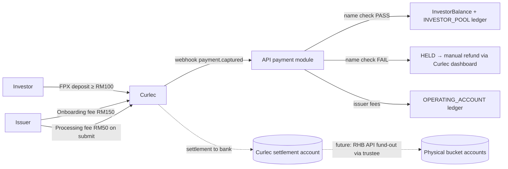

# Payment Gateway Integration Plan — Razorpay Curlec (Money In)

High-level implementation plan for collecting funds via Razorpay Curlec (Malaysia). Covers investor deposits (min RM100 onboarding + wallet top-ups), issuer onboarding fee, and application processing fee — plus AML name checks, manual refunds, ledger posting, and reconciliation. Money **out** (disbursement, fund movement between accounts, repayment collection by paymaster) will be done via the RHB bank API in a later phase; this plan only lays hooks for it.

For production operations, see the Curlec ops runbook: `docs/integrations/payment-gateway-curlec-ops-runbook.md`.

## 1. Confirmed Decisions

| Decision | Choice |
|---|---|
| Payment method | **FPX only** at launch (bank-to-bank, no chargebacks, supports payer identification) |
| Settlement | **Single Curlec settlement account**. Our internal ledger attributes funds to buckets (`INVESTOR_POOL`, `OPERATING_ACCOUNT`); physical movement between bank accounts happens later via RHB API / manual fund-out instructed through the trustee |
| AML name check (investors only) | Payer bank account name must match investor account name. On mismatch: **never credit the wallet**; deposit is held, admin refunds manually via Curlec dashboard, then marks refunded in our system |
| Issuers | No name check |
| Fee amounts | Admin-configurable via `PlatformFinanceSetting`: issuer onboarding fee (default RM150), application processing fee (default RM50), minimum investor deposit (default RM100) |
| Issuer onboarding fee timing | Paid **before eKYB starts** — gates the onboarding-start flow (matches money-flow doc: Sign-up → Fee → eKYB/KYC) |
| Refund policy | Issuer fees are **non-refundable** (even on rejection). Only investor deposits that fail the name check are refunded (manually) |
| Maker/checker | Unchanged — trustee remains the checker for money-out via the existing `WithdrawalInstruction` letter flow. Payment gateway handles money-in only |

## 2. Current State (codebase anchors)

There is **no payment gateway code today**. Key existing pieces the integration builds on:

| Concern | Where it lives today |
|---|---|
| Prisma schema | `apps/api/prisma/schema.prisma` |
| Investor wallet | `InvestorBalance` + append-only `InvestorBalanceTransaction` (sources: `MANUAL_TOPUP`, `NOTE_INVESTMENT_COMMIT`, `NOTE_INVESTMENT_RELEASE`); helpers in `apps/api/src/modules/notes/investor-balance.ts` |
| Deposit gate | `InvestorOrganization.deposit_received` boolean; enforced in `NoteService.createInvestment` (`INVESTOR_DEPOSIT_REQUIRED`) |
| Only money-in path | Dev-only `POST /v1/investor/balance/test-topup` (`testTopUpInvestorBalance` in `apps/api/src/modules/notes/service.ts`) — credits balance, sets `deposit_received`, posts `INVESTOR_POOL` ledger credit. **Must be disabled in production once real deposits ship** |
| Platform ledger | `NoteLedgerAccount` / `NoteLedgerEntry` with buckets `INVESTOR_POOL`, `REPAYMENT_POOL`, `OPERATING_ACCOUNT`, `TAWIDH_ACCOUNT`, `GHARAMAH_ACCOUNT`, `ISSUER_PAYABLE`; all postings idempotent via `idempotency_key`; admin view at `apps/admin/src/app/finance/buckets/page.tsx` |
| Fee settings pattern | `PlatformFinanceSetting` model + admin page `apps/admin/src/app/settings/platform-finance/page.tsx` |
| Investor deposit UI (placeholders) | `apps/investor/src/components/deposit-card.tsx` (onboarding, disabled "Coming Soon"), `apps/investor/src/app/transactions/page.tsx` + `transactions/components/deposit-dialog.tsx` (Bank Transfer/FPX buttons fake success) |
| Investor onboarding steps | `apps/investor/src/components/onboarding-status-card.tsx` — step 4 "Deposit" keyed off `depositReceived`. Deposit is a post-`COMPLETED` activation step, not part of the admin onboarding state machine |
| Issuer onboarding entry | `apps/issuer/src/app/onboarding-start/page.tsx` → `AccountTypeSelector` → RegTank eKYB start endpoints |
| Application submit | `PATCH /v1/applications/:id/status` → `ApplicationService.updateApplicationStatus` (`apps/api/src/modules/applications/service.ts`), `DRAFT → SUBMITTED`; issuer UI submit at `apps/issuer/src/app/(application-flow)/applications/edit/[id]/page.tsx` |
| Webhook pattern to copy | RegTank webhooks (`apps/api/src/modules/regtank/webhooks/`) and Shoraka STP webhook controller |
| Background jobs | `node-cron` only (`apps/api/src/lib/jobs/index.ts`) — recon jobs follow this pattern |
| Env validation | `apps/api/src/config/env.ts` (zod) + `env-templates/api.env.*` + SSM paths in `docs/guides/environment-variables.md` |
| API module pattern | `modules/<domain>/{controller,service,schemas}.ts`, zod-validated routes, `ApiResponse` envelope, typed SDK in `packages/config/src/api-client.ts`, shared DTOs in `packages/types` |

## 3. Money Flows To Implement



### 3.1 Investor deposit (onboarding activation + wallet top-up)

Same flow for both; the first successful deposit also sets `deposit_received = true`.

1. Investor enters amount (≥ configured minimum) → `POST /v1/investor/deposits` → API creates a Curlec **Order** (amount in sen, MYR), persists a `GatewayPayment` row (`CREATED`), returns `order_id` + public key.
2. Frontend opens Curlec Checkout (`checkout.razorpay.com/v1/checkout.js`, FPX method) → user authorizes at their bank portal → redirected back.
3. Webhook `payment.captured` → mark `PAID`, snapshot payer bank details → run **name check**.
4. **Name check PASS** → in one transaction: credit `InvestorBalance` (new source `GATEWAY_DEPOSIT`), set `deposit_received = true` if first deposit, post `INVESTOR_POOL` ledger credit (mirror `testTopUpInvestorBalance`), mark payment `COMPLETED`.
5. **Name check FAIL / payer name unavailable** → mark `HELD`, surface in admin held-deposits queue. Wallet is never credited. Admin refunds via Curlec dashboard/bank, then records the refund in our system (`REFUND_INITIATED` → `REFUNDED`, storing Curlec refund reference). No automated refund API call.

**Name source for the check:** expected name = investor account name (individual full name for `PERSONAL` orgs; company name for `COMPANY` orgs, from org record / `bank_account_details`). Actual name = payer bank account name from Curlec. ⚠️ **Open item (must verify with Curlec before build):** the standard Curlec `GET /v1/payments/:id` for FPX returns only the payer's bank code, not the account holder name, and Smart Collect/TPV is not available in Malaysia. Business has confirmed name check is possible via Razorpay — confirm with the Curlec account manager exactly which API/report exposes the FPX buyer name (FPX messages do carry it). Design the name check as a discrete step that consumes the name from whatever source is available (webhook payload, payment fetch, or settlement report); if no name is available programmatically, the deposit lands in a `NAME_CHECK_PENDING` admin queue where ops verifies against the Curlec dashboard and approves/holds manually. Matching is exact normalized comparison (case/whitespace/punctuation-insensitive); anything else fails to admin review — no fuzzy auto-approval.

### 3.2 Issuer onboarding fee (before eKYB)

1. New gate: after issuer signs up, `/onboarding-start` shows a "Pay onboarding fee" step before `AccountTypeSelector`. API-side, the RegTank onboarding start endpoints reject if the fee isn't paid.
2. `POST /v1/issuer/onboarding-fee` → Curlec order → checkout → webhook `payment.captured` → mark `COMPLETED`, set `onboarding_fee_paid_at` on the issuer org, post `OPERATING_ACCOUNT` ledger credit.
3. Non-refundable, including on onboarding rejection. No name check.

### 3.3 Application processing fee (on submission)

1. Fee is charged **once per application**, at first submission (`DRAFT → SUBMITTED`). Resubmissions after amendment do not re-charge.
2. Issuer UI: the final wizard step requires payment before the submit call. `POST /v1/applications/:id/processing-fee` → order → checkout → webhook completes payment linked to the application.
3. API hard gate: `ApplicationService.updateApplicationStatus` asserts a `COMPLETED` processing-fee payment exists for the application when transitioning `DRAFT → SUBMITTED` (defense in depth against UI bypass).
4. Ledger: `OPERATING_ACCOUNT` credit. Non-refundable. Admin application review shows fee paid status + receipt reference.

## 4. New Backend Module: `apps/api/src/modules/payment/`

Follow the standard module layout (controller / service / schemas), plus:

- `curlec-client.ts` — thin Curlec REST client (create order, fetch order/payment, fetch settlements). Server-side only, basic auth with key id/secret. Use the official `razorpay` Node SDK if it works against Curlec endpoints; otherwise plain fetch.
- `webhook-controller.ts` — public route `POST /v1/webhooks/curlec`. Requirements:
  - Mounted with **raw body** (signature is HMAC-SHA256 of the raw payload with the webhook secret; do not run through JSON middleware first).
  - Verify `X-Razorpay-Signature`; dedupe via `x-razorpay-event-id` (persist every event in `GatewayWebhookEvent`).
  - Handle out-of-order delivery (`payment.authorized` / `payment.captured` / `payment.failed` can arrive in any order) — process by reading current payment state, not by assuming sequence. All handlers idempotent.
  - Respond 2xx fast; processing inside a DB transaction keyed by idempotency.
- `name-check.ts` — normalization + exact-match comparison, returns `PASS | FAIL | NAME_UNAVAILABLE`.
- Auto-capture enabled on the Curlec account (or capture on `payment.authorized`) so FPX payments settle without a manual capture call.

### 4.1 Data model (Prisma)

New tables (snake_case mapped, money as `numeric(18,6)`, amounts stored in MYR not sen — convert at the Curlec boundary):

```
model GatewayPayment {
  id, purpose: GatewayPaymentPurpose
  organization_type (INVESTOR | ISSUER), investor_organization_id?, issuer_organization_id?
  application_id?                      // for APPLICATION_PROCESSING_FEE
  amount, currency ("MYR")
  status: GatewayPaymentStatus
  curlec_order_id @unique, curlec_payment_id? @unique, method ("fpx"), bank_code?
  payer_name?, name_check_result?, name_check_at?, name_checked_by_user_id?   // admin manual verify
  refund_reference?, refund_initiated_by?, refunded_at?, refund_notes?
  settlement_id?, settled_at?, gateway_fee_amount?     // filled by recon
  idempotency_key @unique, metadata Json?, timestamps
}

enum GatewayPaymentPurpose { INVESTOR_DEPOSIT | ISSUER_ONBOARDING_FEE | APPLICATION_PROCESSING_FEE }

enum GatewayPaymentStatus {
  CREATED          // order created, checkout not completed
  PAID             // captured by Curlec, pre name-check
  NAME_CHECK_PENDING // paid, name not programmatically available → admin verifies
  COMPLETED        // funds attributed: wallet credited / fee recognized + ledger posted
  HELD             // name check failed → awaiting manual refund
  REFUND_INITIATED // admin started manual refund in Curlec dashboard
  REFUNDED         // refund confirmed + recorded
  FAILED           // payment failed at gateway
  EXPIRED          // order abandoned (recon job closes stale CREATED rows)
}

model GatewayWebhookEvent { id, event_id @unique, event_type, payload Json, signature_valid, processed_at?, error?, created_at }
```

Supporting changes:

- `InvestorBalanceTransactionSource` + `GATEWAY_DEPOSIT`.
- `IssuerOrganization` (or shared org model): `onboarding_fee_paid_at DateTime?` denormalized gate flag (same pattern as `deposit_received`).
- `NoteLedgerEntry`: nullable `gateway_payment_id` reference so ledger postings link back to the gateway payment (same pattern as `payment_id`/`settlement_id`). Idempotency keys: `gateway-payment:{id}:credit`.
- `PlatformFinanceSetting`: `issuer_onboarding_fee_amount` (150), `application_processing_fee_amount` (50), `investor_min_deposit_amount` (100). Fee amount is snapshotted onto `GatewayPayment` at order creation.

### 4.2 Routes

| Route | Auth | Purpose |
|---|---|---|
| `POST /v1/investor/deposits` | INVESTOR | Create deposit order (validates min amount) |
| `GET /v1/investor/deposits/:id` | INVESTOR + ownership | Poll status after checkout redirect |
| `POST /v1/issuer/onboarding-fee` | ISSUER | Create onboarding fee order |
| `POST /v1/applications/:id/processing-fee` | ISSUER + ownership | Create processing fee order |
| `POST /v1/webhooks/curlec` | signature | Webhook ingress |
| `GET /v1/admin/gateway-payments` | ADMIN | List/filter (purpose, status, org) |
| `GET /v1/admin/gateway-payments/:id` | ADMIN | Detail incl. events + name check |
| `POST /v1/admin/gateway-payments/:id/name-check` | ADMIN | Manual verify: approve (credit) or fail (hold) for `NAME_CHECK_PENDING` |
| `POST /v1/admin/gateway-payments/:id/refund-initiated` | ADMIN | Record manual refund started |
| `POST /v1/admin/gateway-payments/:id/refunded` | ADMIN | Record refund confirmed (reference required) |

All DTOs exported from `packages/types`; SDK methods added to `packages/config/src/api-client.ts`.

## 5. Reconciliation

Goal: every Curlec payment is matched to a `GatewayPayment` and ledger entry; every Curlec settlement batch is matched to expected net amounts. The framework should be reusable for RHB bank-statement matching later.

- **Stuck-order poller** (cron, every 15 min): for `CREATED` rows older than ~30 min, fetch order/payments from Curlec API — catches missed webhooks; expire abandoned orders after 24h.
- **Daily settlement recon job** (cron): fetch Curlec settlements + constituent payments; stamp `settlement_id`, `settled_at`, `gateway_fee_amount` (MDR) onto `GatewayPayment` rows; flag orphans (Curlec payment with no internal row) and mismatches (amount drift, internal `COMPLETED` with no settlement after N days).
- Ledger posts **gross** amounts to buckets; MDR is tracked on the payment row and surfaced in the recon report (not posted to the note ledger — revisit when RHB integration defines the operating-expense treatment).
- **Admin recon page** (`apps/admin/src/app/finance/...`): settlement batches, match status, exceptions list. Daily exceptions should be zero.

## 6. Frontend Changes

**Investor portal** (`apps/investor`)
- Replace `deposit-card.tsx` placeholder with a real deposit flow (amount input ≥ configured min, Curlec checkout, success/pending/failed states; skeletons while polling).
- Wire `transactions/components/deposit-dialog.tsx` FPX button to the real flow; remove fake success paths; keep dev top-up strictly behind the env flag and **add an API-side env guard** to `test-topup`.
- Deposit status surfaces: pending name check ("deposit received, verification in progress"), held ("deposit could not be verified — our team will contact you for a refund").
- Onboarding step 4 completes when the first deposit reaches `COMPLETED`.

**Issuer portal** (`apps/issuer`)
- Onboarding fee payment step gating `onboarding-start` (paid state persists across sessions via `onboarding_fee_paid_at`).
- Application submit step: pay processing fee → then submit; show paid state if fee already completed (e.g. retry after a failed submit).

**Admin portal** (`apps/admin`)
- Finance → Gateway Payments: list/detail with webhook event trail.
- Held deposits queue: name-check review (approve `NAME_CHECK_PENDING` / confirm `HELD`), record refund initiated/refunded.
- Recon page (section 5).
- Badges on existing surfaces: onboarding approval queue shows issuer fee paid; application review shows processing fee paid.

All UI uses shared `packages/ui` components, brand tokens, Hero Icons; checkout script loaded only on pages that need it (Next.js `Script`, lazy).

## 7. Config & Secrets

- Extend `apps/api/src/config/env.ts` zod schema: `CURLEC_KEY_ID`, `CURLEC_KEY_SECRET`, `CURLEC_WEBHOOK_SECRET` (replaces the documented-but-unwired `PAYMENT_GATEWAY_*` placeholders).
- Frontends need only the public key id (`NEXT_PUBLIC_CURLEC_KEY_ID`) — prefer returning it from the order-create response instead to avoid build-time env coupling.
- Add to `env-templates/api.env.*` and SSM under `/cashsouk/prod/secrets/`; update `docs/guides/environment-variables.md`.
- Curlec dashboard: enable FPX, auto-capture, webhook URL `https://api.<domain>/v1/webhooks/curlec` with secret; test mode keys for staging.

## 8. Delivery Phases

| Phase | Scope | Depends on |
|---|---|---|
| **1. Foundation** | Prisma models + migration, `PlatformFinanceSetting` fee fields + admin settings UI, payment module skeleton, Curlec client, webhook endpoint (verify/dedupe/store), env wiring | Curlec test account |
| **2. Investor deposits** | Deposit order API, checkout UI (deposit card + transactions), name check, wallet credit + `INVESTOR_POOL` ledger, held/refund admin flow, prod-guard test-topup | Phase 1, name-source confirmation from Curlec |
| **3. Issuer onboarding fee** | Fee gate UI + API, `onboarding_fee_paid_at`, `OPERATING_ACCOUNT` ledger, admin badge | Phase 1 |
| **4. Application processing fee** | Submit-step payment UI, submission gate in `updateApplicationStatus`, ledger, admin badge | Phase 1 |
| **5. Reconciliation** | Stuck-order poller, settlement recon job, admin recon page | Phases 2–4 |
| **6. Hardening** | Playwright e2e per portal (mocked Curlec), load/replay tests on webhook, prod SSM config, runbook for held-deposit refunds | All |

Phases 3 and 4 are independent of 2 and can run in parallel after Phase 1.

## 9. Testing

- **Unit**: name normalization/matching, status transitions (reject illegal e.g. `HELD → COMPLETED`), fee snapshotting, sen↔RM conversion.
- **Integration** (supertest + test Postgres): webhook signature pass/fail, duplicate event replay (no double credit), out-of-order events, submit gate without paid fee, ownership checks on order creation.
- **E2E** (Playwright, Curlec mocked at the network edge): investor deposit happy path + held path; issuer onboarding fee gate; application submit with fee. Shared utils in `packages/testing/playwright`.
- **Manual**: full FPX flow against Curlec test mode before go-live (test bank simulator).

## 10. Risks & Open Items

1. **FPX payer name availability (blocking for Phase 2 design detail)** — standard Curlec payment fetch exposes only the bank code; Smart Collect/TPV is not offered in Malaysia. Confirm with Curlec which API field/report carries the FPX buyer name. The `NAME_CHECK_PENDING` manual-verify path is the fallback if it's dashboard/report-only.
2. **FPX transaction limits** — FPX B2C caps (typically RM30k per transaction retail; B2B model higher) may matter for large investor top-ups; confirm limits on the Curlec account and surface a max in the deposit UI.
3. **Settlement timing** — funds are credited to the investor wallet at `payment.captured`, before Curlec settles to our bank (T+1/T+2). This float is accepted (gateway guarantees captured FPX funds); recon (Phase 5) verifies settlement.
4. **Single settlement account vs buckets** — physical cash sits in one account until RHB fund-out exists; the ledger is the source of truth for bucket attribution. Trustee-instructed movements remain manual in the interim.
5. **MDR accounting** — gateway fees are tracked per payment in recon but not posted to the note ledger yet; finance to decide treatment when RHB/accounting integration lands.
6. **Queue infrastructure** — webhooks are processed inline + node-cron recon, consistent with the current codebase. If webhook volume or retry complexity grows, graduate to BullMQ/SQS per backend rules.
