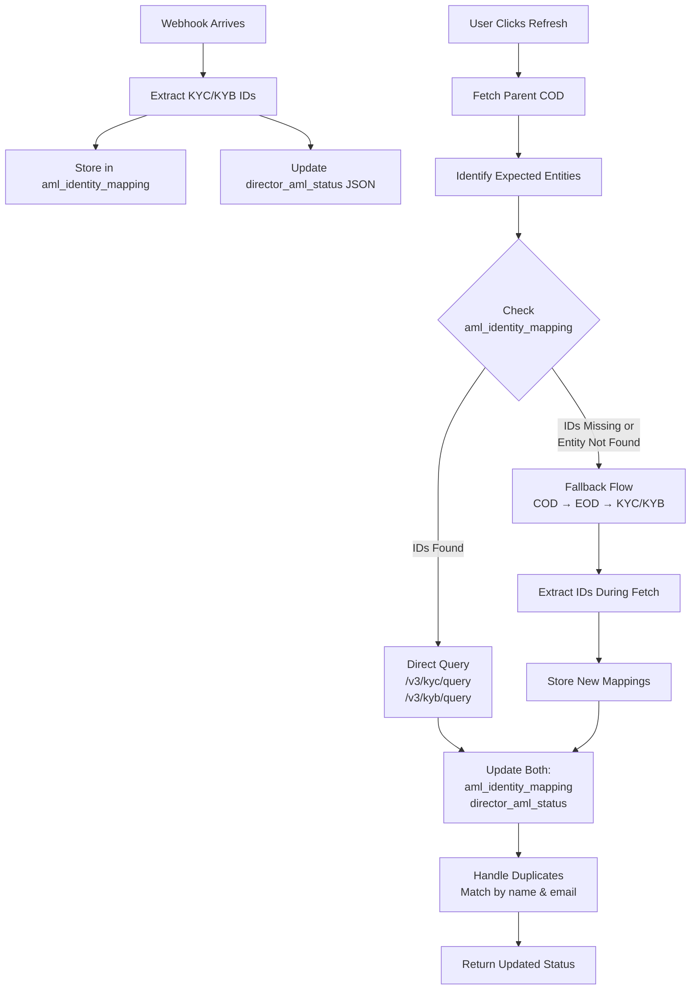

# RegTank KYC Integration Guide

This document provides a comprehensive guide for integrating RegTank's KYC/KYB onboarding services with CashSouk. It is based on the [official RegTank API documentation](https://regtank.gitbook.io/regtank-api-docs/) and cross-referenced with the RegTank Postman collection (v3.0 - Shoraka Digital Trial).

## Table of Contents

1. [Overview](#overview)
2. [Quick Start](#quick-start)
3. [Environment Configuration](#environment-configuration)
4. [Authentication](#authentication)
5. [API Reference](#api-reference)
   - [Individual Onboarding](#individual-onboarding)
   - [Business Onboarding](#business-onboarding)
   - [KYC Screening](#kyc-screening)
   - [KYB Screening](#kyb-screening)
   - [KYT Monitoring](#kyt-monitoring)
6. [Webhooks](#webhooks)
7. [Integration Flow](#integration-flow)
8. [Implementation Checklist](#implementation-checklist)
9. [Troubleshooting](#troubleshooting)

---

## Overview

RegTank is a compliance and risk management platform that provides:

- **Digital Onboarding** - ID document verification + liveness check
- **KYC (Know Your Customer)** - Individual screening against sanctions/watchlists
- **KYB (Know Your Business)** - Business entity verification
- **KYT (Know Your Transaction)** - Transaction monitoring

For CashSouk, we primarily use:

- **Individual Onboarding** for Investors (personal identity verification) - **Personal Account only available in Investor portal**
- **Business Onboarding (COD/EOD)** for Issuers (company + director verification) - **Issuer portal only supports Company Account onboarding**

### Key Integration Points

1. **Server-to-Server OAuth2** - Backend authenticates with RegTank (users never log in)
2. **Webhook-Based Updates** - Asynchronous status notifications via webhooks
3. **Global Configuration** - Webhook and redirect URLs configured once per environment
4. **Form-Based Settings** - Redirect URL configured per `formId` via settings endpoint
5. **Multiple Form IDs** - RegTank uses three different form IDs:
   - Personal Account (Investor portal): Individual onboarding form
   - Company Account (Investor portal): Corporate onboarding form for investors
   - Company Account (Issuer portal): Corporate onboarding form for issuers

---

## Quick Start

### Testing with Postman

RegTank provides Postman collection files for testing. To get started:

1. **Import Postman Collection**: Import `Regtank APIs v3.0 - Shoraka Digital Trial.postman_collection.json`
2. **Import Environment**: Import `Regtank APIs v3.0 - Shoraka Digital Trial.postman_environment.json`
3. **Get OAuth Token**: Run the "Oauth Token" request to obtain an access token
4. **Test Onboarding**: Use the "Onboarding Request" endpoint to create a test onboarding

### Manual Testing Portal

For manual testing of the digital onboarding flow:

- **Trial/Sandbox**: https://shoraka-trial-onboarding.regtank.com/BaseInfo/emailVerify
- **Production**: https://shoraka-onboarding.regtank.com/BaseInfo/emailVerify

After completion, view results in the RegTank Client Portal:
- **Trial/Sandbox**: https://shoraka-trial.regtank.com
- **Production**: https://shoraka.regtank.com

---

## Environment Configuration

RegTank provides separate **Production** and **Trial/Sandbox** environments.

### Production Environment

| Component         | URL                                                           |
| ----------------- | ------------------------------------------------------------- |
| OAuth Server      | `https://crm-server.regtank.com`                              |
| API Server        | `https://shoraka-server.regtank.com`                          |
| Onboarding Proxy  | `https://shoraka-onboarding-proxy.regtank.com`                |
| Client Portal     | `https://shoraka.regtank.com`                                 |
| Manual Onboarding | `https://shoraka-onboarding.regtank.com/BaseInfo/emailVerify` |

**Configuration Storage**: AWS Secrets Manager at `cashsouk/prod/regtank`

**Form IDs:**
RegTank uses different form IDs for different onboarding scenarios:
- **Personal Account (Investor portal)**: Individual onboarding form ID
- **Company Account (Investor portal)**: Corporate onboarding form ID for investors
- **Company Account (Issuer portal)**: Corporate onboarding form ID for issuers

Each form ID has its own settings configuration (redirect URL, liveness confidence, etc.) configured via the `/v3/onboarding/indv/setting` endpoint.

### Trial/Sandbox Environment

| Component         | URL                                                                 |
| ----------------- | ------------------------------------------------------------------- |
| OAuth Server      | `https://crm-server.regtank.com`                                    |
| API Server        | `https://shoraka-trial-server.regtank.com`                          |
| Onboarding Proxy  | `https://shoraka-trial-onboarding-proxy.regtank.com`                |
| Client Portal     | `https://shoraka-trial.regtank.com`                                 |
| Manual Onboarding | `https://shoraka-trial-onboarding.regtank.com/BaseInfo/emailVerify` |

**Configuration Storage**: AWS Secrets Manager at `cashsouk/staging/regtank`

**Trial/Sandbox Credentials:**
- **Client ID**: `6c3eb4f4-3402-45a3-8707-a365059e7581`
- **Client Secret**: `88b2d5fe7d5ac366f0d7b59f67bf9ee4`

**Form IDs:**
Same as production - RegTank uses different form IDs for different onboarding scenarios:
- **Personal Account (Investor portal)**: Individual onboarding form ID (configured via `REGTANK_INVESTOR_PERSONAL_FORM_ID`, default: 1036131)
- **Company Account (Investor portal)**: Corporate onboarding form ID for investors (configured via `REGTANK_INVESTOR_CORPORATE_FORM_ID`, default: 1015520)
- **Company Account (Issuer portal)**: Corporate onboarding form ID for issuers (configured via `REGTANK_ISSUER_CORPORATE_FORM_ID`, default: 1015520)

Each form ID has its own settings configuration (redirect URL, liveness confidence, etc.) configured via the `/v3/onboarding/indv/setting` endpoint.

> **Note:** The OAuth server (`crm-server.regtank.com`) is shared between environments. Only the API server URL differs.

---

## Authentication

RegTank uses **OAuth2 Client Credentials Flow** for server-to-server authentication.

### Key Characteristics

- **Backend-only**: Users never log into RegTank directly
- **Automatic**: OAuth happens automatically when backend makes API calls
- **Token Caching**: Tokens are cached and auto-refreshed (expires in ~1 hour)
- **Secure**: Credentials stored in AWS Secrets Manager

### OAuth Token Endpoint

**Endpoint:** `POST https://crm-server.regtank.com/oauth/token`

**Request Headers:**
```
Content-Type: multipart/form-data
```

**Request Body (form-data):**
```
grant_type: client_credentials
client_id: <from secrets manager>
client_secret: <from secrets manager>
```

**Response:**
```json
{
  "access_token": "eyJhbGciOiJSUzI1NiIsInR5cCI6IkpXVCIs...",
  "token_type": "bearer",
  "expires_in": 3599,
  "scope": "read write",
  "sub": "client-id",
  "jti": "unique-token-id"
}
```

**Usage:**
All subsequent API requests must include:
```
Authorization: Bearer <access_token>
```

---

## API Reference

### Individual Onboarding

#### 1. Create Individual Onboarding Request

**Endpoint:** `POST https://{client-portal-server}/v3/onboarding/indv/request`

**Reference:** [RegTank API Docs - Individual Onboarding Request](https://regtank.gitbook.io/regtank-api-docs/reference/api-reference/2.-onboarding/2.1-individual-onboarding-endpoint-json-request)

**Headers:**
```
Authorization: Bearer <access_token>
Content-Type: application/json; charset=utf-8
```

**Request Body:**
```json
{
  "email": "user@example.com",
  "surname": "Doe",
  "forename": "John",
  "middleName": "William",
  "referenceId": "cashsouk-org-123",
  "countryOfResidence": "MY",
  "nationality": "MY",
  "placeOfBirth": "MY",
  "idIssuingCountry": "MY",
  "dateOfBirth": "1977-01-01",
  "yearOfBirth": 1977,
  "gender": "MALE",
  "governmentIdNumber": "A12345678",
  "idType": "IDENTITY",
  "language": "EN",
  "bypassIdUpload": false,
  "skipFormPage": true,
  "address": "123 Main St",
  "walletAddress": "KwmgX4oEAZRLDLaVBv6VbV2S8PiyYv23mctbqHdP6GjQAcDvZUNg",
  "industry": "WINE_SPIRITS",
  "occupation": "CHIEF_EXECUTIVES_SENIOR_OFFICIALS_AND_LEGISLATORS",
  "tags": [],
  "formId": 12306,
  "proofOfAddress": {
    "fileName": "proofOfAddress.pdf",
    "fileContent": "data:image/jpeg;base64,/9j..."
  }
}
```

**Required Fields:**
- `email` (String) - Individual's email address
- `surname` (String) - Last name
- `forename` (String) - First name

**Required When Webhook Enabled:**
- `referenceId` (String) - Internal reference ID for webhook matching
- `countryOfResidence` (Enum) - ISO 3166 country code
- `placeOfBirth` (Enum) - ISO 3166 country code
- `nationality` (Enum) - ISO 3166 country code
- `idIssuingCountry` (Enum) - ISO 3166 country code

**Optional Fields:**
- `middleName` (String)
- `dateOfBirth` (String) - ISO format "YYYY-MM-DD" or epoch milliseconds
- `yearOfBirth` (Integer) - Redundant if `dateOfBirth` provided
- `gender` (Enum) - "MALE", "FEMALE", "UNSPECIFIED"
- `governmentIdNumber` (String)
- `idType` (String) - "PASSPORT", "IDENTITY", "DRIVER_LICENSE", "RESIDENCE_PERMIT"
- `language` (String) - "EN", "ZH_CN", "RU", "JA", "KO", "DE", "ES", "FR", "PT", "IT", "TR", "TH", "VI", "ID", "ZH_TW", "AR"
- `bypassIdUpload` (Boolean) - If `true`, URL points directly to liveness check
- `skipFormPage` (Boolean) - If `true`, URL points directly to form page (default: `true`)
- `address` (String)
- `walletAddress` (String) - Crypto wallet address
- `industry` (Enum) - See [Appendix B: Industry Values](https://regtank.gitbook.io/regtank-api-docs)
- `occupation` (Enum) - See [Appendix C: Occupation Values](https://regtank.gitbook.io/regtank-api-docs)
- `tags` (Array) - Array of strings
- `formId` (Integer) - Form ID linking to configured settings
- `proofOfAddress` (Object) - Document with `fileName` and `fileContent` (base64)

**Important Notes:**
- **Do NOT include `webhookUrl` or `redirectUrl`** in the request body
- `webhookUrl` is configured globally via `/alert/preferences` endpoint
- `redirectUrl` is configured per `formId` via `/v3/onboarding/indv/setting` endpoint
- `referenceId` should be your internal organization ID for webhook matching

**Response:**
```json
{
  "requestId": "LD00001",
  "verifyLink": "https://shoraka-onboarding.regtank.com?requestId=LD00001&token=eyJhbG...&language=EN&step=ID",
  "expiredIn": 86400,
  "timestamp": "2023-07-31 09:45:29+0000"
}
```

**Error Responses:**
- `400 ERROR_VALUE_INVALID` - Invalid field value (idType, occupation, industry, gender)
- `400 ERROR_MISSING_PARAM` - Required field missing (referenceId, idType)
- `400 ERROR_DATA_NOT_FOUND` - formId does not exist
- `400 ERROR_INVALID_ID_TYPE` - ID type doesn't match document type
- `400 Invalid Request Parameters` - Missing required fields (surname, forename, email)
- `429 Too Many Requests` - Rate limit exceeded

#### 2. Get Onboarding Details

**Endpoint:** `GET https://{client-portal-server}/v3/onboarding/indv/query?requestId={requestId}`

**Reference:** [RegTank API Docs - Get Detail](https://regtank.gitbook.io/regtank-api-docs/reference/api-reference/2.-onboarding/2.5-individual-onboarding-endpoint-json-get-detail)

**Query Parameters:**
- `requestId` (required) - RegTank request ID
- `email` (optional) - Query by email instead of requestId

**Response:**
```json
{
  "requestId": "LD00001",
  "status": "APPROVED",
  "substatus": "LIVENESS_PASSED",
  "userProfile": {
    "email": "user@example.com",
    "firstName": "John",
    "lastName": "Doe",
    "dateOfBirth": "1977-01-01",
    "nationality": "MY",
    "gender": "MALE",
    "governmentIdNumber": "A12345678",
    "referenceId": "cashsouk-org-123"
  },
  "documentInfo": {
    "countryCode": "MY",
    "documentType": "IDENTITY",
    "frontDocumentUrl": "https://...",
    "backDocumentUrl": "https://..."
  },
  "livenessCheckInfo": {
    "documentUrl": "https://...",
    "selfieUrl": "https://...",
    "verifyStatus": "LIVENESS_PASSED",
    "confidence": 98.5
  },
  "kycPositiveMatch": false,
  "requestDate": "2024-01-15T10:00:00",
  "verifyDate": "2024-01-15T10:15:00"
}
```

#### 3. Restart Onboarding

**Endpoint:** `POST https://{client-portal-server}/v3/onboarding/indv/request/{requestId}/restart`

**Reference:** [RegTank API Docs - Restart Onboarding](https://regtank.gitbook.io/regtank-api-docs/reference/api-reference/2.-onboarding/2.4-individual-onboarding-endpoint-json-restart-onboarding)

**Request Body:**
```json
{
  "requestId": "LD00001",
  "email": "user@example.com"
}
```

**Response:** Returns a new `verifyLink` and `expiredIn` (same structure as create request)

#### 4. Set Onboarding Settings

**Endpoint:** `POST https://{client-portal-server}/v3/onboarding/indv/setting`

**Reference:** [RegTank API Docs - Set Setting](https://regtank.gitbook.io/regtank-api-docs/reference/api-reference/2.-onboarding/2.7-individual-onboarding-endpoint-json-set-setting)

**Purpose:** Configure redirect URL, liveness confidence, and other form-specific settings. This is a **one-time configuration per `formId`**.

**Request Body:**
```json
{
  "formId": 12306,
  "livenessConfidence": 60,
  "approveMode": false,
  "kycApprovalTarget": "DOWJONES",
  "enabledRegistrationEmail": true,
  "redirectUrl": "https://investor.cashsouk.com/regtank-callback"
}
```

**Required Fields:**
- `formId` (Integer) - Form ID
- `livenessConfidence` (Integer) - Face match threshold (default: 60)
- `approveMode` (Boolean) - Enable/disable Approve/Reject button

**Optional Fields:**
- `redirectUrl` (String) - URL to redirect after completion
- `kycApprovalTarget` (String) - "ACURIS" or "DOWJONES"
- `enabledRegistrationEmail` (Boolean) - Send email on status changes

**Response:**
```json
{
  "message": "Success"
}
```

**Important Notes:**
- Settings are configured **per `formId`**
- `redirectUrl` applies to all onboarding requests using the specified `formId`
- This is a **one-time configuration** - call once per environment per `formId`
- The `redirectUrl` is where users are redirected after completing onboarding

#### 5. Get Onboarding Settings

**Endpoint:** `GET https://{client-portal-server}/v3/onboarding/indv/setting/query?formId={formId}`

**Reference:** [RegTank API Docs - Get Setting](https://regtank.gitbook.io/regtank-api-docs/reference/api-reference/2.-onboarding/2.6-individual-onboarding-endpoint-json-get-setting)

**Query Parameters:**
- `formId` (required) - Form ID to query

**Response:** Returns current settings for the specified `formId`

#### 6. Upload ID Document (Optional)

**Endpoint:** `POST https://{client-portal-server}/v3/onboarding/indv/document-upload`

**Reference:** [RegTank API Docs - ID Document Upload](https://regtank.gitbook.io/regtank-api-docs/reference/api-reference/2.-onboarding/2.2-individual-onboarding-endpoint-json-id-document-upload)

**Purpose:** Upload ID documents separately after creating onboarding request. This is optional if documents are uploaded through the `verifyLink` flow.

**Request Body:**
```json
{
  "requestId": "LD00001",
  "email": "user@example.com",
  "documentType": "Identity",
  "frontImage": {
    "fileName": "icFront.jpeg",
    "fileContent": "data:image/jpeg;base64,/9j..."
  },
  "backImage": {
    "fileName": "icBack.jpeg",
    "fileContent": "data:image/jpg;base64,/9j..."
  }
}
```

**Response:**
```json
{
  "requestId": "LD00001",
  "status": "ID_UPLOADED",
  "docUploadErrors": null,
  "rejected": null
}
```

### Business Onboarding

#### 1. Create Business Onboarding Request

**Endpoint:** `POST https://{client-portal-server}/v3/onboarding/corp/request`

**Reference:** [RegTank API Docs - Business Onboarding Request](https://regtank.gitbook.io/regtank-api-docs/reference/api-reference/2.-onboarding/2.8-business-onboarding-endpoint-json-request)

**Request Body:**
```json
{
  "email": "test@regtank.com",
  "companyName": "Company A",
  "formName": "Business End User Onboarding Example Form1"
}
```

**Required Fields:**
- `email` (String) - Intended recipient email address
- `companyName` (String) - Registered Company Name
- `formName` (String) - Business form name

**Important Notes:**
- **Do NOT include `referenceId`** in the request body - RegTank API does not accept this field
- `referenceId` is used internally by CashSouk for tracking and webhook matching, but is not sent to RegTank
- **Do NOT include `formId`** in the request body - RegTank API does not accept this field
- `formId` is used internally by CashSouk for form name selection, but is NOT sent to RegTank API
- The `formName` field is what RegTank uses to identify the form configuration

**Response:**
```json
{
  "requestId": "COD00001",
  "verifyLink": "https://shoraka-onboarding.regtank.com/Onboarding2Company/step1?requestId=COD00001&token=...",
  "expiredIn": 86400,
  "timestamp": "2023-07-31 11:41:08+0000"
}
```

**Response Fields:**
- `requestId` (String) - Unique ID generated from the request, to be used for COD/EOD queries
- `verifyLink` (String) - Link to access the business onboarding portal
- `expiredIn` (Integer) - Duration before URL expires in seconds (default: 86400 = 24 hours)
- `timestamp` (Datetime) - Time when URL is generated (GMT +8)

**Error Responses:**
- `400 Bad Request` - "The email already exists"
  ```json
  {
    "timestamp": "2023-06-23T09:33:17.175+00:00",
    "status": 400,
    "error": "Bad Request",
    "message": "The email already exists",
    "path": "/v3/onboarding/corp/request"
  }
  ```

#### 2. Query Company Onboarding Data (COD)

**Endpoint:** `GET https://{client-portal-server}/v3/onboarding/corp/query?requestId={requestId}`

**Reference:** [RegTank API Docs - Query COD](https://regtank.gitbook.io/regtank-api-docs/reference/api-reference/2.-onboarding/2.9-business-onboarding-endpoint-json-query-cod)

**Query Parameters:**
- `requestId` (required) - COD request ID

**Response Fields:**
- `requestId` (String) - Corresponding COD id
- `formId` (String) - Id of business onboarding form
- `deviceType` (String) - Type of device used to make submission
- `status` (Enum) - Progress of business onboarding (e.g., "APPROVED", "WAIT_FOR_APPROVAL")
- `approveStatus` (String) - Progress of approval
- `kybType` (String) - Database used for screening (onboarding settings configuration)
- `formContent` (Object) - Submitted form details with displayAreas
- `sendEmailStatus` (Enum) - Status of email sent
- `lastModifiedBy` (Object) - User who last modified the record
- `isPrimary` (Boolean) - Company to be onboarded
- `requestIpAddress` (String) - Request's IP address
- `directorCount` (Integer) - Number of directors
- `individualShareholderCount` (Integer) - Number of individual shareholders
- `corporateShareholderCount` (Integer) - Number of corporate shareholders
- `corporateIndividuals` (Object) - List of corporate individuals (EOD records)
- `corporateRequests` (Object) - List of corporate requests
- `kybRequest` (Object) - KYB request information

**Error Responses:**
- `404 Not Found` - "COD record not found"
  ```json
  {
    "timestamp": "2023-06-23T09:33:17.175+00:00",
    "status": 404,
    "error": "Not Found",
    "message": "COD00001 not Found",
    "path": "/v3/onboarding/corp/query"
  }
  ```

#### 3. Query Entity Onboarding Data (EOD)

**Endpoint:** `GET https://{client-portal-server}/v3/onboarding/corp/indv/query?requestId={requestId}`

**Reference:** [RegTank API Docs - Query EOD](https://regtank.gitbook.io/regtank-api-docs/reference/api-reference/2.-onboarding/2.10-business-onboarding-endpoint-json-query-eod)

**Query Parameters:**
- `requestId` (required) - EOD request ID (for individual directors/shareholders)

**Response Structure:**
The response contains the following main objects:

- `corporateIndividualRequest` (Object) - Corporate individual request information
  - `requestId` (String) - EOD request ID
  - `email` (String) - Individual's email address
  - `status` (String) - Current status (e.g., "WAIT_FOR_APPROVAL", "APPROVED")
  - `deviceType` (String) - Device type used for submission
  - `requestIpAddress` (String) - Request IP address
  - `approveStatus` (String) - Approval status
  - `kycType` (String) - KYC database type (e.g., "ACURIS")

- `corporateUserRequestInfo` (Object) - Corporate user request information
  - Personal information fields (firstName, lastName, email, etc.)
  - `formContent` (Object) - Form content with displayAreas and field values
  - `documentType` (String) - Type of document (e.g., "Passport", "Identity")
  - `corporateIndividualRequestId` (Integer) - Link to corporate individual request

- `corporateDocumentInfo` (Object) - Corporate document information
  - `frontDocumentUrl` (String) - Front document URL
  - `backDocumentUrl` (String) - Back document URL (if applicable)
  - `documentType` (String) - Document type
  - `documentNum` (String) - Document number
  - `ocrStatus` (String) - OCR processing status

- `corporateLivenessCheckInfo` (Object) - Corporate liveness check information
  - Liveness check status and verification results
  - Video/document URLs if available

- `kycRequest` (Object) - KYC request information
  - `kycId` (String) - KYC request ID
  - `status` (String) - KYC status
  - `kycType` (String) - KYC database type
  - `kycPositiveMatch` (Boolean) - Whether positive match was found

**Error Responses:**
- `404 Not Found` - "EOD record not found"
  ```json
  {
    "timestamp": "2023-06-23T09:33:17.175+00:00",
    "status": 404,
    "error": "Not Found",
    "message": "EOD00001 not Found",
    "path": "/v3/onboarding/corp/indv/query"
  }
  ```

### KYC Screening

RegTank supports two KYC providers: **Acuris** and **Dow Jones**. Each has separate endpoints.

#### Acuris KYC

**1. KYC Request**
- **Endpoint:** `POST /v3/kyc/input`
- **Reference:** [RegTank API Docs - KYC](https://regtank.gitbook.io/regtank-api-docs/reference/api-reference/3.-know-your-customer-kyc)

**2. Query Status**
- **Endpoint:** `GET /v3/kyc/query?requestId={requestId}&referenceId={referenceId}`

**3. Generate Score**
- **Endpoint:** `POST /v3/kyc/scoring`

**4. Ongoing Monitoring**
- **Endpoint:** `POST /v3/kyc/ongoing-monitoring`

#### Dow Jones KYC

Same structure as Acuris but with `/djkyc/` prefix:
- `POST /v3/djkyc/input`
- `GET /v3/djkyc/query?requestId={requestId}&referenceId={referenceId}`
- `POST /v3/djkyc/scoring`
- `POST /v3/djkyc/ongoing-monitoring`

### KYB Screening

RegTank supports two KYB providers: **Acuris** and **Dow Jones**. Each has separate endpoints.

#### Acuris KYB

**1. KYB Request**
- **Endpoint:** `POST /v3/kyb/input`

**2. Query Status**
- **Endpoint:** `GET /v3/kyb/query?requestId={requestId}&referenceId={referenceId}`

**3. Complete Resolution**
- **Endpoint:** `POST /v3/kyb/complete-resolution`

**4. Generate Score**
- **Endpoint:** `POST /v3/kyb/scoring`

**5. Ongoing Monitoring**
- **Endpoint:** `POST /v3/kyb/ongoing-monitoring`

#### Dow Jones KYB

Same structure as Acuris but with `/djkyb/` prefix:
- `POST /v3/djkyb/input`
- `GET /v3/djkyb/query?requestId={requestId}&referenceId={referenceId}`
- `POST /v3/djkyb/complete-resolution`
- `POST /v3/djkyb/scoring`
- `POST /v3/djkyb/ongoing-monitoring`

### KYT Monitoring

**1. KYT Request**
- **Endpoint:** `POST /v3/kyt/input`

**2. Query Status**
- **Endpoint:** `GET /v3/kyt/query?requestId={requestId}&referenceId={referenceId}`

---

## Webhooks

### Configuration

Webhook URL is configured **globally** via the `/alert/preferences` endpoint. This is a **one-time setup per environment**.

**Endpoint:** `POST https://{client-portal-server}/alert/preferences`

**Request Body:**
```json
{
  "webhookUrl": "https://api.cashsouk.com/v1/webhooks/regtank",
  "webhookEnabled": true
}
```

**Important Notes:**
- This is a **global configuration** - applies to all webhooks for the environment
- Can also be configured via RegTank admin portal
- Do NOT include `webhookUrl` in individual onboarding requests
- Webhook URL should be publicly accessible (no localhost)

### Webhook Endpoints

RegTank automatically appends suffixes to your configured `webhookUrl` based on the webhook type. According to the [official RegTank documentation](https://regtank.gitbook.io/regtank-api-docs/reference/api-reference/6.-webhook/6.2-receiving-webhook-notifications), RegTank sends webhooks to:

| Webhook Type | Endpoint Suffix | Full URL Example | Reference |
|--------------|----------------|------------------|-----------|
| Individual Onboarding | `/liveness` | `https://api.cashsouk.com/v1/webhooks/regtank/liveness` | [6.2.6](https://regtank.gitbook.io/regtank-api-docs/reference/api-reference/6.-webhook/6.2-receiving-webhook-notifications/6.2.6-individual-onboarding-notification-definition) |
| KYC Screening (Acuris) | `/kyc` | `https://api.cashsouk.com/v1/webhooks/regtank/kyc` | [6.2.1](https://regtank.gitbook.io/regtank-api-docs/reference/api-reference/6.-webhook/6.2-receiving-webhook-notifications/6.2.1-kyc-notification-definition) |
| KYC Screening (Dow Jones) | `/djkyc` | `https://api.cashsouk.com/v1/webhooks/regtank/djkyc` | [6.2.2](https://regtank.gitbook.io/regtank-api-docs/reference/api-reference/6.-webhook/6.2-receiving-webhook-notifications/6.2.2-djkyc-notification-definition) |
| KYB Screening (Acuris) | `/kyb` | `https://api.cashsouk.com/v1/webhooks/regtank/kyb` | [6.2.3](https://regtank.gitbook.io/regtank-api-docs/reference/api-reference/6.-webhook/6.2-receiving-webhook-notifications/6.2.3-kyb-notification-definition) |
| KYB Screening (Dow Jones) | `/djkyb` | `https://api.cashsouk.com/v1/webhooks/regtank/djkyb` | [6.2.4](https://regtank.gitbook.io/regtank-api-docs/reference/api-reference/6.-webhook/6.2-receiving-webhook-notifications/6.2.4-djkyb-notification-definition) |
| KYT Monitoring | `/kyt` | `https://api.cashsouk.com/v1/webhooks/regtank/kyt` | [6.2.5](https://regtank.gitbook.io/regtank-api-docs/reference/api-reference/6.-webhook/6.2-receiving-webhook-notifications/6.2.5-kyt-notification-definition) |
| Business Onboarding (COD) | `/cod` | `https://api.cashsouk.com/v1/webhooks/regtank/cod` | [6.2.7](https://regtank.gitbook.io/regtank-api-docs/reference/api-reference/6.-webhook/6.2-receiving-webhook-notifications/6.2.7-business-onboarding-notification-definition-cod) |
| Business Onboarding (EOD) | `/eod` | `https://api.cashsouk.com/v1/webhooks/regtank/eod` | [6.2.8](https://regtank.gitbook.io/regtank-api-docs/reference/api-reference/6.-webhook/6.2-receiving-webhook-notifications/6.2.8-business-onboarding-notification-definition-eod) |

**Important Notes:**
- RegTank automatically appends the suffix to your base `webhookUrl`
- You must configure route handlers for each suffix in your application
- All webhooks use the same signature verification mechanism
- The `referenceId` field is included in all webhook payloads for record matching

### Webhook Signature Verification

RegTank uses **HMAC-SHA256** signature verification for webhooks.

**Header:** `X-RegTank-Signature`

**Format:** `sha256=<signature>` or `<signature>`

**Verification Process:**
1. Extract signature from `X-RegTank-Signature` header
2. Compute HMAC-SHA256 of raw request body using `REGTANK_WEBHOOK_SECRET`
3. Compare signatures using constant-time comparison
4. Reject with `401 Unauthorized` if signature is invalid

**Note:** In development/testing, webhooks may be accepted without signature (logged as warning).

### Webhook Payloads

RegTank sends webhook notifications as **POST requests** to your configured webhook URL with the appropriate suffix. The **request body** (JSON payload) contains the webhook data. All webhooks include `requestId` and `referenceId` for record matching.

**Reference:** [RegTank Webhook Documentation](https://regtank.gitbook.io/regtank-api-docs/reference/api-reference/6.-webhook/6.2-receiving-webhook-notifications)

#### Individual Onboarding Webhook (`/liveness`)

**Reference:** [Individual Onboarding Notification Definition](https://regtank.gitbook.io/regtank-api-docs/reference/api-reference/6.-webhook/6.2-receiving-webhook-notifications/6.2.6-individual-onboarding-notification-definition)

**Payload:**
  ```json
  {
  "requestId": "LD00001",
  "referenceId": "cashsouk-org-123",
  "status": "APPROVED",
  "substatus": "LIVENESS_PASSED",
  "timestamp": "2024-01-15T10:15:00+08:00",
  "exceedDeclinedLimit": false,
  "ocrResult": {
    "firstName": "John",
    "lastName": "Doe",
    "documentNumber": "A12345678"
  },
  "confidence": 98.5
}
```

#### KYC Webhook - Acuris (`/kyc`)

**Reference:** [KYC Notification Definition](https://regtank.gitbook.io/regtank-api-docs/reference/api-reference/6.-webhook/6.2-receiving-webhook-notifications/6.2.1-kyc-notification-definition)

**Payload:**
```json
{
  "requestId": "KYC06407",
  "referenceId": "id00000001",
  "riskScore": "33.0",
  "riskLevel": "Medium Risk",
  "status": "Score Generated",
  "messageStatus": "DONE",
  "possibleMatchCount": 10,
  "blacklistedMatchCount": 12,
  "assignee": "",
  "timestamp": "2025-08-18T03:40:27.417+00:00",
  "onboardingId": "LD58043",
  "tags": []
}
```

**Status Values:**
- `Unresolved` - Initial status
- `No Match` - When no match is found
- `Positive Match` - When there is a positive match found
- `Score Generated` - Risk score calculated
- `Approved` - Final approval
- `Rejected` - Final rejection
- `Terminated` - Process terminated

#### KYC Webhook - Dow Jones (`/djkyc`)

**Reference:** [DJKYC Notification Definition](https://regtank.gitbook.io/regtank-api-docs/reference/api-reference/6.-webhook/6.2-receiving-webhook-notifications/6.2.2-djkyc-notification-definition)

**Payload:** Same structure as Acuris KYC webhook, but with `requestId` prefixed with "DJKYC" (e.g., "DJKYC08238")

#### KYB Webhook - Acuris (`/kyb`)

**Reference:** [KYB Notification Definition](https://regtank.gitbook.io/regtank-api-docs/reference/api-reference/6.-webhook/6.2-receiving-webhook-notifications/6.2.3-kyb-notification-definition)

**Payload:**
```json
{
  "requestId": "KYB00087",
  "referenceId": "id00000002",
  "riskScore": "30",
  "riskLevel": "Medium Level",
  "status": "Approved",
  "messageStatus": "DONE",
  "possibleMatchCount": 9,
  "blacklistedMatchCount": 2,
  "assignee": "user@regtank.com",
  "timestamp": "2023-11-09T22:49:10.991+00:00",
  "onboardingId": "COD12345",
  "tags": []
}
```

#### KYB Webhook - Dow Jones (`/djkyb`)

**Reference:** [DJKYB Notification Definition](https://regtank.gitbook.io/regtank-api-docs/reference/api-reference/6.-webhook/6.2-receiving-webhook-notifications/6.2.4-djkyb-notification-definition)

**Payload:** Same structure as Acuris KYB webhook, but with `requestId` prefixed with "DJKYB"

#### KYT Webhook (`/kyt`)

**Reference:** [KYT Notification Definition](https://regtank.gitbook.io/regtank-api-docs/reference/api-reference/6.-webhook/6.2-receiving-webhook-notifications/6.2.5-kyt-notification-definition)

**Payload:** Contains transaction monitoring results with `requestId`, `referenceId`, `status`, and transaction-related fields.

#### Business Onboarding - COD (`/cod`)

**Reference:** [Business Onboarding Notification Definition (COD)](https://regtank.gitbook.io/regtank-api-docs/reference/api-reference/6.-webhook/6.2-receiving-webhook-notifications/6.2.7-business-onboarding-notification-definition-cod)

**Payload:** Contains company-level onboarding status updates with `requestId`, `referenceId`, and company verification status.

#### Business Onboarding - EOD (`/eod`)

**Reference:** [Business Onboarding Notification Definition (EOD)](https://regtank.gitbook.io/regtank-api-docs/reference/api-reference/6.-webhook/6.2-receiving-webhook-notifications/6.2.8-business-onboarding-notification-definition-eod)

**Payload:** Contains entity-level (director/shareholder) onboarding status updates with `requestId`, `referenceId`, and individual entity verification status.

**Note:** The `referenceId` field is included in all webhook request body payloads. This is confirmed in the [official RegTank documentation](https://regtank.gitbook.io/regtank-api-docs/reference/api-reference/6.-webhook/6.2-receiving-webhook-notifications), which states: "Take note that the record is tagged using the referenceId. Therefore referenceId is returned as part of the webhook response."

**Your Response:** Your webhook endpoint should return `200 OK` with a simple acknowledgment. RegTank expects an HTTP 200 response to confirm successful receipt.

**Response Format:**
```json
{
  "success": true,
  "message": "Webhook received and processed"
}
```

**Important:** RegTank will retry webhook delivery if it doesn't receive a 200 OK response. Ensure your endpoint:
- Returns 200 OK immediately upon receipt (processing can be async)
- Handles errors gracefully without returning 5xx errors for invalid payloads
- Processes webhooks idempotently (same webhook can be delivered multiple times)

**Status Values:**
- `URL_GENERATED` - Onboarding link created
- `PROCESSING` - User started but not complete
- `ID_UPLOADED` - ID document successfully uploaded
- `ID_UPLOADED_FAILED` - ID failed quality check (user can retry)
- `LIVENESS_STARTED` - User clicked "I'm ready" for liveness
- `CAMERA_FAILED` - Camera not available (user can retry)
- `LIVENESS_PASSED` - Face match successful
- `LIVENESS_FAILED` - Face comparison failed
- `WAIT_FOR_APPROVAL` - Pending manual review
- `APPROVED` - Final approval
- `REJECTED` - Final rejection
- `EXPIRED` - Link expired

### Webhook Handling Strategy

| Status | Action |
|--------|--------|
| `URL_GENERATED`, `PROCESSING`, `ID_UPLOADED`, `LIVENESS_STARTED` | Log only - Update UI progress indicator |
| `LIVENESS_PASSED`, `WAIT_FOR_APPROVAL` | Log only - User progressing, await final status |
| `APPROVED` | Pull full details via Get Detail API, update user record, unlock features |
| `REJECTED` | Pull full details to get rejection reason, update user record, notify user |
| `LIVENESS_FAILED`, `EXPIRED` | Update status - User may need to retry |

**Key Insight:** Let the user complete the entire flow on RegTank's side. When `APPROVED` or `REJECTED` is received, call the Get Detail API to pull the complete verified profile data.

---

## Integration Flow

### Complete Onboarding Flow

```
1. User clicks "Start Onboarding" → Frontend calls onboarding endpoint
   │
   ├─> Investor Portal: POST /v1/regtank/start-individual-onboarding (Personal Account only)
   └─> Both Portals: POST /v1/regtank/start-corporate-onboarding (Company Account)
   │
   ├─> Backend validates user/organization
   ├─> Backend authenticates with RegTank OAuth (server-to-server)
   ├─> Backend sets webhook preferences (one-time, if not set)
   ├─> Backend sets onboarding settings (redirectUrl per formId, one-time)
   ├─> Backend creates onboarding request (NO webhookUrl/redirectUrl in body)
   │
   └─> Returns verifyLink to frontend

2. Frontend redirects user to verifyLink
   │
   └─> User completes onboarding on RegTank portal (ID upload + liveness)

3. RegTank sends webhooks (async)
   │
   ├─> Progress webhooks (LIVENESS_STARTED, ID_UPLOADED, etc.) → Log only
   └─> Final webhook (APPROVED/REJECTED) → Update database, pull full details

4. User redirected back to redirectUrl (configured in settings)
   │
   ├─> Frontend calls syncRegTankStatus() (fallback)
   ├─> Polls for status updates
   └─> Redirects to dashboard when complete
```

### Status State Machine

```
  URL_GENERATED
    │
    ├─> EMAIL_SENT (if email option used)
    │
    └─> PROCESSING
         │
         ├─> ID_UPLOADED_FAILED (retry allowed)
         │
         └─> ID_UPLOADED
              │
              └─> LIVENESS_STARTED
                   │
                   ├─> CAMERA_FAILED (retry)
                   ├─> LIVENESS_FAILED (may retry)
                   │
                   └─> LIVENESS_PASSED
                        │
                        └─> WAIT_FOR_APPROVAL
                             │
                             ├─> APPROVED
                             └─> REJECTED
```

---

## AML Identity Mapping System

### Overview

The AML Identity Mapping system provides efficient tracking and querying of KYC/KYB IDs for corporate onboarding entities (directors, individual shareholders, and business shareholders). This system enables:

- **Direct Status Queries**: Query KYC/KYB status directly using stored IDs instead of reconstructing via COD → EOD flow
- **Automatic ID Extraction**: Webhooks automatically extract and store KYC/KYB IDs as they arrive
- **Missing Entity Discovery**: Automatically discovers and stores new directors/shareholders that don't exist in the database
- **Duplicate Handling**: Properly handles directors who are also shareholders (same person, multiple roles)

### Database Schema

The `aml_identity_mapping` table stores KYC/KYB ID mappings:

```sql
CREATE TABLE aml_identity_mapping (
  id                TEXT PRIMARY KEY,
  organization_id   TEXT NOT NULL,
  organization_type TEXT NOT NULL, -- 'investor' | 'issuer'
  entity_type       TEXT NOT NULL, -- 'director' | 'individual_shareholder' | 'business_shareholder'
  
  -- Identity fields for matching
  name              TEXT,
  email             TEXT,
  business_name     TEXT, -- For business shareholders
  
  -- RegTank IDs
  cod_request_id    TEXT, -- Parent COD for individuals, own COD for businesses
  eod_request_id    TEXT, -- Only for directors/individual shareholders
  kyc_id            TEXT, -- For individuals
  kyb_id            TEXT, -- For businesses
  
  -- Metadata
  created_at        TIMESTAMP DEFAULT NOW(),
  updated_at        TIMESTAMP DEFAULT NOW(),
  last_synced_at    TIMESTAMP
);
```

**Indexes:**
- `organization_id` - Fast lookup by organization
- `kyc_id` - Direct KYC status queries
- `kyb_id` - Direct KYB status queries
- `cod_request_id` - Lookup by COD
- `eod_request_id` - Lookup by EOD
- `(organization_id, email)` - Duplicate detection

### Data Flow



### Webhook ID Extraction

Webhooks automatically extract and store KYC/KYB IDs:

#### COD Webhook

Extracts:
- **EOD requestIds** from `corpIndvDirectors` and `corpIndvShareholders` arrays
- **COD requestIds** from `corpBizShareholders` (business shareholder COD IDs)
- **kybId** from `kybRequestDto.kybId` (main company KYB ID)

Stores mappings for:
- All directors (with EOD requestId and parent COD requestId)
- All individual shareholders (with EOD requestId and parent COD requestId)
- All business shareholders (with their own COD requestId)

#### EOD Webhook

Extracts:
- **kycId** from `kycRequestInfo.kycId` in EOD details

Updates mapping:
- Finds mapping by `eodRequestId`
- Updates with `kycId`
- Copies `kycId` to all records with matching name + email (handles duplicates)

#### KYC Webhook

Extracts:
- **kycId** from `requestId` (the KYC webhook `requestId` IS the kycId)

Updates mapping:
- If `onboardingId` is EOD: Finds mapping by EOD requestId, updates with kycId
- If `onboardingId` is COD: Finds all mappings for that COD, updates with kycId
- Copies kycId to all records with matching name + email

#### KYB Webhook

Extracts:
- **kybId** from `requestId` (the KYB webhook `requestId` IS the kybId)

Updates mapping:
- If `onboardingId` is main company COD: Updates main company mapping (if stored)
- If `onboardingId` is business shareholder COD: Updates business shareholder mapping
- If no `onboardingId` but `kybId` matches stored value: Updates by kybId lookup

### Refresh Endpoint

**Endpoint:** `POST /v1/organizations/{portalType}/:id/refresh-aml`

**Purpose:** Manually sync AML statuses for an organization. Handles both existing entities with IDs and missing entities.

**Authentication:** Required (user must have access to organization)

**Request:**
```bash
POST /v1/organizations/investor/cmkgklvz5001jkhktmxav791t/refresh-aml
Authorization: Bearer <token>
```

**Response:**
```json
{
  "success": true,
  "data": {
    "directorAmlStatus": {
      "directors": [
        {
          "kycId": "KYC06407",
          "name": "John Doe",
          "email": "john@example.com",
          "role": "Director",
          "amlStatus": "Approved",
          "amlMessageStatus": "DONE",
          "amlRiskScore": 33.0,
          "amlRiskLevel": "Medium Risk",
          "lastUpdated": "2025-01-19T12:30:00Z"
        }
      ],
      "individualShareholders": [...],
      "businessShareholders": [...],
      "lastSyncedAt": "2025-01-19T12:30:00Z"
    },
    "lastSyncedAt": "2025-01-19T12:30:00Z"
  },
  "correlationId": "..."
}
```

**How It Works:**

1. **Fetches Parent COD**: Gets the organization's COD requestId and fetches COD details
2. **Identifies Expected Entities**: Extracts all directors, shareholders, and business shareholders from COD
3. **Checks Existing Mappings**: Queries `aml_identity_mapping` table for existing records
4. **Identifies Missing Entities**: Compares expected vs existing to find missing ones
5. **Direct Queries**: For entities with KYC/KYB IDs, queries `/v3/kyc/query` or `/v3/kyb/query` directly
6. **Fallback Flow**: For entities without IDs or completely missing, uses COD → EOD → KYC/KYB flow
7. **Stores New Mappings**: As entities are discovered, stores them in `aml_identity_mapping`
8. **Updates Both Locations**: Updates both `aml_identity_mapping` table and `director_aml_status` JSON
9. **Handles Duplicates**: Merges records for people appearing as both director and shareholder
10. **Returns Fresh Data**: Returns complete updated AML status to frontend

**Missing Entity Handling:**

If a director/shareholder/business shareholder is completely missing from the database:

- The service fetches parent COD to discover all expected entities
- Identifies which entities are missing
- Uses the full COD → EOD → KYC/KYB flow to fetch their data
- Stores the newly discovered entities in both `aml_identity_mapping` AND `director_aml_status`
- Returns the complete updated status to the frontend

### Duplicate Handling

The system handles directors who are also shareholders (same person, multiple roles):

**Matching Logic:**
- Individuals are matched by `name` + `email` (case-insensitive)
- Business shareholders are matched by `business_name`

**KYC ID Sharing:**
- When a person appears as both director and shareholder, they share the same `kycId`
- The `updateKycIdAndCopyToDuplicates()` method copies kycId to all matching records
- Both roles are preserved in the response (person appears in both `directors` and `individualShareholders` arrays)

**Example:**
```json
{
  "directors": [
    {
      "kycId": "KYC06407",
      "name": "John Doe",
      "email": "john@example.com",
      "role": "Director, Shareholder (25%)"
    }
  ],
  "individualShareholders": [
    {
      "kycId": "KYC06407",  // Same kycId
      "name": "John Doe",
      "email": "john@example.com",
      "role": "Shareholder (25%)"
    }
  ]
}
```

### Migration Script

A one-time migration script is available to populate the mapping table from existing data:

**File:** `apps/api/src/scripts/migrate-aml-mappings.ts`

**Usage:**
```bash
cd apps/api
pnpm tsx src/scripts/migrate-aml-mappings.ts
```

**What It Does:**
- Extracts KYC/KYB IDs from `director_aml_status` JSON (most reliable source)
- Extracts EOD requestIds from `director_kyc_status` JSON
- Extracts entity information from `corporate_entities` JSON
- Creates mapping entries for all directors, shareholders, and business shareholders
- Handles duplicates by name + email matching

**When to Run:**
- After deploying the migration to production
- Before enabling the refresh endpoint for users
- Can be run multiple times safely (uses upsert logic)

### Benefits

1. **Performance**: Direct KYC/KYB queries are much faster than reconstructing via COD → EOD flow
2. **Reliability**: Mapping table provides single source of truth for ID relationships
3. **Deduplication**: Proper handling of directors who are also shareholders
4. **Auto-Discovery**: Automatically discovers and stores missing entities during refresh
5. **Maintainability**: Clear separation between ID mapping and AML status storage
6. **Scalability**: Indexed lookups enable fast queries even with thousands of records

---

## Implementation Checklist

### Backend (`apps/api`)

- [x] **OAuth Client** - Token management with caching/refresh
- [x] **API Client** - HTTP requests with automatic token injection
- [x] **RegTank Service** - Business logic orchestration
- [x] **Webhook Handler** - Signature verification and processing
- [x] **Repository** - Database operations
- [x] **Controller** - API endpoints
- [x] **Settings Configuration** - Set redirect URL per formId
- [x] **Webhook Preferences** - Set webhook URL globally
- [x] **AML Identity Mapping** - KYC/KYB ID tracking table
- [x] **AML Identity Repository** - CRUD operations for mapping table
- [x] **AML Sync Service** - Direct queries and missing entity handling
- [x] **Refresh Endpoint** - POST `/organizations/:id/refresh-aml`
- [x] **Webhook ID Extraction** - COD, EOD, KYC, KYB webhooks extract and store IDs
- [x] **Migration Script** - Populate mapping table from existing data

### Frontend (Investor/Issuer Portals)

- [x] **Start Onboarding** - Initiate onboarding flow
- [x] **Status Display** - Show current verification status
- [x] **Callback Handler** - Handle return from RegTank
- [x] **Status Polling** - Poll for updates after callback

### Admin Portal

- [x] **Onboarding Approval Page** - Review pending applications
- [x] **SSM Verification** - Internal company verification (for issuers)
- [x] **RegTank Portal Links** - Direct links to RegTank admin portal

---

## Troubleshooting

### Webhooks Not Being Called

1. **Verify Webhook Configuration:**
   - Check that `/alert/preferences` endpoint was called successfully
   - Verify `webhookEnabled: true` is set
   - Confirm webhook URL is publicly accessible (not localhost)

2. **Check Logs:**
   - Search for "Processing RegTank webhook" in CloudWatch logs
   - Check ALB access logs for requests to `/v1/webhooks/regtank`

3. **Test Webhook Endpoint:**
   ```bash
   curl -X POST https://api.cashsouk.com/v1/webhooks/regtank \
     -H "Content-Type: application/json" \
     -d '{"requestId":"test","status":"APPROVED"}'
   ```

### Redirect URL Not Working

1. **Verify Settings Configuration:**
   - Check that `/v3/onboarding/indv/setting` was called with correct `formId`
   - Verify `redirectUrl` is set in settings
   - Confirm `formId` in onboarding request matches settings `formId`

2. **Check URL Format:**
   - Must be publicly accessible (not localhost)
   - Must use HTTPS in production
   - Can include query parameters if needed

### Onboarding Request Fails

1. **Check Required Fields:**
   - Verify `email`, `surname`, `forename` are provided
   - If webhook enabled, verify `referenceId`, `countryOfResidence`, etc. are provided

2. **Verify Field Types:**
   - `bypassIdUpload` and `skipFormPage` must be boolean (not string)
   - `formId` must be integer (not string)
   - `dateOfBirth` can be ISO string or epoch milliseconds

3. **Check Form ID:**
   - Verify `formId` exists in RegTank
   - Use `GET /v3/onboarding/indv/setting/query?formId={formId}` to verify

### Status Not Updating

1. **Check Webhook Processing:**
   - Verify webhooks are being received and processed
   - Check webhook payloads in database (`webhook_payloads` field)

2. **Manual Sync:**
   - Use `POST /v1/regtank/sync-status/:organizationId` to manually sync
   - This calls RegTank API directly to get latest status

---

## References

- [RegTank API Documentation](https://regtank.gitbook.io/regtank-api-docs/)
- [Quick Start Guide](https://regtank.gitbook.io/regtank-api-docs/quick-start-guide-regtank-api)
- [Individual Onboarding Request](https://regtank.gitbook.io/regtank-api-docs/reference/api-reference/2.-onboarding/2.1-individual-onboarding-endpoint-json-request)
- [Set Onboarding Settings](https://regtank.gitbook.io/regtank-api-docs/reference/api-reference/2.-onboarding/2.7-individual-onboarding-endpoint-json-set-setting)
- [Webhook Documentation](https://regtank.gitbook.io/regtank-api-docs/reference/api-reference/6.-webhook)

---

## Open Questions

### Resolved

1. ✅ **Webhook Security** - HMAC-SHA256 signature verification implemented
2. ✅ **Return URL Mechanism** - Configured via `/v3/onboarding/indv/setting` endpoint
3. ✅ **Webhook URL Configuration** - Configured globally via `/alert/preferences` endpoint
4. ✅ **Redirect URL Configuration** - Configured per formId via settings endpoint
5. ✅ **referenceId in Webhook** - `referenceId` is included in webhook request body payloads
   - **Confirmed for KYC webhooks:** See [KYC Notification Definition](https://regtank.gitbook.io/regtank-api-docs/reference/api-reference/6.-webhook/6.2-receiving-webhook-notifications/6.2.1-kyc-notification-definition#request-syntax)
   - **Likely for Individual Onboarding:** Following the same pattern as KYC webhooks, Individual Onboarding webhooks likely include `referenceId` in the request body
   - **Implementation:** The code already handles this correctly - `referenceId` is optional in the TypeScript interface, and the code uses `requestId` as the primary identifier for webhook processing

### Not Documented (Contact RegTank Support)

These topics are not covered in the official RegTank API documentation. Contact RegTank support or your account representative for details:

1. **Rate Limits** - The documentation mentions HTTP 429 "Too Many Requests" errors but does not specify:
   - Requests per minute/hour/day
   - Different limits per endpoint
   - Whether limits are per API key or per IP address
   - Rate limit headers in responses

2. **IP Whitelist** - The documentation does not mention:
   - Whether IP whitelisting is supported for API access
   - Whether IP whitelisting is required/allowed for webhook delivery
   - How to configure IP whitelists if supported

---

*Last Updated: December 2025*
