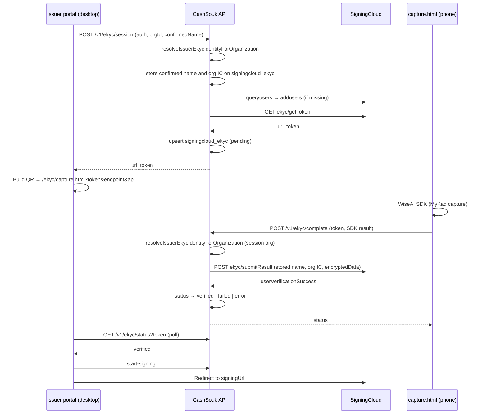

# SigningCloud eKYC Flow

Identity verification (eKYC) is required before an issuer user can start SigningCloud offer signing. Verification is **user-scoped** (one row per CashSouk user), **MyKad-only**, and uses RegTank-backed org data for legal name and IC.

Related docs:

- [Issuer Offer Flow](./issuer-offer-flow.md) — offer accept/reject and signing
- [RegTank KYC Integration](./regtank-kyc-integration.md) — org onboarding that supplies MyKad details
- [Issuer Application Process Context](../guides/application-flow/issuer-application-process-context.md) — SigningCloud in the offer modal

## Purpose

When SigningCloud is configured, `startContractOfferSigning` and `startInvoiceOfferSigning` call `requireCompletedSigningCloudEkyc`. If the user has no `signingcloud_ekyc` row with `status = verified`, the API returns `403 EKYC_REQUIRED`.

The issuer **Review offer** modal catches that code, shows a confirm step and QR step, and polls until verification completes. The user then continues to SigningCloud for the offer letter.

Verification is done once per user account. After `verified`, `POST /v1/ekyc/session` returns `409 EKYC_ALREADY_COMPLETED`.

## End-to-end flow



### Desktop (issuer portal)

1. User accepts an offer that requires SigningCloud.
2. If eKYC is missing, modal step switches to **ekyc-confirm**, then **ekyc** (`ReviewOfferModal` + `useEkycFlow`).
3. User confirms name (editable) and full IC number (read-only, for verification against their MyKad).
4. `createEkycSession({ issuerOrganizationId, confirmedName, force? })` runs with the active org from `useOrganization()`. IC is resolved server-side from org data.
5. QR encodes `{issuerOrigin}/ekyc/capture.html?token=…&endpoint=…&api={API_URL}` — **no PII in the URL**.
6. Desktop polls `GET /v1/ekyc/status?token=` every 2.5s until status is not `pending`.
7. On `verified`, user taps **Continue to signing** → `start-signing` APIs → browser redirect to SigningCloud.

Pending QR reuse: without `force: true`, an existing fresh pending session (updated within 25 minutes) returns the same `url` and `token` **only when** the incoming confirmed name matches what is already bound on the session row. If the user edits their name and re-confirms, a new SigningCloud token is issued.

### Mobile (`apps/issuer/public/ekyc/capture.html`)

Static page served from the issuer Next.js app. No auth cookie — identification is the session `token` only.

1. Loads WiseAI SDK (`WAILib.SDK`) with `docType: "mykad"` and `showActionButtons: false` (IC front/back captured when document quality is detected — no manual shutter).
2. On capture success, posts `{ token, result }` to `POST /v1/ekyc/complete` (identity is read from the server-bound session, not from the URL).
3. Shows outcome from API response:
   - `verified` → success overlay
   - `failed` → failed overlay (vendor rejection / capture quality / name mismatch)
   - anything else → error overlay with retry
4. Client-side failures (camera, boot timeout, SDK errors) call `POST /v1/ekyc/fail` so desktop polling sees `error`.

## Identity resolution

MyKad **name** and **IC** sent to SigningCloud `submitResult` come from issuer organization data populated by RegTank onboarding — not from SDK OCR fields or mobile query parameters.

| Org type | Name source | IC source |
|----------|-------------|-----------|
| `PERSONAL` | `first_name`, `middle_name`, `last_name` on org | `document_number` (12 digits) |
| Company | `corporate_entities.directors` or `.shareholders` entry whose `personalInfo.email` matches the user’s account email | `governmentIdNumber` or extracted government ID from `personalInfo` |

Normalization:

- IC: digits only, exactly 12 characters
- Name: trimmed, uppercased

### When each resolver runs

| Step | Function | Scope |
|------|----------|-------|
| Session create (`POST /session`) | `resolveIssuerEkycIdentityForOrganization` | Active org only — fail early if MyKad details missing; org id, confirmed name, and org IC stored on `signingcloud_ekyc` |
| Complete (`POST /complete`) | `resolveIssuerEkycIdentityForOrganization` | Same org as stored on the session row; org IC is always used for submit |

The desktop user may edit the **name** before scanning. That edited name is bound to the session at create time. **IC** is shown in full (not masked), read-only in the UI, and always comes from org registration data on the server.

Missing identity → `400 EKYC_IDENTITY_NOT_ON_FILE`: *"We don't have your verified MyKad details on file. Complete identity onboarding before signing."*

## API reference

Base path: `/v1/ekyc` (mounted in `apps/api/src/routes.ts`).

| Method | Path | Auth | Purpose |
|--------|------|------|---------|
| `GET` | `/me` | Required | User-level completion: `{ completed, completedAt }` |
| `GET` | `/identity-preview?issuerOrganizationId=` | Required | On-file MyKad details for desktop confirmation: `{ name, icNumber }` (full IC, read-only in UI) |
| `POST` | `/session` | Required | Start or reuse session; body `{ issuerOrganizationId, confirmedName, force? }` |
| `GET` | `/status?token=` | None | Poll session status (desktop + debugging) |
| `POST` | `/complete` | None | Submit WiseAI capture result; body `{ token, result }` |
| `POST` | `/fail` | None | Record client-side capture failure |

Shared types: `packages/types` — `EkycSession`, `CreateEkycSessionInput`, `EkycSessionStatus`, `EkycMeStatus`, `EkycIdentityPreview`.

### Session create errors

| Code | When |
|------|------|
| `409 EKYC_ALREADY_COMPLETED` | User already `verified` |
| `400 EKYC_IDENTITY_NOT_ON_FILE` | Active org has no MyKad match for user email |
| `403 FORBIDDEN` | User not owner/member of org |
| `404 NOT_FOUND` | Unknown org |
| `502` / `503` | SigningCloud unavailable (see user messages in `signingcloud-user-messages.ts`) |

### Complete behaviour

1. Assert SDK reported success (`ekycSuccess`, `status: success`, or `code: SUCCESS`).
2. Load server-bound confirmed name from `signingcloud_ekyc.confirmed_name`.
3. Resolve org identity for the session org and submit stored confirmed name with org IC to SigningCloud.
4. Extract `encryptedData` from SDK result (preferred) or plain JSON fallback.
5. If `userVerificationSuccess !== true` → DB `failed` with a neutral retry message.
6. Otherwise → DB `verified` with `completed_at`.

Signing gate: `403 EKYC_REQUIRED` from offer signing if status is not `verified`.

## Status model

Prisma enum `SigningCloudEkycStatus` on table `signingcloud_ekyc`:

| Status | Meaning |
|--------|---------|
| `pending` | Session created; awaiting mobile capture |
| `verified` | SigningCloud accepted verification; user may sign offers |
| `failed` | Capture submitted but identity not verified |
| `error` | Setup/submit error or client-reported failure via `/fail` |

One row per `user_id`. Columns: `issuer_organization_id`, `confirmed_name`, `confirmed_ic_number`, `session_token`, `sdk_endpoint`, `doc_type` (always `mykad`), `last_error`, `completed_at`, timestamps.

## SigningCloud integration

Module: `apps/api/src/modules/ekyc/signingcloud-ekyc.ts`. Shares env and crypto with offer signing (`apps/api/src/modules/signingcloud/`).

### Environment

Same variables as offer signing:

| Variable | Purpose |
|----------|---------|
| `SC_BASE_URL` | SigningCloud SignServer base URL |
| `SC_API_KEY` | API key |
| `SC_API_SECRET` | Payload encryption secret |

If unset, eKYC session create returns `503 SIGNINGCLOUD_NOT_CONFIGURED`.

### API sequence

1. **Access token** — `getSigningCloudAccessToken` (shared helper)
2. **queryusers** — `POST /signserver/v1/account/queryusers` with `{ email, roletype: "-1" }`; skip `addusers` when signer exists
3. **addusers** — register document signer (`roletype: "-1"`) if missing
4. **getToken** — `GET /signserver/v1/user/ekyc/getToken` → SDK `url` + session `token`
5. **submitResult** — `POST /signserver/v1/user/ekyc/submitResult` with encrypted SDK payload plus session-bound name and org-resolved IC

All account and submit calls use encrypted `data` + `mac` form bodies per SigningCloud conventions.

## Key files

| Area | Path |
|------|------|
| Service | `apps/api/src/modules/ekyc/service.ts` |
| Confirmed identity | `apps/api/src/modules/ekyc/confirmed-identity.ts` |
| Identity | `apps/api/src/modules/ekyc/resolve-issuer-ekyc-identity.ts` |
| SigningCloud HTTP | `apps/api/src/modules/ekyc/signingcloud-ekyc.ts` |
| Routes | `apps/api/src/modules/ekyc/controller.ts` |
| Signing gate | `apps/api/src/modules/applications/service.ts` (`requireCompletedSigningCloudEkyc`) |
| Mobile capture | `apps/issuer/public/ekyc/capture.html` |
| Desktop hook | `apps/issuer/.../use-ekyc-flow.ts` |
| Offer modal | `apps/issuer/.../ReviewOfferModal.tsx` |
| API client | `packages/config/src/api-client.ts` |
| Tests | `service.test.ts`, `confirmed-identity.test.ts`, `resolve-issuer-ekyc-identity.test.ts`, `signingcloud-ekyc.test.ts` |

## Testing locally

1. Apply pending migration and ensure RegTank onboarding has filled MyKad details for the test user’s issuer org (see [Seeding identity in dev](#seeding-identity-in-dev) if you used `prisma:seed` only).
2. Configure `SC_*` env vars on the API.
3. Open issuer applications → **Review offer** → accept (SigningCloud path).
4. Confirm MyKad details on desktop, then scan QR with a phone that can reach issuer origin and API URL.
5. Complete MyKad capture; confirm desktop poll reaches `verified`, then signing redirect works.
6. Verify the QR URL contains only `token`, `endpoint`, and `api`.

### Database migration

After pulling schema changes, run:

```bash
cd apps/api
npx prisma migrate dev --name add_ekyc_confirmed_identity
```

### Seeding identity in dev

eKYC reads **MyKad name and IC from the issuer organization**, not from the WiseAI SDK. The default `prisma:seed` creates issuer orgs as `COMPLETED` but often **without** `document_number` (personal) or `corporate_entities` (company), which triggers `EKYC_IDENTITY_NOT_ON_FILE`.

| Org type | Required fields |
|----------|-----------------|
| `PERSONAL` | `first_name`, `last_name` (or `middle_name`), `document_number` — 12-digit IC |
| `COMPANY` | `corporate_entities.directors` or `.shareholders` entry where `personalInfo.email` matches the user’s login email, plus `fullName` (or first/last) and `governmentIdNumber` (12-digit IC) |


**Manual (Prisma Studio):** `pnpm prisma:studio` → `issuer_organizations` → edit the org tied to your application.

Company org example (`corporate_entities` JSON):

```json
{
  "directors": [
    {
      "personalInfo": {
        "email": "max.chng@malcan.io",
        "fullName": "MAX CHNG",
        "governmentIdNumber": "901212101234"
      }
    }
  ],
  "shareholders": []
}
```

Personal org example: set `first_name`, `last_name`, `document_number` = `901212101234`.

**Important:** The IC you seed must match the physical MyKad you scan in `capture.html`. If they differ, capture may complete but status becomes `failed` (`userVerificationSuccess: false`).

Unit tests:

```bash
cd apps/api && pnpm test -- ekyc
```

## Troubleshooting

| Symptom | Likely cause |
|---------|----------------|
| `EKYC_IDENTITY_NOT_ON_FILE` on session create | Org missing IC/name or corporate email not in directors/shareholders |
| `EKYC_REQUIRED` after verified UI | Different user signed in on desktop vs phone; or DB not updated |
| QR session expired | Pending TTL 25m; use **New QR** (`force: true`) |
| `failed` after capture | Name/capture did not pass SigningCloud verification (`userVerificationSuccess: false`) |
| `error` + contact support | `EKYC_PROVIDER_UNAVAILABLE` — SigningCloud config or account issue |
| WiseAI 401 on phone | Stale token; regenerate QR |
| Old QR still works after editing name | Should not happen — session create rotates token when confirmed identity changes |
