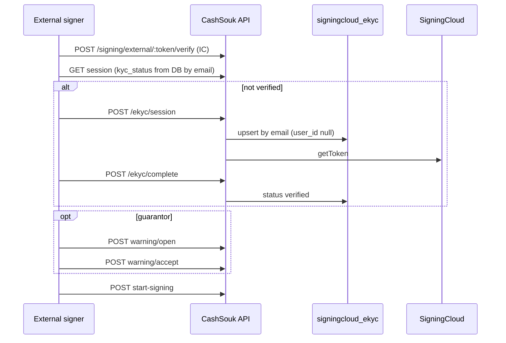

# SigningCloud eKYC Flow (Shared per Email)

MyKad verification is stored in **`signingcloud_ekyc`**, keyed by **signer email** (one row per email). A verified signer reuses that row across issuer orgs and signing envelopes without repeating eKYC.

**Platform users** (issuer portal) have `user_id` set on the row. **External signers** (email link, no login) leave `user_id` null.

Related docs:

- [Issuer Offer Flow](./issuer-offer-flow.md)
- [Issuer Application Process Context](../guides/application-flow/issuer-application-process-context.md)

## Reuse model

| Scenario | eKYC again? |
|----------|-------------|
| Same email, different org / envelope | **No** — if `signingcloud_ekyc.status = verified` and IC matches |
| Same email, new IC bound on envelope | **Blocked** — verified email IC is authoritative; mistyped IC is rejected (does not overwrite) |
| Role with `kyc_required: false` | **No** — skipped entirely |

Each envelope recipient still has its own signing link and IC access-code gate. Only **MyKad eKYC** is shared via email.

## External signer flow


```mermaid
sequenceDiagram
  participant Signer as External signer
  participant API as CashSouk API
  participant DB as signingcloud_ekyc
  participant SC as SigningCloud

  Signer->>API: POST /signing/external/:token/verify (IC)
  Signer->>API: GET session (kyc_status from DB by email)
  alt not verified
    Signer->>API: POST /ekyc/session
    API->>DB: upsert by email (user_id null)
    API->>SC: getToken
    Signer->>API: POST /ekyc/complete
    API->>DB: status verified
  end
  opt guarantor
    Signer->>API: POST warning/open
    Signer->>API: POST warning/accept
  end
  Signer->>API: POST start-signing
```

## Database

**Table:** `signingcloud_ekyc`

| Column | Notes |
|--------|--------|
| `email` | Unique — reuse key |
| `user_id` | Nullable — set for issuer users, null for external signers |
| `confirmed_ic_number` | Must match envelope binding for `VERIFIED` gate |
| `status` | `pending`, `verified`, `failed`, `error` |
| `session_token` | SigningCloud SDK session (for capture.html polling) |

**Removed from `signing_recipients`:** `kyc_status`, `kyc_session_token`, and related columns. Recipients keep `kyc_required` (from product template).

## API

### External signing

- `GET /v1/signing/external/:token` — `kyc_status` resolved from `signingcloud_ekyc` by recipient email
- `POST /v1/signing/external/:token/ekyc/session` — creates/refreshes shared row
- `POST /v1/signing/external/:token/warning/open` — guarantors; records `LegalExternalAcceptance` OPENED and returns a presigned PDF view URL
- `POST /v1/signing/external/:token/warning/accept` — guarantors; requires OPENED, then ACCEPTED. `start-signing` is blocked until this succeeds.

### eKYC callbacks (no auth)

- `GET /v1/ekyc/status?token=`
- `POST /v1/ekyc/complete`
- `POST /v1/ekyc/fail`

## Migrations

After pulling schema changes:

```bash
cd apps/api
npx prisma migrate dev --name restore_shared_signingcloud_ekyc
```

Runs `20260707170000_restore_shared_signingcloud_ekyc` (recreates/alters `signingcloud_ekyc`, drops per-recipient kyc columns).

## Key files

| Area | Path |
|------|------|
| eKYC service | `apps/api/src/modules/ekyc/service.ts` |
| Status resolver | `resolveSigningKycStatus`, `resolveSigningKycStatusMap` |
| Signing gate | `apps/api/src/modules/signing/service.ts` (`assertRecipientCanSign`) |
| Guarantor warning | `apps/api/src/modules/legal-documents/external-acceptance-service.ts` |
| Mobile capture | `apps/issuer/public/ekyc/capture.html` |
