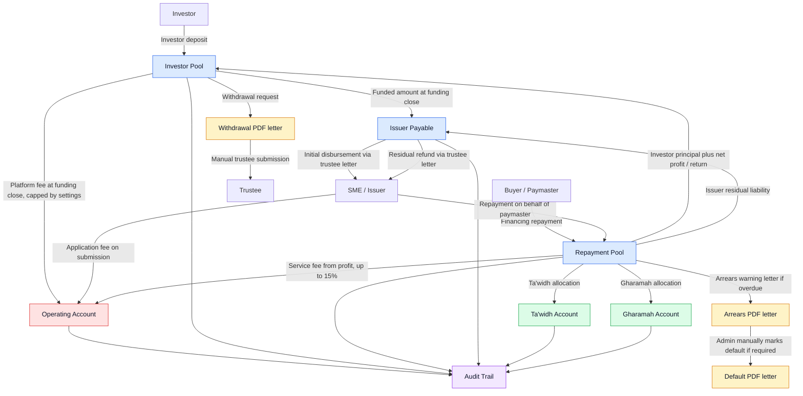
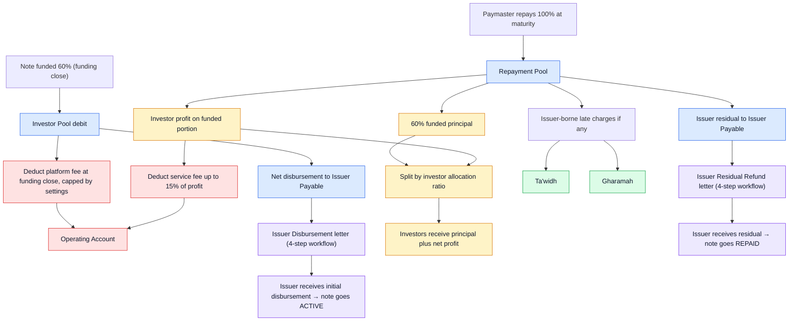

## Overview

Use this guide when you need to understand where note money is, what action to take next, or how a repayment should be allocated. It is written for admin portal users and focuses on day-to-day operations.

A note is created from one approved invoice. If a contract has multiple approved invoices, each invoice can become its own note. The admin portal keeps the note linked to its issuer, paymaster, source application, source contract, and source invoice so you can review the full context when needed.

## Where To Work

- Use **Notes** to create notes from approved invoices, publish notes, close funding, record repayments, settle notes, disburse issuer payouts, generate letters, and review the note timeline.
- Use **Investments** to browse the investments registry — every investor commitment across all notes with its status, amount, and allocation %.
- Use **Finance → Repayments** to see every paymaster/issuer payment that is awaiting admin review and reconciliation.
- Use **Finance → Issuer Payouts** to see every payment owed to issuers in flight (both initial disbursements and residual refunds), filtered by status.
- Use **Finance → Service Fee** to see notes whose **service fee trustee instruction** still needs a PDF, trustee submission, or “instruction completed” after settlement is posted.
- Use **Finance → Buckets** to view the six platform money buckets and inspect activity logs for each bucket.
- Use the **Dashboard** Quick Actions and Bucket Balances overview cards for an at-a-glance snapshot of what needs attention.
- Use **Platform Finance Settings** to manage the default grace period, arrears threshold, Ta'widh cap, Gharamah cap, default listing duration, and letter templates.

### Live counters

The sidebar badges, dashboard quick-action counts, and queue summaries update **immediately** when you complete an action (record a payment, generate a letter, mark submitted/disbursed, post a settlement, etc.). You do not need to refresh the browser. If two admins work simultaneously, the counters also refetch in the background once per minute so the active tab stays consistent.

## The Six Buckets

CashSouk tracks note money through six operational buckets:

- **Investor Pool** holds investor money, investment commitments, repayment returns, and investor withdrawals.
- **Repayment Pool** receives repayment money from the paymaster or from an issuer paying on behalf of the paymaster, and is the source from which a posted settlement is allocated.
- **Operating Account** receives application fees, platform fees, and service fees.
- **Ta'widh Account** receives the compensation portion of approved late-payment charges.
- **Gharamah Account** receives the charity or penalty portion of approved late-payment charges.
- **Issuer Payable** is a liability bucket. It receives the net disbursement amount when funding is closed, and the issuer residual amount when settlement is posted. It is cleared as each issuer withdrawal is marked disbursed. While the bucket has a positive balance, the platform owes money to one or more issuers.

The bucket balances page is based on posted ledger activity. Credits increase a bucket, debits reduce a bucket, and the activity log shows the transactions behind each balance. The total balance across all six buckets is always zero by design — every cent in flight is accounted for.

## Note Lifecycle Stepper

The note detail page shows a five-stage stepper:

1. **Draft** — note created from an approved invoice but not yet listed.
2. **Published** — listed in the investor marketplace and accepting commitments.
3. **Funded** — funding closed (manually or automatically). Investor commitments are confirmed, the disbursement ledger has been posted, and the Issuer Payable bucket holds the net amount owed to the issuer. A draft Issuer Disbursement withdrawal has been auto-created and is awaiting admin action.
4. **Active** — the trustee has paid the disbursement out to the issuer, the Issuer Payable obligation is cleared, and servicing has started.
5. **Repaid** — settlement waterfall posted. Note remains in this stage while the issuer residual refund is being processed; once the residual withdrawal is marked disbursed, the note becomes fully repaid.

Terminal failure states (Failed Funding, Defaulted, Cancelled) are shown in the stepper with a destructive marker on the relevant stage.

Up to three amber sub-steppers surface in-flight admin work:

- When the note is in the **Funded** stage, a sub-stepper shows the issuer disbursement progress: Funding Closed → Letter Generated → Submitted to Trustee → Disbursed. Progress this from the **Issuer Disbursement** card at the top of the settlement panel.
- When the note is in the **Repaid** stage but the issuer residual refund is still in flight, a sub-stepper shows: Waterfall Posted → Letter Generated → Submitted to Trustee → Disbursed. Progress this from the **Issuer Residual Refund** card inside the settlement panel.
- When the note is in the **Repaid** stage, settlement is posted, and the posted service fee is above the portal threshold, a sub-stepper shows: **Settlement posted → Trustee letter generated → Submitted to trustee → Instruction completed**. Progress this from **Trustee instruction — service fee (internal pools)** in section 3 of the settlement panel, or pick the note from **Finance → Service Fee**.

## Note Money Flow

## From Invoice To Funding

Create notes only from approved invoices. Review the invoice, issuer, paymaster, risk rating, amount, profit rate, platform fee, service fee, maturity date, and listing summary before publishing.

When a note is published, it becomes available in the investor marketplace. Investors can commit funds until funding is closed automatically, closed manually, or failed.

- **Publish** makes a reviewed note available to investors. On publish the listing is given a `closes_at` timestamp based on the product&apos;s `marketplace_listing_duration_days` (default 14 days).
- **Unpublish** removes a note from the marketplace before investor commitments exist.
- **Close Funding** ends funding for a successfully funded note. Investments are confirmed, the disbursement ledger is posted, and a draft Issuer Disbursement withdrawal is created. The note moves to the Funded stage and waits for the trustee to actually pay the issuer.
- **Fail Funding** closes an open note that did not meet the minimum funding threshold.

### Auto-close rules

Two automatic triggers can close funding without admin intervention:

- **Fully funded**: as soon as commitments reach 100% of the target amount, the note is auto-closed inline on the same investor request (the hourly cron is a safety net).
- **Listing expired (marketplace listing duration)**: an hourly cron picks up any published note whose `closes_at` has elapsed. If the note has reached the minimum funding threshold, it is auto-closed. Otherwise it is auto-failed and investor commitments are released.

Closing funding (manual or automatic) never auto-activates the note. The note stays in the Funded stage until the disbursement to the issuer is paid out and marked complete. The lifecycle card on the note page displays a countdown banner so admins can see how much time is left in the funding window. Admins can still close or fail funding manually before the deadline. The listing duration is controlled per product via `marketplace_listing_duration_days` (default 14 days).

## Issuer Disbursement

The platform fee is deducted at disbursement. It is set per note and capped by Platform Finance Settings.

When funding closes (manually or automatically), the operation:

- confirms all committed investments,
- debits the Investor Pool by the funded amount,
- credits the Operating Account with the platform fee,
- credits Issuer Payable with the net funded proceeds owed to the issuer,
- auto-creates a draft `WithdrawalInstruction` of type `ISSUER_DISBURSEMENT` with the issuer's bank details prefilled from the issuer organisation profile.

The note moves to the **Funded** stage. An **Issuer Disbursement** card appears at the top of the settlement panel with the same four-step workflow used for residual refunds:

1. **Draft** — beneficiary details can still be edited.
2. **Letter Generated** — admin generates the trustee letter; the PDF is stored in S3.
3. **Submitted to Trustee** — admin records that the signed letter has been handed to the trustee.
4. **Disbursed** — admin marks the withdrawal complete once the trustee confirms payout. This debits Issuer Payable (clearing the obligation), flips the note to **Active**, and starts servicing.

While any disbursement withdrawal is open, the lifecycle card shows a `Pending Disbursement` badge and the four-step sub-stepper. The Finance → Issuer Payouts queue lists every disbursement and residual refund in flight in one place, with a Type column to tell them apart.

## Repayment And Settlement

The repayment amount is based on the invoice face value. It is not the same as the funded amount or the disbursed amount.

Repayment is usually paid by the paymaster into the Repayment Pool. The issuer may also pay the settlement amount on behalf of the paymaster through the issuer portal. When that happens, the admin should review the submitted payment, approve or reject it, and preserve the payment source in the audit trail.

### Multiple payments

If the repayment arrives in more than one tranche, simply record each receipt under Receipt Intake. The settlement waterfall **automatically aggregates** all eligible payments (`RECEIVED`, `RECONCILED`, `PARTIAL`) for the note — admins do not need to pick a single payment row.

The settlement panel shows:

- a `Receipts included in settlement` summary listing every payment that contributes to the waterfall;
- an `Included in settlement` badge on each eligible receipt in the Payment Review table;
- a `Use Settlement Amount` shortcut that pre-fills the remaining shortfall when recording the next receipt.

When the gross receipt total in the waterfall matches the agreed settlement amount, the admin can preview, approve, and post.

### Approve and post confirmation

The **Approve** and **Post** buttons in the settlement waterfall each open a confirmation modal that restates the gross receipt and the allocation totals. This guards against accidental posting and gives the admin one last chance to cancel.

### Allocation

When settlement is posted, the Repayment Pool is allocated across the relevant buckets:

- investors receive principal and net profit according to their allocation,
- the Operating Account receives the service fee (up to 15% of investor profit),
- Ta'widh and Gharamah amounts are posted if approved late charges apply,
- any issuer residual is credited to the Issuer Payable bucket (not paid out yet — see the next section).

After settlement is posted, further payment actions on this note are disabled.

## Issuer Residual Refund

The issuer residual is the leftover amount owed to the issuer after investor principal, investor profit, service fee, and any late charges have been applied. It exists when a note is not 100% funded by investors.

The residual workflow has four steps, tracked by a `WithdrawalInstruction` of type `ISSUER_RESIDUAL_RETURN`:

1. **Draft** — auto-created the moment settlement is posted. Beneficiary details are pre-filled from the issuer organisation's bank profile and can be edited from the Issuer Residual Refund card. While in Draft the residual sits as a credit balance on Issuer Payable.
2. **Letter Generated** — admin generates the trustee letter from the card. The letter PDF is stored in S3 and can be viewed or downloaded.
3. **Submitted to Trustee** — admin records that the signed letter has been handed to the trustee for disbursement.
4. **Disbursed** — admin marks the withdrawal complete once the trustee confirms payout. This writes the offsetting debit to Issuer Payable (zeroing out the obligation) and transitions the note from Active to fully Repaid.

While any residual withdrawal is open, the note lifecycle card displays a `Pending Refund` badge and the four-step sub-stepper. The platform-wide Issuer Payable bucket balance gives a single number for how much residual money is currently in flight across all notes.

## Settlement Example

Example: if a note is 60% funded and the paymaster repays 100% of the invoice, the platform fee is deducted at funding close and the net disbursement to the issuer is parked on Issuer Payable until the trustee pays it out (this flips the note to ACTIVE). At maturity, investors receive the funded 60% principal plus net profit pro rata. The residual is parked on Issuer Payable at settlement post and is paid out to the issuer once the four-step withdrawal workflow is completed (this flips the note to REPAID).

## Late Payments

Late charges are handled manually when repayment funds are received. They are not posted automatically by a daily system job.

Before applying late charges, run the overdue check on the note. This helps confirm the overdue days and prevents duplicate late-charge allocation by taking previous late charges into account.

Late charges are borne by the issuer, but they are deducted from repayment proceeds before any issuer residual is computed.

- **Grace period** is configurable. The standard default is 7 days.
- **Ta'widh** is set at receipt time and capped at 1% per annum.
- **Gharamah** is set at receipt time and capped at 9% per annum.
- **Arrears** starts after the grace period plus the arrears threshold. With a 7-day grace period and 14-day arrears threshold, arrears starts 21 days after the missed payment date.
- **Default** is never automatic. Admin can mark a note as default only after it is already in arrears.

## Arrears And Default Letters

Use generated PDF letters to support arrears and default handling.

- Generate an arrears or warning letter once the note enters arrears.
- Review the letter before external communication.
- If the note must be marked as default, use the manual default action and generate the default letter.
- Keep the generated letters attached to the note timeline.

## Withdrawals

All trustee-submitted withdrawals — investor withdrawals, issuer residual returns, and admin adjustments — follow the same four-step workflow: **Draft → Letter Generated → Submitted to Trustee → Disbursed**. A letter PDF must be generated before a withdrawal can be marked submitted, and the disbursement timestamp must reflect the actual trustee confirmation.

**Service fee (internal pools)** does not create a bank-beneficiary withdrawal, but after settlement is posted it still follows **generate PDF → submitted to trustee → instruction completed** on the settlement panel (and in **Finance → Service Fee**) so the trustee can record the Repayment pool to Operating account allocation.

The withdrawal letter should include:

- withdrawal reference,
- withdrawal type (investor / issuer residual / admin adjustment),
- source bucket,
- beneficiary details or masked bank reference,
- amount and currency,
- reason,
- requester and reviewer,
- related note or investor reference, where applicable,
- trustee submission status.

## Audit Trail

Every important money-flow action should be visible in the note timeline or bucket activity log. This includes:

- note creation from approved invoice,
- publish, unpublish, close funding, fail funding, and auto-close events,
- issuer disbursement withdrawal creation, letter generation, submission, and disbursement (which flips the note to ACTIVE),
- paymaster repayment receipts,
- issuer payments made on behalf of paymaster,
- settlement preview, approval, and posting,
- service fee trustee instruction: PDF generation, submission to trustee, and instruction completed (material service fees after settlement post),
- issuer residual withdrawal creation, letter generation, submission, and disbursement (which flips the note to REPAID),
- late-fee calculation and allocation,
- arrears and default letter generation,
- manual overrides and waivers.

When reviewing a note, use the activity timeline together with the ledger and bucket activity logs. The timeline explains who did what. The ledger and bucket logs explain how money moved.
