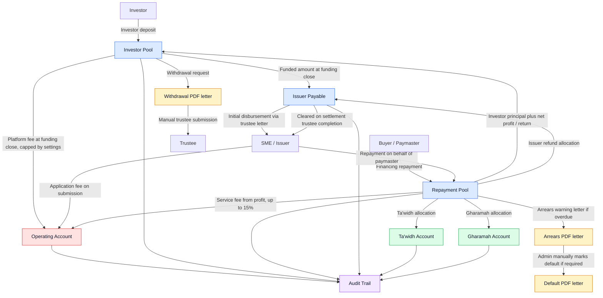

## Overview

Use this guide when you need to understand where note money is, what action to take next, or how a repayment should be allocated. It is written for admin portal users and focuses on day-to-day operations.

A note is created from one approved invoice. If a facility has multiple approved invoices, each invoice can become its own note. The admin portal keeps the note linked to its issuer, paymaster, source application, source facility, and source invoice so you can review the full context when needed.

## Where To Work

- Use **Notes** to create notes from approved invoices, publish notes, close funding, record repayments, settle notes, disburse issuer payouts, generate letters, and review the note timeline.
- On **Note Detail**, use the tab bar for workflow work:
  - **Disbursement** — issuer disbursement (Tawarruq, certificate, trustee payout) before servicing begins.
  - **Servicing & Settlement** — repayment receipts, settlement preview/approve/post, settlement waterfall, and **settlement trustee instruction** (including issuer refund allocation when applicable).
  - **Late Payment** — Ta'widh/Gharamah fees, arrears/default letters, and mark default.
  - **Ledger** and **Investors** — read-only reference.
- The right sidebar shows **Workflow Status** (tab dots), **Source Application**, and **Activity Timeline**.
- Use **Investments** to browse the investments registry — every investor commitment across all notes with its status, amount, and allocation %.
- Use **Finance → Repayments** to see every paymaster/issuer payment that is awaiting admin review and reconciliation.
- Use **Finance → Issuer Payouts** to see issuer disbursement withdrawals still in flight (legacy residual withdrawal rows may still appear for older notes).
- Use **Finance → Service Fee** to see notes whose **settlement trustee instruction** still needs a PDF, trustee submission, or **instruction completed** after settlement is posted.
- Use **Finance → Buckets** to view the six platform money buckets and inspect activity logs for each bucket.
- Use the **Dashboard** next-to-do queues and Bucket Balances overview cards for an at-a-glance snapshot of what needs attention.
- Use **Platform Finance Settings** to manage the default grace period, arrears threshold, Ta'widh cap, Gharamah cap, default listing duration, and letter templates.

### Workflow progress and counters

Sidebar badges, dashboard next-to-do counts, queue summaries, and most Note Detail workflow steps update after you complete an in-portal action (record a payment, generate a letter, mark submitted/disbursed, post a settlement, complete settlement trustee instruction, etc.). You usually do not need to refresh the browser. If two admins work simultaneously, the active tab also refetches in the background about once per minute.

**Tawarruq certificate exception:** Lifecycle counters and the disbursement strip reflect the latest Tawarruq, trustee, and settlement state once that state is **fetched and stored** in the portal. A Shoraka callback may update the Tawarruq order status in the database, but it does **not** store the certificate file. The **Certificate** step on the disbursement lifecycle strip completes only after the Tawarruq certificate PDF has been fetched and stored. On Note Detail, click **Query Status** or **Fetch Tawarruq Certificate**, or reload the page, to see the latest certificate state if the page was already open.

## The Six Buckets

CashSouk tracks note money through six operational buckets:

- **Investor Pool** holds investor money, investment commitments, repayment returns, and investor withdrawals.
- **Repayment Pool** receives repayment money from the paymaster or from an issuer paying on behalf of the paymaster, and is the source from which a posted settlement is allocated.
- **Operating Account** receives application fees, platform fees, and service fees.
- **Ta'widh Account** receives the compensation portion of approved late-payment charges.
- **Gharamah Account** receives the charity or penalty portion of approved late-payment charges.
- **Issuer Payable** is a liability bucket. It receives the net disbursement amount when funding is closed, and the issuer refund allocation when settlement is posted. It is cleared when settlement trustee instruction completes (or via legacy residual withdrawal flows on older notes).

The bucket balances page is based on posted ledger activity. Credits increase a bucket, debits reduce a bucket, and the activity log shows the transactions behind each balance. The total balance across all six buckets is always zero by design — every cent in flight is accounted for.

## Note Lifecycle Stepper

The note detail page shows a **six-stage** stepper:

1. **Draft** — note created from an approved invoice but not yet listed.
2. **Published** — listed in the investor marketplace and accepting commitments.
3. **Funded** — funding closed (manually or automatically). Investor commitments are confirmed and the disbursement ledger has been posted.
4. **Disbursement** — issuer disbursement (Tawarruq, certificate, trustee instruction) is in progress before servicing begins.
5. **Active** — the trustee has paid the disbursement to the issuer and servicing has started.
6. **Repaid** — settlement is posted and all settlement allocations (including settlement trustee instruction) are complete.

Terminal failure states (Failed Funding, Defaulted, Cancelled) are shown in the stepper with a destructive marker on the relevant stage.

### Status labels (admin)

| Situation | Lifecycle card / registry |
|-----------|---------------------------|
| Settlement posted, trustee instruction pending | **Active · servicing** (badge) / **Currently Active** (lifecycle) |
| Settlement trustee instruction completed | **Settled** / note fully repaid |
| Defaulted with settlement work still pending | **Defaulted** (main risk status) + settlement trustee strip may still show |

**Defaulted notes can still proceed through recovery settlement.** Defaulted remains the primary risk status; settlement trustee progress is shown as operational work when applicable.

### Sub-steppers on the lifecycle card

- **Disbursement** (Funded stage): Tawarruq order → Certificate → Trustee instruction → Disbursed. The **Certificate** step completes once the Tawarruq certificate has been fetched and stored (callbacks may update order status, but not the stored certificate). Continue from the **Disbursement** tab.
- **Settlement trustee instruction** (after settlement is posted): Settlement posted → Trustee letter generated → Submitted to trustee → Instruction completed. Continue from the **Servicing & Settlement** tab. This single workflow covers investor pool movements, service fee, Ta'widh/Gharamah account allocations, and **issuer refund allocation** when present — there is no separate issuer-residual lifecycle strip on Note Detail.

## Note Money Flow

```mermaid
flowchart TD
  investor["Investor"] -->|"Investor deposit"| investorPool["Investor Pool"]
  investorPool -->|"Funded amount at funding close"| issuerPayable["Issuer Payable"]
  investorPool -->|"Platform fee at funding close, capped by settings"| operating["Operating Account"]
  issuerPayable -->|"Initial disbursement via trustee letter"| issuer["SME / Issuer"]
  issuer -->|"Application fee on submission"| operating
  paymaster["Buyer / Paymaster"] -->|"Financing repayment"| repaymentPool["Repayment Pool"]
  issuer -->|"Repayment on behalf of paymaster"| repaymentPool
  repaymentPool -->|"Investor principal plus net profit / return"| investorPool
  repaymentPool -->|"Service fee from profit, up to 15%"| operating
  repaymentPool -->|"Issuer refund allocation"| issuerPayable
  issuerPayable -->|"Cleared on settlement trustee completion"| issuer
  repaymentPool -->|"Ta'widh allocation"| tawidh["Ta'widh Account"]
  repaymentPool -->|"Gharamah allocation"| gharamah["Gharamah Account"]
  investorPool -->|"Withdrawal request"| withdrawalLetter["Withdrawal PDF letter"]
  withdrawalLetter -->|"Manual trustee submission"| trustee["Trustee"]
  repaymentPool -->|"Arrears warning letter if overdue"| arrearsLetter["Arrears PDF letter"]
  arrearsLetter -->|"Admin manually marks default if required"| defaultLetter["Default PDF letter"]
  operating --> audit["Audit Trail"]
  investorPool --> audit
  repaymentPool --> audit
  issuerPayable --> audit
  tawidh --> audit
  gharamah --> audit

  class investorPool,repaymentPool,issuerPayable pool
  class operating operatingAccount
  class tawidh,gharamah syariahAccount
  class withdrawalLetter,arrearsLetter,defaultLetter documentStep
  class audit auditStep

  classDef pool fill:#dbeafe,stroke:#2563eb,color:#0f172a
  classDef operatingAccount fill:#fee2e2,stroke:#dc2626,color:#0f172a
  classDef syariahAccount fill:#dcfce7,stroke:#16a34a,color:#0f172a
  classDef documentStep fill:#fef3c7,stroke:#d97706,color:#0f172a
  classDef auditStep fill:#f3e8ff,stroke:#9333ea,color:#0f172a
```

## From Invoice To Funding

Create notes only from approved invoices. Review the invoice, issuer, paymaster, risk rating, amount, profit rate, platform fee, service fee, maturity date, and listing summary before publishing.

When a note is published, it becomes available in the investor marketplace. Investors can commit funds until funding is closed automatically, closed manually, or failed.

- **Publish** makes a reviewed note available to investors. On publish the listing is given a `closes_at` timestamp based on the product&apos;s `marketplace_listing_duration_days` (default 14 days).
- **Unpublish** removes a note from the marketplace before investor commitments exist. The prospectus returns to Draft with previous fields kept; it must be reviewed and approved again before republish. Pause (with commitments) does not change the prospectus.
- **Close Funding** ends funding for a successfully funded note. Investments are confirmed, the disbursement ledger is posted, and a draft Issuer Disbursement withdrawal is created. The note moves to the Funded stage and waits for disbursement on the **Disbursement** tab.
- **Fail Funding** closes an open note that did not meet the minimum funding threshold.

### Auto-close rules

Two automatic triggers can close funding without admin intervention:

- **Fully funded**: as soon as commitments reach 100% of the target amount, the note is auto-closed inline on the same investor request (the hourly cron is a safety net).
- **Listing expired (marketplace listing duration)**: an hourly cron picks up any published note whose `closes_at` has elapsed. If the note has reached the minimum funding threshold, it is auto-closed. Otherwise it is auto-failed and investor commitments are released.

Closing funding (manual or automatic) never auto-activates the note. The note stays in the Funded/Disbursement stages until the disbursement to the issuer is paid out and marked complete. The lifecycle card on the note page displays a countdown banner so admins can see how much time is left in the funding window.

## Issuer Disbursement

**Tab:** **Disbursement** on Note Detail.

The platform fee is deducted at disbursement. It is set per note and capped by Platform Finance Settings.

When funding closes (manually or automatically), the operation:

- confirms all committed investments,
- debits the Investor Pool by the funded amount,
- credits the Operating Account with the platform fee,
- credits Issuer Payable with the net funded proceeds owed to the issuer,
- auto-creates a draft `WithdrawalInstruction` of type `ISSUER_DISBURSEMENT` with the issuer's bank details prefilled from the issuer organisation profile.

The **Issuer Disbursement** card on the Disbursement tab follows this workflow:

1. **Tawarruq order** (when required) — submit and query until the commodity trade is complete.
2. **Tawarruq certificate** — fetch the certificate PDF as proof before marking disbursed (when required).
3. **Trustee letter** — generate the disbursement instruction PDF.
4. **Submitted to trustee** — record that the signed letter was handed to the trustee.
5. **Disbursed** — mark complete once the trustee confirms payout. This clears Issuer Payable, flips the note to **Active**, and starts servicing.

While disbursement is in flight, the lifecycle card shows **Awaiting issuer disbursement** and the disbursement sub-stepper.

### Tawarruq transaction (issuer disbursement proof)

When shown on the Issuer Disbursement card:

- The **Tawarruq transaction** confirms the financing amount went through a Shariah-compliant commodity trade process.
- CashSouk stores the **Tawarruq certificate** PDF as proof for the final payout step.
- Typical flow: **Submit Tawarruq Order** → **Query Status** until completed → **Fetch Tawarruq Certificate** → then generate trustee letter and mark disbursed when allowed.
- Callbacks may update Tawarruq order status, but the **Certificate** step and **Certificate ready** badge complete only after the certificate is fetched and stored. Use **Query Status**, **Fetch Tawarruq Certificate**, or reload if Note Detail was already open.
- **Mark Disbursed** may remain disabled until the certificate is fetched when Tawarruq gating applies.

Cutoff reminder (MYT): between **11:30 PM and 12:30 AM**, you cannot submit a Tawarruq order. Query status, fetch certificate, and view certificate still work.

## Repayment And Settlement

**Tab:** **Servicing & Settlement** on Note Detail.

The repayment amount is based on the invoice face value. It is not the same as the funded amount or the disbursed amount.

Repayment is usually paid by the paymaster into the Repayment Pool. The issuer may also pay the settlement amount on behalf of the paymaster through the issuer portal. When that happens, the admin should review the submitted payment, approve or reject it, and preserve the payment source in the audit trail.

### Repayment receipts

Record each tranche with **Record receipt** on the Servicing & Settlement tab. Payment evidence is stored in **`evidence_files`** on the payment record (not a single legacy evidence key). Open receipts must reach the **invoice settlement amount** (invoice face value) before you can preview settlement.

When open receipts cover the invoice amount and any issuer submissions are approved, preview the waterfall, then approve and post.

### Approve and post confirmation

The **Approve** and **Post** buttons each open a confirmation modal that restates the gross receipt and allocation totals.

### Allocation when settlement is posted

When settlement is posted, the Repayment Pool is allocated across the relevant buckets:

- investors receive principal and net profit according to their allocation,
- the Operating Account receives the service fee (up to 15% of investor profit),
- approved Ta'widh can be split so a percentage is returned to investors while the balance remains in the Ta'widh Account,
- Gharamah is posted to the Gharamah Account if approved late charges apply,
- any **issuer refund allocation** is credited to Issuer Payable as part of the same posted waterfall.

After settlement is posted, further receipt/settlement posting actions on this note are disabled. Investor balances are credited at post. The note becomes **REPAID** / **SETTLED** only after the **settlement trustee instruction** is marked **instruction completed** (unless the posted settlement had no trustee movements).

### Settlement trustee instruction

After post, when the waterfall includes trustee movements (investor pool, service fee, Ta'widh account, Gharamah account, and/or issuer refund allocation), complete:

1. **Generate** the settlement trustee instruction PDF.
2. **Mark submitted to trustee** after the trustee has received it.
3. **Mark instruction completed** when the trustee confirms processing.

Until instruction completed, the status badge shows **Active · servicing**, the lifecycle header **Currently Active**, and the settlement strip shows **Trustee instruction** as the current step. Use **Finance → Service Fee** for the platform-wide queue.

**Issuer refund allocation** is part of this settlement trustee instruction — not a separate Note Detail lifecycle workflow. The waterfall shows an **Issuer Refund** pool line when the amount is greater than zero.

## Late Payments

**Tab:** **Late Payment** on Note Detail.

Late charges are handled manually when repayment funds are received.

Before applying late charges, use **Apply suggested fees** or **Custom amounts** on the Late Payment tab. Suggested amounts respect Syariah caps and **settlement headroom**.

- **Grace period** default is 7 days.
- **Ta'widh** and **Gharamah** are queued, then saved when you **Preview settlement** on the Servicing & Settlement tab.
- **Arrears** starts after grace plus the arrears threshold (default 21 days after missed payment with standard settings).
- **Default** is never automatic. Admin can mark default only after the note is in arrears.

## Arrears And Default Letters

**Tab:** **Late Payment** → **Arrears and Default Documents**.

Generate arrears or default PDF letters, review before external use, and attach to the note timeline. If marking default, record admin, timestamp, and reason.

## Withdrawals

Investor withdrawals and admin adjustments follow: **Draft → Letter Generated → Submitted to Trustee → Disbursed**.

Settlement trustee instruction follows: **Settlement posted → Letter generated → Submitted to trustee → Instruction completed** (no external bank beneficiary when only internal pool movements apply).

## Audit Trail

Every important money-flow action should be visible in the note timeline or bucket activity log, including:

- note creation, publish, funding close/fail,
- issuer disbursement workflow,
- paymaster/issuer repayment receipts (`evidence_files` where uploaded),
- settlement preview, approval, posting,
- settlement trustee instruction: PDF, submission, instruction completed,
- issuer refund allocation cleared on trustee completion,
- late-fee calculation, arrears/default letters,
- manual overrides and waivers.
