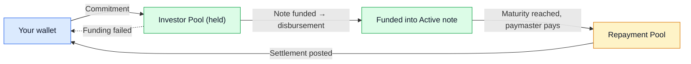

## What You're Investing In

Each marketplace listing represents a **note** — a short-term financing instrument backed by an approved invoice. When you invest in a note, you are funding a portion of that invoice in exchange for a share of:

- the **principal** (your funded amount, returned at maturity), plus
- a **profit** based on the note's profit rate and your share of the funded amount.

Notes are denominated in MYR and move through a four-stage lifecycle: Draft → Published → Active → Repaid.

## Browsing the Marketplace

The marketplace lists only notes currently in the **Published** stage. For each note you can see:

- the **issuer** and **paymaster** (the party that will ultimately repay),
- the **target amount** (how much the note is raising),
- the **profit rate**,
- the **maturity date** (when the paymaster is expected to repay in full),
- the **funding progress** (how much has been committed so far),
- the **time remaining** in the funding window,
- a **risk rating** assigned during admin review.

Each note has a **minimum funding threshold** (e.g. 60% of the target). The note will only proceed to disbursement if that threshold is met within the funding window.

## The Marketplace Funding Window

Every published note has a **listing window of `marketplace_listing_duration_days` days for its product**. If the product does not configure this value, it **defaults to 14 days**. The note can close in two ways:

- **Reaches 100% before the window ends** → the note closes early, moves into Active, and the funded amount is disbursed to the issuer.
- **Listing window expires** →
  - if the **minimum funding threshold is met**, the note is closed successfully and moves to Active;
  - if **not**, the note is marked **Failed Funding**, and **all commitments are released back to investors automatically**. You are not charged anything for a failed listing.

While the window is open you can see a countdown next to the listing.

## Committing to a Note

When you commit to a note, your commitment is reserved from your investor wallet. It is held in the **Investor Pool** while the note is being funded.

- If the note closes successfully, your commitment is **confirmed** — you are now an investor in that note and the funds are part of the disbursement.
- If the note fails to fund, your commitment is **released** automatically and returned to your wallet — you can use the money for another investment or withdraw it.

You can review your active commitments and confirmed positions from the **Investments** page.

## Disbursement

You don't need to do anything at disbursement. When funding closes successfully, the platform:

1. confirms all commitments on the note,
2. takes the platform fee (capped by Platform Finance Settings) into the Operating Account,
3. disburses the net funded amount to the issuer,
4. moves the note to **Active**.

Your position is now tracked under that note in your portfolio.

## During Servicing

Notes in Active are simply waiting for the paymaster to repay on or before maturity. There is nothing for you to do here — the platform will notify you when meaningful events happen (settlement posted, principal and profit credited, late payment events).

## Repayment and Settlement

When the paymaster (or in some cases the issuer on the paymaster's behalf) pays back the invoice, the money lands in the platform's **Repayment Pool**. If the repayment arrives in multiple tranches, that is fine — the platform aggregates them when computing the settlement waterfall.

Once the full settlement amount has been received, admin posts the **settlement waterfall**. Your share is allocated as follows:

1. **Principal** — your funded amount, in full, returned to your wallet.
2. **Net profit** — your profit on the funded portion, after the service fee (capped at 15% of investor profit).

Both credits show up under your wallet activity as soon as settlement is posted. The note moves into the **Repaid** stage. If the note was not 100% funded by investors, there is also a residual portion owed to the issuer — that is handled by admin and does not affect your principal and profit.

## Where Your Money Sits at Each Stage

## Late Payments and Defaults

If the paymaster misses the due date, the note may enter **Arrears** after a grace period (default 7 days) plus an arrears threshold (default 14 days) — roughly 21 days after the original due date.

When this happens:

- Late charges (Ta'widh up to 1% p.a., Gharamah up to 9% p.a.) are **borne by the issuer**, not investors.
- Your principal and profit calculation are not penalised by late charges.
- Admin may allocate part of Ta'widh back to investors as compensation during settlement. If this happens, it appears separately from your contractual profit.
- In a worst-case scenario where the matter cannot be resolved, admin may mark the note as **Defaulted** and pursue formal recovery. Default is never automatic — it is a deliberate admin action.

## Withdrawals From Your Wallet

You can withdraw available funds from your wallet at any time. Withdrawals follow a four-step trustee workflow: **Draft → Letter Generated → Submitted to Trustee → Disbursed**. Once disbursed, the amount is paid to your registered bank account. You will see the current step of any open withdrawal in your portal.

## Quick Reference

- Listings run for **`marketplace_listing_duration_days` days** (default 14), close early on full funding, or fail if minimum threshold not met.
- Failed listings release commitments back to your wallet automatically.
- Principal is **always** returned in full on settlement; profit is paid net of the service fee.
- Late charges are borne by the issuer and do not reduce your returns.
- The **Investments** page is the single place to see your active commitments, confirmed positions, and historical performance.
