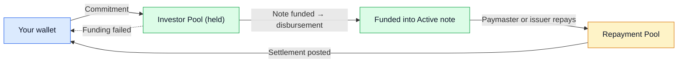

## What You're Investing In

Each marketplace listing represents a **note** — a short-term financing instrument backed by an approved invoice. When you invest in a note, you are funding a portion of that invoice in exchange for a share of:

- the **principal** (your funded amount, returned when the note is settled), plus
- a **profit** based on the note's profit rate, your share of the funded amount, and the days profit actually runs.

Notes are denominated in MYR and move through a four-stage lifecycle: Draft → Published → Active → Repaid.

## Browsing the Marketplace

The marketplace lists only notes currently in the **Published** stage. Issuer identity stays hidden. For each note you can see:

- the **purpose of financing** and **industry**,
- the **paymaster** (the party that will ultimately repay) on the note detail,
- the **target amount** (how much the note is raising),
- the **profit rate** — expected profit is shown as **up to** that amount until the note is settled,
- the **expected maturity** — before disbursement this reads as **"{n} days from disbursement"**; after disbursement it becomes a calendar date,
- the **funding progress** (how much has been committed so far),
- the **time remaining** in the funding window,
- a **risk rating** assigned during admin review.

Each note has a **minimum funding threshold** (e.g. 60% of the target). The note will only proceed to disbursement if that threshold is met within the funding window.

## The Marketplace Funding Window

Every published note has a **listing window of `marketplace_listing_duration_days` days for its product**. If the product does not configure this value, it **defaults to 14 days**. The note can close in two ways:

- **Reaches 100% before the window ends** → the note closes early, moves into Active, and the funded amount is disbursed to the issuer.
- **Listing window expires** →
  - if the **minimum funding threshold is met**, the note is closed successfully and moves to Active;
  - if **not**, the note is marked **Failed Funding**, and **all commitments are released back to investors automatically**. You are not charged anything for a failed listing.

While the window is open you can see a countdown next to the listing.

## Committing to a Note

When you commit to a note, your commitment is reserved from your investor wallet. It is held in the **Investor Pool** while the note is being funded.

- If the note closes successfully, your commitment is **confirmed** — you are now an investor in that note and the funds are part of the disbursement.
- If the note fails to fund, your commitment is **released** automatically and returned to your wallet — you can use the money for another investment or withdraw it.

You can review your active commitments and confirmed positions from the **Portfolio** page (Investments tab).

## Disbursement

You don't need to do anything at disbursement. When funding closes successfully, the platform:

1. confirms all commitments on the note,
2. takes issuer disbursement fees (drawdown fee and any frozen utilisation lines) into the Operating Account — these are charged to the issuer, not to your principal,
3. disburses the net funded amount to the issuer,
4. moves the note to **Active**.

Your position is now tracked under that note in your portfolio.

## Tenure, maturity, and profit

This is **what you may earn**. Until settlement, treat listed profit as **up to** the full-tenure amount.

- The listing tenure is **30 to 180 days** in **15-day steps**. Financing on the invoice cannot exceed **80%** of invoice value.
- Before payout, maturity is shown as **"{n} days from disbursement"**. After disbursement, maturity is the bank value date plus that tenure.
- Profit starts on the **actual disbursement date** (the bank value date).
- **Gross profit** is principal × annual rate × profit days ÷ 365. A **service fee** (up to 15% of that gross) is taken from it. You see and earn **net** profit. Your payout is principal + net profit.
- **Early settlement:** profit stops when funds are cleared. You earn fewer profit days. There is no early-settlement penalty.
- **On maturity or in the 7-day grace:** profit stops at maturity. No Ta'widh or Gharamah during grace.
- **After grace:** profit can continue to the cleared date, but **gross** profit can never exceed invoice value minus the funded principal. Late charges may apply; they are borne by the issuer and do not reduce your principal.
- Separately billed issuer late charges do **not** delay your principal or net profit.
- The invoice due date is an internal invoice fact. It is not the public note maturity.

### Worked example — what you may earn

- Invoice **RM 100,000**
- Funded principal **RM 80,000** (80%, the maximum)
- Annual gross profit rate **12%**
- Tenure **90 days**
- Disbursed **20 Aug 2026** → maturity **18 Nov 2026**
- Service fee **15%** of gross profit

Amounts use days ÷ 365, then 2-decimal rounding: round gross first, then the 15% service fee, then net = gross − service fee.

**If it runs the full 90 days** (clears on 18 Nov, or in grace such as **22 Nov**):

- Gross: 80,000 × 12% × 90/365 = **RM 2,367.12**
- Service fee **RM 355.07**
- **You earn** net profit **RM 2,012.05**
- **You receive** **RM 82,012.05** (principal + net)
- Clearing on 22 Nov is still 90 profit days. No Ta'widh or Gharamah in grace.

Until it settles, this full-tenure net is **up to RM 2,012.05**.

**If it settles early on 1 Nov 2026** (73 days from 20 Aug to 1 Nov):

- Gross: 80,000 × 12% × 73/365 = **RM 1,920.00**
- Service fee **RM 288.00**
- **You earn** net profit **RM 1,632.00**
- **You receive** **RM 81,632.00**

**If it clears after grace** (after 25 Nov): profit can continue to the cleared date. Gross profit cannot go above **RM 20,000** (RM 100,000 − RM 80,000). Once it reaches that ceiling it stops increasing. The service fee is still taken from that (capped) gross, so your net is less than the ceiling. Any issuer late charges do not hold back this payout.

## During Servicing

Notes in Active are waiting for repayment on or before the note’s maturity. There is nothing for you to do — the platform will notify you when settlement is posted, principal and profit are credited, or a late payment event occurs.

## Repayment and Settlement

When the paymaster (or in some cases the issuer on the paymaster's behalf) pays back the invoice, the money lands in the platform's **Repayment Pool**. If the repayment arrives in multiple tranches, that is fine — the platform aggregates them when computing the settlement waterfall.

Once the full settlement amount has been received, admin posts the **settlement waterfall**. Your share is allocated as follows:

1. **Principal** — your funded amount, in full, returned to your wallet.
2. **Net profit** — your profit for the days it actually ran, after the service fee (up to 15% of **gross** profit). This is what you earn; the listing showed it as **up to** until settlement.

Both credits show up under your wallet activity as soon as settlement is posted. The note moves into the **Repaid** stage. Issuer residual refunds and any separately billed late charges do not delay your principal and profit.

## Where Your Money Sits at Each Stage

```mermaid
flowchart LR
  wallet["Your wallet"] -->|"Commitment"| pool1["Investor Pool (held)"]
  pool1 -->|"Note funded → disbursement"| pool2["Funded into Active note"]
  pool2 -->|"Paymaster or issuer repays"| repay["Repayment Pool"]
  repay -->|"Settlement posted"| wallet
  pool1 -.->|"Funding failed"| wallet

  class wallet wallet
  class pool1,pool2 active
  class repay action

  classDef wallet fill:#dbeafe,stroke:#2563eb,color:#0f172a
  classDef active fill:#dcfce7,stroke:#16a34a,color:#0f172a
  classDef action fill:#fef3c7,stroke:#d97706,color:#0f172a
```

## Late Payments and Defaults

If the paymaster misses **maturity**, the note may enter **Arrears** after grace (default 7 days) plus an arrears threshold (default 14 days) — roughly 21 days after maturity.

When this happens:

- Late charges (Ta'widh up to 1% p.a., Gharamah up to 9% p.a.) are **borne by the issuer**, not investors.
- Your principal is not reduced by late charges. After grace, your profit can continue to the cleared date (capped as above).
- Admin may allocate part of Ta'widh back to investors as compensation during settlement. If this happens, it appears separately from your contractual profit.
- Any late-charge shortfall billed separately to the issuer does **not** block your settlement.
- In a worst-case scenario, admin may mark the note as **Defaulted** and pursue formal recovery. Default is never automatic.

## Withdrawals From Your Wallet

You can withdraw available funds from the **Portfolio** cash bar at any time. Withdrawals follow a four-step trustee workflow: **Draft → Letter Generated → Submitted to Trustee → Disbursed**. Once disbursed, the amount is paid to your registered bank account. You will see the current step of any open withdrawal in your portal.

## Quick Reference

- Listings run for **`marketplace_listing_duration_days` days** (default 14), close early on full funding, or fail if minimum threshold not met.
- Failed listings release commitments back to your wallet automatically.
- Before disbursement, maturity reads as **"{n} days from disbursement"**. Profit starts on the actual disbursement date.
- Principal is **always** returned in full on settlement. Listed profit is **up to** the full-tenure **net** (after service fee) until settlement; you are paid for the days it actually ran.
- Late charges are borne by the issuer and do not reduce your principal. They do not block investor settlement.
- The **Portfolio** page is the single place to see notes you have funded and your cash movements. Use the **Investments** tab for positions and the **Transactions** tab for deposits, withdrawals, and ledger activity.
