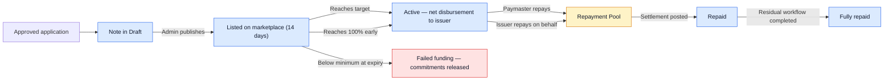

## What Happens After Your Application Is Approved

Once admin approves a financing application linked to one of your invoices, CashSouk creates a **note** for that invoice and publishes it on the investor **marketplace**. From here on, the note moves through four stages: Draft → Published → Active → Repaid.

You do not list or unlist the note yourself — admin handles publishing — but you can track every stage of its progress from the issuer portal.

## The Marketplace Funding Window

Each published note is listed on the marketplace for **14 days by default**. During this window:

- Investors can commit any amount, subject to per-investor minimums set by the platform.
- The note shows a live funding percentage against its target amount.
- The note will **close early if it reaches 100% funded**.
- If, at the end of 14 days, the note has met its **minimum funding threshold** (set per note), funding is closed successfully and the note moves to Active.
- If the minimum is not met, the note is marked **Failed Funding**. Investor commitments are released and no money moves to your account. You can request a new financing application against the same invoice if you wish to try again.

You can see how much of your note has been funded, and the time remaining on the listing, from the note detail page in your portal.

## Disbursement

When funding closes successfully, the platform disburses the **funded portion** of the invoice to your designated bank account on file.

A **platform fee** (set per note and capped by Platform Finance Settings) is deducted from the funded amount at this point. The net amount you receive is:

```
Net disbursement = Funded amount − Platform fee
```

The platform fee is shown on the note before publishing, so there are no surprises. You receive the disbursement once the note transitions to **Active**.

## During Servicing

While the note is Active, it is on its way to maturity. You do not need to take action unless:

- The paymaster fails to pay on time, in which case you may be asked about the status.
- You wish to **pay on behalf of the paymaster** early (see below).

## Repayment

The full **invoice face value** is due on the maturity date. Repayment is normally made by the **paymaster** directly into the platform's Repayment Pool.

You can also choose to **repay on behalf of the paymaster** via the issuer portal. When you do this, admin reviews and approves the submitted payment before settlement is run. Each tranche you pay is shown in your timeline.

If the agreed amount arrives in **multiple instalments**, that is fine — the platform automatically aggregates all eligible receipts when calculating the settlement waterfall.

## Settlement Waterfall

Once the full settlement amount is received, admin posts the settlement. Funds in the Repayment Pool are allocated in this order:

1. Investor principal (proportional to each investor's commitment) and investor profit.
2. Service fee deducted from investor profit (capped at 15%).
3. Approved late charges, if any (Ta'widh and Gharamah).
4. **Issuer residual refund** — paid back to you. See the next section.

Posting the settlement transitions the note to the **Repaid** stage in the lifecycle, but the cycle is only fully closed once any residual refund owed to you has actually been disbursed.

## Issuer Residual Refund

When a note is not 100% funded by investors and the paymaster pays in full, there is a **residual amount** owed back to you. This is the leftover that does not belong to investors or to platform fees.

The residual goes through a four-step workflow before reaching your bank account:

1. **Draft** — auto-created the moment settlement is posted, with your beneficiary bank details pre-filled from your organisation profile.
2. **Letter Generated** — admin generates the trustee instruction letter.
3. **Submitted to Trustee** — admin lodges the signed letter with the trustee.
4. **Disbursed** — once the trustee confirms payment to your account, admin marks the withdrawal complete.

You can see the current step of any residual refund owed to you from the note detail page in your portal. If your bank details change before the letter is generated, contact admin so the beneficiary information on the letter is updated.

## Late Payments

If the paymaster misses the due date, the note may enter **Arrears** after a grace period (default 7 days) plus an arrears threshold (default 14 days) — i.e. about 21 days after the original due date.

Late charges are **borne by the issuer**, but they are taken from the repayment proceeds before any residual is returned, so they reduce your residual rather than being billed separately. Two late-charge types may apply, in line with Syariah principles:

- **Ta'widh** (compensation): capped at 1% per annum.
- **Gharamah** (charity/penalty): capped at 9% per annum.

If the matter escalates further, admin may mark the note as **Defaulted** and trigger formal default communication. Default is never automatic — it is a manual admin action.

## What You'll See in Your Portal

- **Marketplace status** — current funding percentage, time remaining on the listing, target amount, minimum funding threshold.
- **Disbursement** — net amount sent to your account, with the platform fee shown.
- **Repayment timeline** — payments received from paymaster, plus any payments you submitted yourself.
- **Settlement summary** — how the receipt was split across investor returns, fees, late charges, and your residual.
- **Residual refund tracker** — the four-step workflow with the current step highlighted.

## Quick Reference


