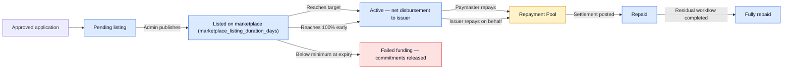

## What Happens After Your Application Is Approved

Once admin approves a financing application linked to one of your invoices, CashSouk creates a **note** for that invoice and publishes it on the investor **marketplace**. In Financing, that invoice shows **Pending listing** (blue — waiting on CashSouk) until admin publishes it. After that, the note moves through Published → Active → Repaid.

You do not list or unlist the note yourself — admin handles publishing — but you can track every stage of its progress from the issuer portal.

From the note page you can also **Download application summary**. That PDF is a copy of the original financing application, including remarks and history. It is for your records, not a new offer or signed agreement.

## The Marketplace Funding Window

Each published note is listed on the marketplace for **`marketplace_listing_duration_days` days on its product** (default: **14 days**). During this window:

- Investors can commit any amount, subject to per-investor minimums set by the platform.
- The note shows a live funding percentage against its target amount.
- The note will **close early if it reaches 100% funded**.
- If, at the end of the product&apos;s `marketplace_listing_duration_days` window, the note has met its **minimum funding threshold** (set per note), funding is closed successfully and the note moves to Active.
- If the minimum is not met, the note is marked **Failed Funding**. Investor commitments are released, the reserved facility credit and contract allocation are freed, and no money moves to your account. You can request a new financing application against the same invoice if you wish to try again.

You can see how much of your note has been funded, and the time remaining on the listing, from the note detail page in your portal.

## Disbursement

When funding closes successfully, the platform disburses the **funded portion** of the invoice to your designated bank account on file.

Deductions come from the **utilisation offer** you accepted: a **drawdown fee** (% of the actual funded amount), any frozen RM **facility-fee collection**, and any named additional lines (fixed RM or % of actual funds raised). They are charged only if funding succeeds. Net payout is funded amount minus those lines. Invoice-only notes have no facility fee.

See **Facility, Drawdown, and Additional Fees** for examples, waivers, and partial funding. You receive the disbursement once the note transitions to **Active**.

Profit starts on the **actual disbursement date** (the bank value date). Before payout, the listing shows **"{n} days from disbursement"**. Maturity is that disbursement date plus the tenure.

## During Servicing

While the note is Active, it is on its way to maturity. You do not need to take action unless:

- The paymaster fails to pay on time, in which case you may be asked about the status.
- You wish to **pay on behalf of the paymaster** early (see below).
- After grace, separately billed late charges appear as **Action required** (see Late Payments).

## Tenure, maturity, and profit

This is **what you will pay** in profit, and when.

- You chose a tenure of **30 to 180 days** (15-day steps). CashSouk may have adjusted it in the final offer. Financing cannot exceed **80%** of invoice value.
- The **invoice due date** remains an invoice fact. It is not the public note maturity.
- Profit starts on the actual disbursement bank value date. Maturity is that date plus the tenure.
- **Early settlement:** profit stops when funds are cleared. You pay fewer profit days. There is no early-settlement penalty.
- **On maturity or in the 7-day grace:** profit stops at maturity. No Ta'widh or Gharamah during grace.
- **After grace:** profit continues to the cleared date, but cannot exceed invoice value minus the funded principal. Ta'widh or Gharamah may apply.
- Investors earn **net** profit after a service fee (up to 15% of gross profit) is taken from that gross. That fee is not an extra bill to you on top of the invoice repayment.
- Separately billed excess late charges show as **Action required**. They do not delay investor principal or profit settlement.

### Worked example — what you pay

- Invoice **RM 100,000**
- Funded principal **RM 80,000** (80%, the maximum)
- Annual gross profit rate **12%**
- Tenure **90 days**
- Disbursed **20 Aug 2026** → maturity **18 Nov 2026**
- Service fee **15%** of gross profit (taken from investor profit, not added as a separate invoice)

Profit uses days ÷ 365, then 2-decimal rounding (gross first, then the service fee).

**If it runs the full 90 days** (clears on 18 Nov, or in grace such as **22 Nov**):

- Gross profit: 80,000 × 12% × 90/365 = **RM 2,367.12**
- You still repay the invoice. **RM 2,367.12** of that repayment is profit. Clearing on 22 Nov is still 90 profit days. No Ta'widh or Gharamah in grace.

**If you settle early on 1 Nov 2026** (73 days from 20 Aug to 1 Nov):

- Gross profit: 80,000 × 12% × 73/365 = **RM 1,920.00**
- You pay **RM 447.12 less** profit than the full 90 days. No penalty.

**If it clears after grace** (after 25 Nov): profit continues until the funds clear, but gross profit cannot go above **RM 20,000** (RM 100,000 − RM 80,000). Once it reaches that ceiling it stops increasing. Ta'widh or Gharamah may also apply. Any late-charge shortfall billed separately is **Action required** and does not hold back investors.

## Repayment

The full **invoice face value** is due by the note’s maturity date. Repayment is normally made by the **paymaster** directly into the platform's Repayment Pool.

You can also choose to **repay on behalf of the paymaster** via the issuer portal. When you do this, admin reviews and approves the submitted payment before settlement is run. Each payment you make is shown in your timeline.

- **Before and through grace:** repayment must be in full. Partial receipts are not accepted.
- **After grace:** receipts may accumulate. Settlement uses a final waterfall when the note is cleared.

## Settlement Waterfall

Once the full settlement amount is received, admin posts the settlement. Funds in the Repayment Pool are allocated in this order:

1. Investor principal (proportional to each investor's commitment) and investor profit.
2. Service fee deducted from investor profit (capped at 15%).
3. Approved late charges, if any — taken from your residual first. Any shortfall is billed to you separately and does not block investor settlement. Admin may allocate a percentage of Ta'widh to investors.
4. **Issuer residual refund** — paid back to you. See the next section.

Posting the settlement transitions the note to the **Repaid** stage in the lifecycle, but the cycle is only fully closed once any residual refund owed to you has actually been disbursed.

## Issuer Residual Refund

When a note is not 100% funded by investors and the paymaster pays in full, there is a **residual amount** owed back to you. This is the leftover that does not belong to investors or to platform fees.

The residual goes through a four-step workflow before reaching your bank account:

1. **Draft** — auto-created the moment settlement is posted, with your beneficiary bank details pre-filled from your organisation profile.
2. **Letter Generated** — admin generates the trustee instruction letter.
3. **Submitted to Trustee** — admin lodges the signed letter with the trustee.
4. **Disbursed** — once the trustee confirms payment to your account, admin marks the withdrawal complete.

You can see the current step of any residual refund owed to you from the note detail page in your portal. If your bank details change before the letter is generated, contact admin so the beneficiary information on the letter is updated.

## Late Payments

If the paymaster misses **maturity**, the note may enter **Arrears** after grace (default 7 days) plus an arrears threshold (default 14 days) — about 21 days after maturity.

Late charges are **borne by the issuer**. Two types may apply, in line with Syariah principles:

- **Ta'widh** (compensation): capped at 1% per annum.
- **Gharamah** (charity/penalty): capped at 9% per annum.

How they are collected:

- Late charges come from your residual first.
- Any shortfall is payable separately by you via FPX. It shows as **Action required** in Financing. This does **not** block investor settlement.
- Admin may return part of approved Ta'widh to investors. That changes only the destination; it does not reduce the total late charge.

If the matter escalates further, admin may mark the note as **Defaulted**. Default is never automatic.

## What You'll See in Your Portal

- **Marketplace status** — current funding percentage, time remaining on the listing, target amount, minimum funding threshold. Before disbursement, maturity reads as **"{n} days from disbursement"**.
- **Disbursement** — net amount sent to your account, with the drawdown fee and any other frozen utilisation fees shown.
- **Repayment timeline** — payments received from paymaster, plus any payments you submitted yourself.
- **Settlement summary** — how the receipt was split across investor returns, fees, late charges, and your residual.
- **Late charges to pay** — any shortfall billed separately, shown as **Action required**.
- **Residual refund tracker** — the four-step workflow with the current step highlighted.

## Quick Reference

```mermaid
flowchart LR
  approved["Approved application"] --> draft["Pending listing"]
  draft -->|"Admin publishes"| listed["Listed on marketplace (marketplace_listing_duration_days)"]
  listed -->|"Reaches target"| active["Active — net disbursement to issuer"]
  listed -->|"Reaches 100% early"| active
  listed -->|"Below minimum at expiry"| failed["Failed funding — commitments released"]
  active -->|"Paymaster repays"| pool["Repayment Pool"]
  active -->|"Issuer repays on behalf"| pool
  pool -->|"Settlement posted"| repaid["Repaid"]
  repaid -->|"Residual workflow completed"| done["Fully repaid"]

  class draft,listed,active,repaid,done lifecycle
  class failed terminal
  class pool pool

  classDef lifecycle fill:#dbeafe,stroke:#2563eb,color:#0f172a
  classDef terminal fill:#fee2e2,stroke:#dc2626,color:#0f172a
  classDef pool fill:#fef3c7,stroke:#d97706,color:#0f172a
```
