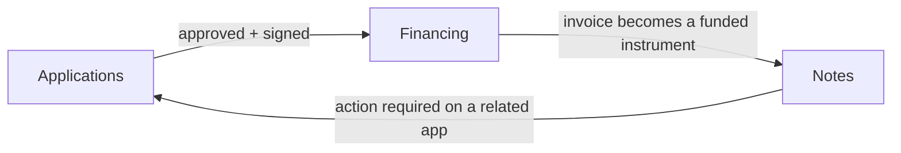

## The lifecycle in one picture

A single financing request moves through three stages in the portal. Each stage has its own sidebar entry, in the same left-to-right order as the lifecycle:

- **Applications** — the **pipeline**. Drafts, submissions, amendments, offers to review, signing.
- **Financing** — the **facility view**. Approved contracts and invoice financing lines, with offers and utilisation.
- **Notes** — the **instrument view**. Funded invoices that are now live notes, with funding, repayment, and settlement.

The **Dashboard** sits above all three and shows a roll-up of activity from each one.

## Where everything lives

The sidebar is ordered to match the lifecycle:

1. **Dashboard** — overview and KPIs (`/`).
2. **Applications** — manage submissions and offers (`/applications`).
3. **Financing** — your contracts and invoice financing (`/financing`).
4. **Notes** — your funded notes (`/notes`).
5. **Activity**, **Profile**, **Help** below.

You will see a small number badge on **Applications** when there are offers waiting for your review.

## Dashboard — your daily landing page

`/` is the orientation page after onboarding. From top to bottom:

- **Welcome banner** with an **Apply for financing** button to start a new application.
- **Account Overview** — success rate, active and past financing, active and completed notes.
- **Repayment Performance** — on-time rate, past-due count, late repayments over the last 6 months.
- **Recent applications** — the most recent and most actionable applications. The header shows a count of applications that need action (amendments or offers to review). Each row links into the right place: amendment items open the editor, others open **Applications**. **View all** takes you to `/applications`.
- **Recent financing** — a mix of your most relevant contracts and invoice financing rows. The header shows a count of items with action required. **View all** takes you to `/financing`. Contract rows open the contract detail page; invoice rows that already have a note open the note.
- **Recent notes** — your latest active (non-settled) notes. **View all** takes you to `/notes`.

The Dashboard does not replicate full lists — use the **View all** links to drill into each area.

## Applications — the pipeline

Open **Applications** in the sidebar (`/applications`). This is where the work happens:

- **Header** — `Applications` title, a one-line description, and the **Apply for financing** primary button on the right.
- **Filter row** — search by application ID, customer, or invoice number, plus **Status**, **Filters** (Financing structure, Submitted in, Offer expiring), **Clear**, and a count badge that shows visible / total.
- **Application cards** — each card shows the application ID, financing type, status badge, and any action buttons (Review Offer, Make Amendments, View Signed Offer, Withdraw, Delete Draft).

### Statuses you will commonly see

- **Draft** — not yet submitted. Open and continue from where you left off.
- **Submitted** — under review by CashSouk.
- **Action Required** — amendments requested. The card shows a **Make Amendments** button that opens the editor.
- **Offer Received** — a contract and/or invoice offer is ready. The card shows a **Review Offer** button and the validity date.
- **Completed**, **Withdrawn**, **Declined**, **Offer Expired** — terminal states for that application.

### Action-required deep links

When something in **Financing** needs action on a related application (for example an amendment), the contract or invoice card carries an **Action required** pill. Clicking it opens **Applications** with a filter applied to just those applications, with a one-line note at the top explaining what you are looking at. Use **Clear filter** to return to the full list.

## Financing — your active facilities

Open **Financing** in the sidebar (`/financing`). This is the **post-approval** view. Think of it as "what do I have on the books?"

- **Header** — `Financing` title, description, and the same **Apply for financing** button (so you can spawn a new request from here too).
- **Tabs** — **Contracts** and **Invoices**. The active tab is remembered in the URL (`?tab=contracts` or `?tab=invoices`) so links are shareable.
- **Filter row per tab** — search box (left), and on the right: **Status**, **Period** (contracts) or **Submission date** (invoices), **Customer**, **Product** (when you have more than one product), **Clear**, **Reload**, and a count badge.

### Contracts tab

Each row is a **contract / facility** that has been approved or is in progress. The card shows:

- Contract title, status badge, and any offer pill.
- Customer, contract period, active notes count.
- A utilisation bar with the approved and utilised facility amounts.
- A **Review offer** button when an offer is waiting, and an **Action required** pill if any related application needs amendment.
- A `⋮` menu with **View details**, which opens the contract detail page (`/financing/contracts/[id]`).

The contract detail page shows facility totals, invoice breakdowns, and a filtered list of invoices under that contract. Use the **Back to Financing** button (top right) to return.

### Invoices tab

Each row is an **invoice financing line** — every invoice you have submitted under any contract, plus invoice-only submissions. The card shows:

- Invoice number, status badge, and any offer pill.
- Note number (if a note has been issued), customer, submission date, funding deadline, maturity date.
- Invoice value and financing amount.
- A funding progress bar with the live funding status (e.g. *Funded 62%*).
- The **Note no.** value is a link — click it to jump straight to the note in `/notes/{id}`.

If an invoice has not yet become a note, the link is replaced with a plain display. When the note is created, the link appears automatically.

## Notes — funded instruments

Open **Notes** in the sidebar (`/notes`). Notes are **what your invoices become** once they go through funding. A note is a new entity with its own lifecycle (draft → published → active → repaid), its own reference number, and its own funding and repayment data.

- **Header** — `Notes` title and description.
- **Filter row** — search by note reference, paymaster, application, etc., plus a **Filters** dropdown (All / Exclude settled), **Clear**, **Reload**, and a count badge.
- **Note cards** — a grid showing each note's title, status, target, funded %, SoukScore risk rating, and (if applicable) a settlement summary panel. **View Note** opens the note detail page.

The note detail page is where you track funding progress, see disbursement, record payments on behalf of the paymaster, and follow settlement / residual refund. The longer guide is **From Approved Application to Repayment**.

## Common navigation patterns

A few flows you will use often:

- **Start a new financing request** — Dashboard **Apply for financing** button, or **Applications** > **Apply for financing**.
- **Resume a draft** — **Applications** > open the draft card > **Edit Application**.
- **Review an offer** — Dashboard **Recent applications** > row, or **Applications** > card > **Review Offer**.
- **Make amendments** — Dashboard **Recent applications** > row, or **Applications** > card > **Make Amendments**, or follow an **Action required** pill from a card in **Financing**.
- **Check a facility** — **Financing** > **Contracts** tab > contract row > `⋮` > **View details**.
- **Open the note for a financed invoice** — **Financing** > **Invoices** tab > click the **Note no.** link on the invoice card, or **Notes** > click the note card.
- **Track repayment / settlement** — **Notes** > open a note > scroll to the timeline and settlement summary.

## When to use which page

| If you want to... | Go to |
|---|---|
| Submit, fix, sign, or withdraw an application | **Applications** |
| Browse approved facilities and invoice financing lines | **Financing** |
| Drill into one contract and its invoices | **Financing** > Contracts > contract row > **View details** |
| See or pay a funded note | **Notes** |
| Get a quick read on overall activity | **Dashboard** |

When in doubt: **Applications** is upstream of **Financing**, and **Financing** is upstream of **Notes**. Move down the sidebar as a request matures.
