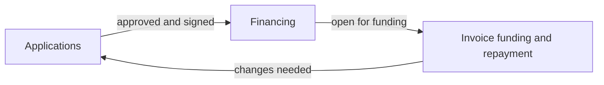

## The lifecycle in one picture

A financing request moves through two workspaces in the portal:

```mermaid
flowchart LR
  Apps["Applications"] -->|"approved and signed"| Fin["Financing"]
  Fin -->|"open for funding"| Fund["Invoice funding and repayment"]
  Fund -->|"changes needed"| Apps
```

- **Applications** — requests in progress. Drafts, submissions, requested changes, offers to review, and signing.
- **Financing** — what you already have. **Facilities** are your credit lines. **Invoices** are the bills you have financed.

The **Dashboard** sits above both and shows a roll-up of activity from each one.

## Where everything lives

The sidebar is ordered to match the lifecycle:

1. **Dashboard** — overview and KPIs (`/`).
2. **Activity** — milestones across applications and financing (`/activity`).
3. **Applications** — manage submissions and offers (`/applications`).
4. **Financing** — your facilities and invoices (`/financing`).
5. **Organisation**, **My account**, and **Help** in Settings.

You will see a small number badge on **Applications** when there are offers waiting for your review.

## Dashboard — your daily landing page

`/` is the orientation page after onboarding. From top to bottom:

- **Welcome banner** with an **Apply for financing** button to start a new application.
- **Account Overview** — success rate, active and past financing, active and completed notes.
- **Repayment Performance** — on-time rate, past-due count, late repayments over the last 6 months.
- **Recent applications** — the most recent and most actionable applications. The header shows a count of applications that need action (amendments or offers to review). Each row links into the right place: amendment items open the editor, others open **Applications**. **View all** takes you to `/applications`.
- **Recent financing** — a mix of your most relevant facilities and invoice financing rows. The header shows a count of items with action required. **View all** takes you to `/financing`. Facility rows open the facility detail page; invoice rows that already have a note open the note.
- **Latest activity** — the five most recent milestones. Rows open the related application, facility, invoice, or note. **View all** takes you to `/activity`.

The Dashboard does not replicate full lists — use the **View all** links to drill into each area.

## Applications — the pipeline

Open **Applications** in the sidebar (`/applications`). This is where the work happens:

- **Header** — `Applications` title, a one-line description, and the **Apply for financing** primary button on the right.
- **Needs your attention** — offers and amendments sit in taller featured cards at the top. Each card names **Facility** or **Invoice** on a line above the task. Offer review uses **Review offer**. Search and filters do not hide these cards.
- **Filter row** — below the carousel: search by application ID, customer, or invoice number, plus **Status**, **Filters** (Financing structure, Submitted in, Offer expiring), and a count for the list.
- **Application cards** — each card shows the application ID, financing type, status badge, and any action buttons (Review Facility Offer, Review Invoice Offer, Make Amendments, View Signed Offer, Withdraw, Delete Draft).

### Statuses you will commonly see

- **Draft** — not yet submitted. Open and continue from where you left off.
- **Submitted** — under review by CashSouk.
- **Action Required** — amendments requested. The card shows a **Make Amendments** button that opens the editor.
- **Offer Received** — a facility offer and/or an invoice offer is ready. Facility offers use **Review Facility Offer**; invoice offers use **Review Invoice Offer**. Both open the application Offer tab.
- **Completed**, **Withdrawn**, **Declined**, **Offer Expired** — terminal states for that application.

### Action-required deep links

When something in **Financing** needs action on a related application (for example an amendment), the facility or invoice card carries an **Action required** pill. Clicking it opens **Applications** with a filter applied to just those applications. Use **Clear filters** to return to the full list.

## Financing — facilities and invoices

Open **Financing** in the sidebar (`/financing`). This is the **post-approval** view. Think of it as "what do I have on the books?"

- **Header** — `Financing` title, a short description, and **Apply for financing**.
- **Tabs** — **Facilities** and **Invoices**. The active tab is remembered in the URL (`?tab=contracts` or `?tab=invoices`) so links are shareable. `/notes` and `?tab=notes` open the Invoices tab.
- **Needs your attention** — offers and amendments sit in taller featured cards at the top of each tab. Each card names **Facility** or **Invoice** on a line above the task. Search and filters do not hide these cards.
- **Filter row per tab** — below the carousel: search, status, period (facilities) or submission date (invoices), customer, product, clear, reload, and a count for the list.
- **List sections** — Facilities show **Active facilities** first. Invoices show **Active invoices**, then **Fully funded**, then **Funding now**, then the rest.

### Facilities tab

Each row is a **facility** (credit line). Attention items use the same featured cards as invoices. List cards show **remaining credit** (reusable after repayment) and **remaining allocation** (invoice face, kept after settlement). **Reserved** pending invoices reduce remaining credit. **View details** opens `/financing/contracts/[id]`. **Review Facility Offer** is the same offer as on Applications — it still opens the application Offer tab. From an approved facility, **Finance an invoice** starts a new application for that facility.

### Invoices tab

Each row is one invoice you have financed. You can review an offer, see how much has been funded, and track repayment from the same list.

- **Review Invoice Offer** is the same offer as on Applications — it still opens the application Offer tab.
- Open **View details** to see funding, repayment, and settlement.
- Separately billed late charges show as **Action required**. Pay them with FPX. This does not block investor settlement.

The longer guide is **From Approved Application to Repayment**.

## Common navigation patterns

A few flows you will use often:

- **Start a new financing request** — Dashboard **Apply for financing** button, or **Applications** > **Apply for financing**.
- **Resume a draft** — **Applications** > open the draft card > **Edit Application**.
- **Review a facility offer** — **Applications** > card > **Review Facility Offer**, or **Financing** > Facilities > **Review Facility Offer**. Both open the same application Offer tab; Financing does not host a second review.
- **Review an invoice offer** — **Applications** > card > **Review Invoice Offer**, or **Financing** > Invoices > **Review Invoice Offer**. Both open the same application Offer tab; Financing does not host a second review. An invoice on an approved facility requires both confirmations and the full authorisation to be confirmed, and needs a verification code emailed to a director or authorised signatory — see **Get Financed**.
- **Download an application summary** — open the application and use **Download application summary**, or open the note after listing and use the same action there.
- **Make amendments** — Dashboard **Recent applications** > row, or **Applications** > card > **Make Amendments**, or follow an **Action required** pill from a card in **Financing**.
- **Check a facility** — **Financing** > **Facilities** tab > **View details**.
- **Open a funded invoice** — **Financing** > **Invoices** tab > the row, or **View details**.
- **Track repayment** — open the invoice from the Invoices tab and scroll to the timeline.

## When to use which page

| If you want to...                             | Go to                                         |
| --------------------------------------------- | --------------------------------------------- |
| Submit, fix, sign, or withdraw an application | **Applications**                              |
| Browse credit lines                           | **Financing** > Facilities                    |
| Browse invoices, funding, and repayment       | **Financing** > Invoices                      |
| Drill into one facility                       | **Financing** > Facilities > **View details** |
| Get a quick read on overall activity          | **Dashboard**                                 |

When in doubt: start in **Applications** for requests in progress, and use **Financing** for facilities and invoices you already have.
